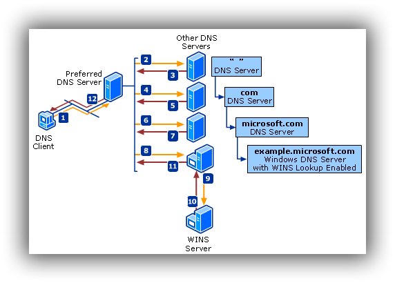

> 从我们输入URL并按下回车键到看到网页结果之间发生了什么？换句话说，一张网页，要经历怎样的过程，才能抵达用户面前？下面来从一些细节上面尝试一下探寻里面的秘密。

### 按下回车键之前

比如我按下一个‘b’键，会出现很多待选URL给我，第一个便是百度。那么其实是在浏览器接收到这个消息之后，会触发浏览器的自动完成机制，会在你之前访问过的搜索最匹配的相关URL，会根据特定的算法显示出来供用户选择。

{:.center}

### 按下回车键之后

依据键盘触发原理，一个专用于回车键的电流回路通过不同的方式闭合了。然后触发硬件中断，随之操作系统内核去处理对应中断。省略其中的过程，最后交给了浏览器这样一个“回车”信号。那么浏览器会进行以下但不仅限于以下炫酷（乱七八糟）的步骤：

1. **解析URL**：您输入的是http还是https开头的网络资源 / file开头的文件资源 / 待搜索的关键字？然后浏览器进行对应的资源加载进程
2. **URL转码**：RFC标准中规定部分字符可以不经过转码直接用于URL，但是汉字不在范围内。所以如果在网址路径中包含汉字将会被转码
3. **HSTS**：鉴于HTTPS遗留的安全隐患，大部分现代浏览器已经支持HSTS。对于浏览器来说，浏览器会检测是否该网络资源存在于预设定的只使用HTTPS的网站列表，或者是否保存过以前访问过的只能使用HTTPS的网站记录，如果是，浏览器将强行使用HTTPS方式访问该网站。

### 不查DNS，读取缓存

- 浏览器中的缓存：对于Chrome，缓存查看地址为：<chrome://net-internals/#dns>
- 本地hosts文件：以Mac与Linux为例，hosts文件所在路径为：/etc/hosts。所以有一种翻墙的方式就是修改hosts文件避免GFW对DNS解析的干扰，直接访问真正IP地址，但已经不能完全生效因为GFW还有根据IP过滤的机制。

### 发送DNS查找请求(不一定)

DNS的查询方式是：按根域名->顶级域名->次级域名->主机名这样的方式来查找的，对于某个URL，如下所示

```xml
主机名.次级域名.顶级域名.根域名
--------------------------
host.sld.tld.root
```

查询步骤为：

1. 查询本地DNS服务器。本地DNS服务器地址为连接网络时路由器指定的DNS地址，一般为DHCP自动分配的路由器地址，保存在/etc/resolv.conf，而路由器的DNS转发器将请求转发到上层ISP的DNS，所以此处本地DNS服务器是局域网或者运营商的。
2. 从"根域名服务器"查到"顶级域名服务器"的NS记录和A记录（IP地址）。世界上一共有十三组根域名服务器，从A.ROOT-SERVERS.NET一直到M.ROOT-SERVERS.NET，由于已经将这些根域名服务器的IP地址存放在本地DNS服务器中。
3. 从"顶级域名服务器"查到"次级域名服务器"的NS记录和A记录（IP地址）
4. 从"次级域名服务器"查出"主机名"的IP地址

{:.center}

以www.google.com为例，下面是一整个DNS查询过程:

1. 由于本次测试是在阿里云上的实例进行测试，所以首先从100.100.2.138这个阿里内网DNS服务器查找到所有根域名服务器的映射关系。
2. 访问根域名服务器（f.root-servers.net)，拿到com顶级域名服务器的NS记录与IP地址。
3. 访问顶级域名服务器（e.gtld-servers.net），拿到google.com次级域名服务器的NS记录与IP地址。
4. 访问次级域名服务器（[ns2.google.com](http://ns2.google.com/)），拿到www.google.com的IP地址

所以总的来说，DNS的解析是一个逐步缩小范围的查找过程。

### 确定发送目标

拿到IP之后，还需要拿到那台服务器的MAC地址才行，在以太网协议中规定，**同一局域网中的一台主机要和另一台主机进行直接通信，必须要知道目标主机的MAC地址**。所以根据**ARP**（根据IP地址获取物理地址的一个TCP/IP协议）获取到MAC地址之后保存到本地ARP缓存之后与目标主机准备开始通信。具体细节参见维基百科DHCH/ARP。

### 建立TCP连接

