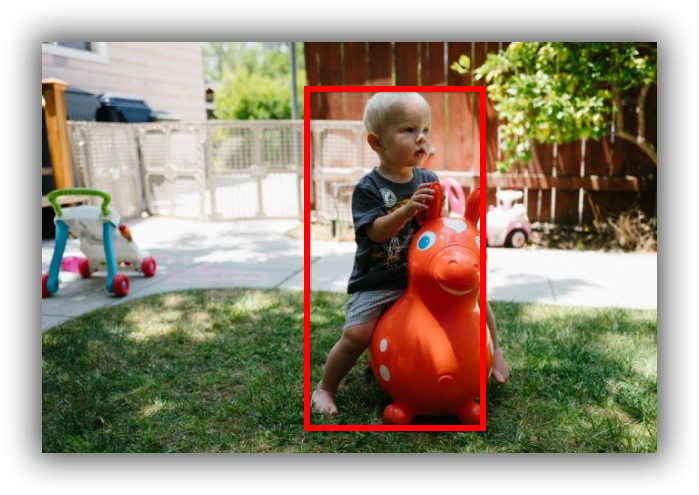
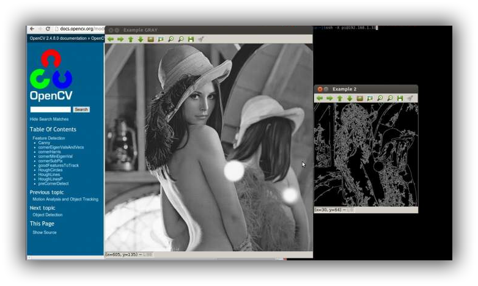
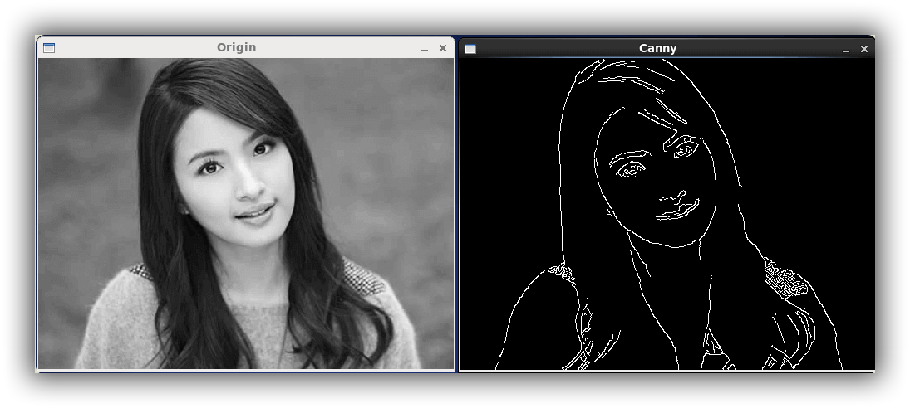
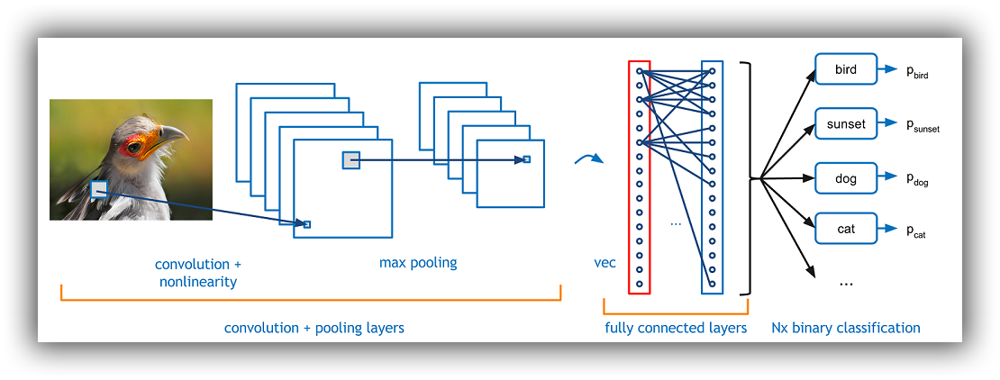
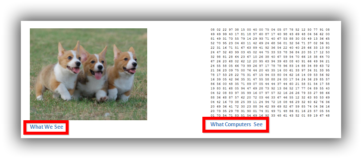
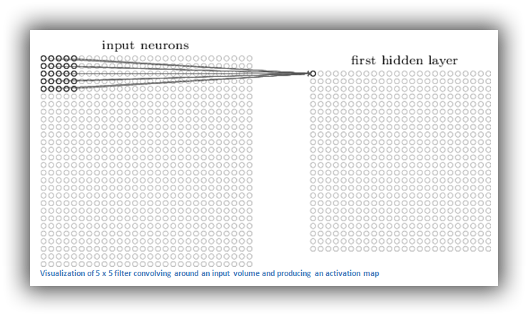
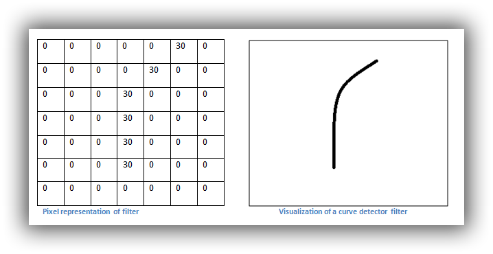
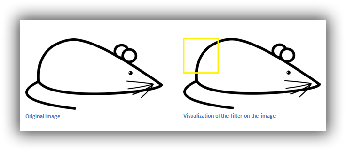
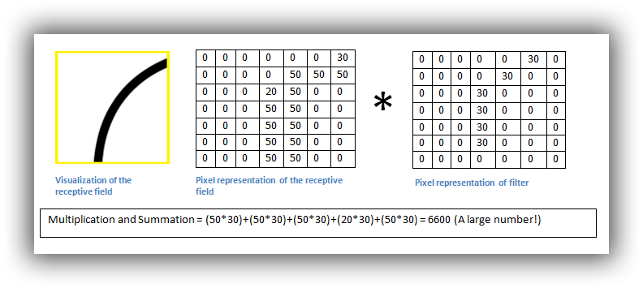
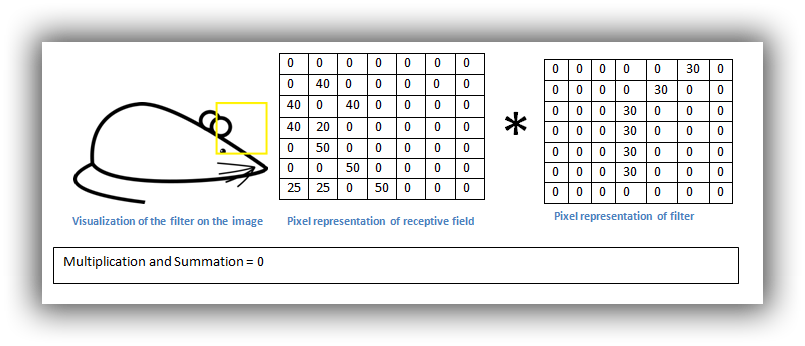

图像识别是一项非常热门而且有趣的技术

文字识别、车牌识别、人脸识别都是它的应用。但是，这些都算初级应用，现在的技术已经发展到了这样一种地步：计算机可以识别出，这是一张狗的照片，那是一张猫的照片，这张图片当中猫在什么位置，狗在什么位置等等。

{:.center}

这是怎么做到的呢？

{:.center}

这其实和人眼是相似的。学者发现，人的视觉细胞对物体的边缘特别敏感。也就是说，我们先看到物体的轮廓，然后才判断这到底是什么东西。

计算机科学家受到启发，第一步也是先识别图像的边缘。就像下面这样：

{:.center}

加州大学的学生 Adit Deshpande 写了一篇文章[《A Beginner's Guide To Understanding Convolutional Neural Networks》](https://adeshpande3.github.io/adeshpande3.github.io/A-Beginner%27s-Guide-To-Understanding-Convolutional-Neural-Networks/)，介绍了一种最简单的算法，非常具有启发性，体现了图像识别的基本思路。

{:.center}

首先，我们要明白，人看到的是图像，计算机看到的是一个数字矩阵。所谓"图像识别"，就是从一大堆数字中找出规律。

{:.center}

怎样将图像转为数字呢？一般来说，为了过滤掉干扰信息，可以把图像缩小（比如缩小到 49 x 49 像素），并且把每个像素点的色彩信息转为灰度值，这样就得到了一个 49 x 49 的矩阵。

然后，从左上角开始，依次取出一个小区块，进行计算。

{:.center}

上图是取出一个 5 x 5 的区块。下面的计算以 7 x 7 的区块为例。

接着，需要有一些现成的边缘模式，比如垂直、直角、圆、锐角等等。

{:.center}

上图右边是一个圆角模式，左边是它对应的 7 x 7 灰度矩阵。可以看到，圆角所在的边缘灰度值比较高，其他地方都是0。

现在，就可以进行边缘识别了。下面是一张卡通老鼠的图片。

{:.center}

取出左上角的区块。

{:.center}

注意下面的算式，可以看出其得到了一个较大的值，我们可以称之为**激活值**。它说明了什么？

{:.center}

取样矩阵移到老鼠头部，与模式矩阵相乘，得到的值是0。

乘积越大就说明越匹配，可以断定区块里的图像形状是圆角。通常会预置几十种模式，每个区块计算出最匹配的模式，然后再对整张图进行判断。

其实，从边缘出发，还有其他启发性的东西。边缘是变化很明显的分界点，人的眼睛的确对这个很敏感。但边缘只剩下一条线了。那么很容易想到，如果不是一条线，该用什么呢？答案是**梯度**。在边缘处，考查变化的强弱及方向。这是现在一些常见的图像识别算法的基础，比如 **hog，sift。 都是基于梯度的**。