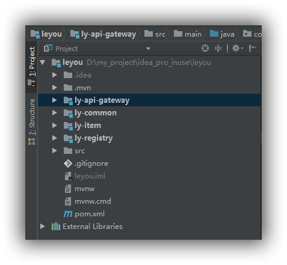
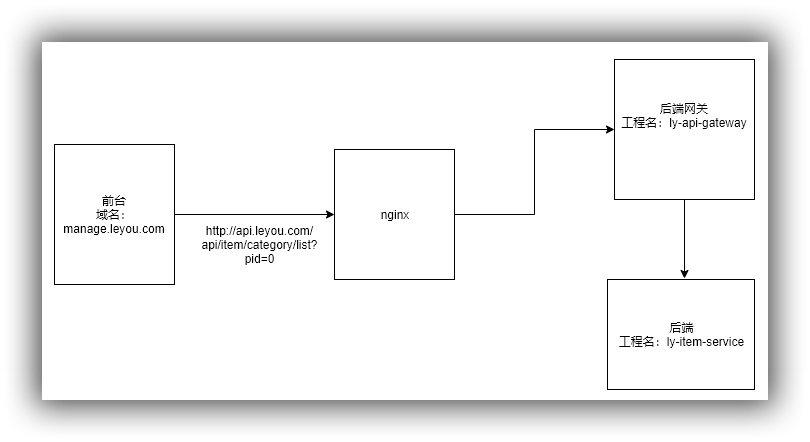
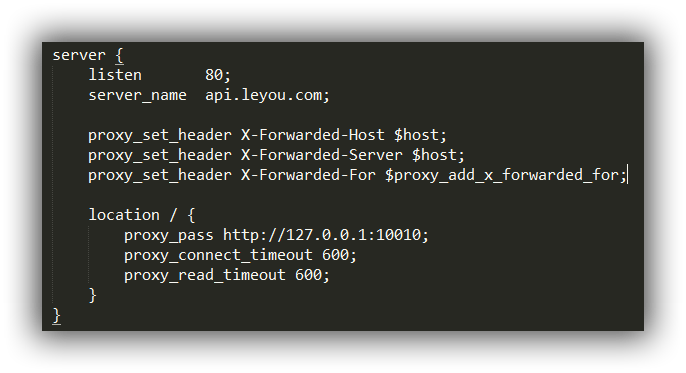
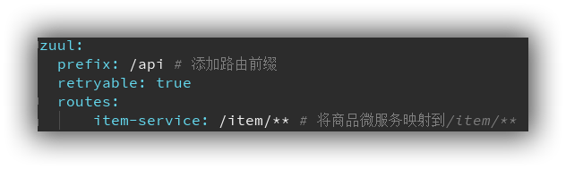
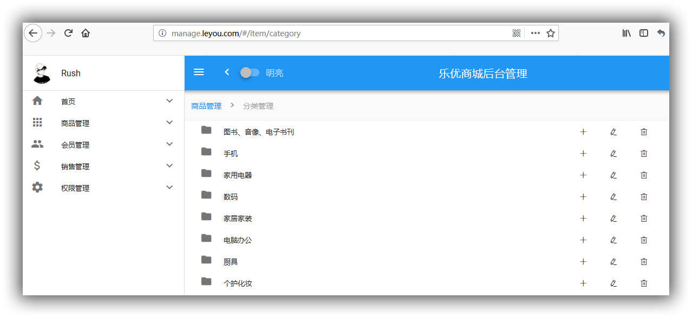

开发当中难免会遇到跨域相关的问题，这其中牵涉到很多知识，好好理解并消化这部分知识大有裨益。

#### 简介

跨域：浏览器对于javascript的同源策略的限制 。

以下情况都属于跨域：

| 跨域原因说明       | 示例                                   |
| ------------------ | -------------------------------------- |
| 域名不同           | `www.jd.com` 与 `www.taobao.com`       |
| 域名相同，端口不同 | `www.jd.com:8080` 与 `www.jd.com:8081` |
| 二级域名不同       | `item.jd.com` 与 `miaosha.jd.com`      |

如果**域名和端口都相同，但是请求路径不同**，不属于跨域，如：

`www.jd.com/item` 

`www.jd.com/goods`

而我们刚才是从`manage.leyou.com`去访问`api.leyou.com`，这属于二级域名不同，跨域了。

#### 为什么会有跨域问题

跨域不一定会有跨域问题。

因为跨域问题是浏览器对于ajax请求的一种安全限制：**一个页面发起的ajax请求，只能是与当前页域名相同的路径**，这能有效的阻止跨站攻击。

因此：**跨域问题 是针对ajax的一种限制**。

但是这却给我们的开发带来了不便，而且在实际生产环境中，肯定会有很多台服务器之间交互，地址和端口都可能不同，怎么办？

#### 跨域问题的可选解决方案

目前比较常用的跨域解决方案有3种：

- Jsonp

  最早的解决方案，利用script标签可以跨域的原理实现。

  限制：

  - 需要服务的支持
  - 只能发起GET请求

- nginx反向代理

  思路是：利用nginx把跨域反向代理为不跨域，支持各种请求方式

  缺点：需要在nginx进行额外配置，语义不清晰

- CORS

  规范化的跨域请求解决方案，安全可靠。

  优势：

  - 在服务端进行控制是否允许跨域，可自定义规则
  - 支持各种请求方式

  缺点：

  - 会产生额外的请求

在我的这个案例当中会采用**cors的跨域方案**。

#### cors解决跨域

##### 什么是cors

CORS是一个W3C标准，全称是"跨域资源共享"（Cross-origin resource sharing）。

它允许浏览器向跨源服务器，发出[`XMLHttpRequest`](http://www.ruanyifeng.com/blog/2012/09/xmlhttprequest_level_2.html)请求，从而克服了AJAX只能[同源](http://www.ruanyifeng.com/blog/2016/04/same-origin-policy.html)使用的限制。

CORS需要浏览器和服务器同时支持。目前，所有浏览器都支持该功能，IE浏览器不能低于IE10。

- 浏览器端：

  目前，所有浏览器都支持该功能（IE10以下不行）。整个CORS通信过程，都是浏览器自动完成，不需要用户参与。

- 服务端：

  CORS通信与AJAX没有任何差别，因此你不需要改变以前的业务逻辑。只不过，浏览器会在请求中携带一些头信息，我们需要以此判断是否允许其跨域，然后在响应头中加入一些信息即可。这一般通过过滤器完成即可。

##### 原理有些复杂

浏览器会将ajax请求分为两类，其处理方案略有差异：**简单请求、特殊请求。**

- **简单请求**

只要同时满足以下两大条件，就属于简单请求。：

（1) 请求方法是以下三种方法之一：

- HEAD
- GET
- POST

（2）HTTP的头信息不超出以下几种字段：

- Accept
- Accept-Language
- Content-Language
- Last-Event-ID
- Content-Type：只限于三个值`application/x-www-form-urlencoded`、`multipart/form-data`、`text/plain`

当浏览器发现发起的ajax请求是简单请求时，会在请求头中携带一个字段：`Origin`.


Origin中会指出当前请求属于哪个域（协议+域名+端口）。服务会根据这个值决定是否允许其跨域。

如果服务器允许跨域，需要在返回的响应头中携带下面信息：

```http
Access-Control-Allow-Origin: http://manage.leyou.com
Access-Control-Allow-Credentials: true
Content-Type: text/html; charset=utf-8
```

- Access-Control-Allow-Origin：可接受的域，是一个具体域名或者*（代表任意域名）
- Access-Control-Allow-Credentials：是否允许携带cookie，默认情况下，cors不会携带cookie，除非这个值是true

> 有关cookie：

要想操作cookie，需要满足3个条件：

- 服务的响应头中需要携带Access-Control-Allow-Credentials并且为true。
- 浏览器发起ajax需要指定withCredentials 为true
- 响应头中的Access-Control-Allow-Origin一定不能为*，必须是指定的域名


- **特殊请求**

不符合简单请求的条件，会被浏览器判定为特殊请求,，例如请求方式为PUT。

> 预检请求

特殊请求会在正式通信之前，增加一次HTTP查询请求，称为"预检"请求（preflight）。

浏览器先询问服务器，当前网页所在的域名是否在服务器的许可名单之中，以及可以使用哪些HTTP动词和头信息字段。只有得到肯定答复，浏览器才会发出正式的`XMLHttpRequest`请求，否则就报错。

一个“预检”请求的样板：

```http
OPTIONS /cors HTTP/1.1
Origin: http://manage.leyou.com
Access-Control-Request-Method: PUT
Access-Control-Request-Headers: X-Custom-Header
Host: api.leyou.com
Accept-Language: en-US
Connection: keep-alive
User-Agent: Mozilla/5.0...
```

与简单请求相比，除了Origin以外，多了两个头：

- Access-Control-Request-Method：接下来会用到的请求方式，比如PUT
- Access-Control-Request-Headers：会额外用到的头信息

> 预检请求的响应

服务的收到预检请求，如果许可跨域，会发出响应：

```http
HTTP/1.1 200 OK
Date: Mon, 01 Dec 2008 01:15:39 GMT
Server: Apache/2.0.61 (Unix)
Access-Control-Allow-Origin: http://manage.leyou.com
Access-Control-Allow-Credentials: true
Access-Control-Allow-Methods: GET, POST, PUT
Access-Control-Allow-Headers: X-Custom-Header
Access-Control-Max-Age: 1728000
Content-Type: text/html; charset=utf-8
Content-Encoding: gzip
Content-Length: 0
Keep-Alive: timeout=2, max=100
Connection: Keep-Alive
Content-Type: text/plain
```

除了`Access-Control-Allow-Origin`和`Access-Control-Allow-Credentials`以外，这里又额外多出3个头：

- Access-Control-Allow-Methods：允许访问的方式
- Access-Control-Allow-Headers：允许携带的头
- Access-Control-Max-Age：本次许可的有效时长，单位是秒，**过期之前的ajax请求就无需再次进行预检了**

如果浏览器得到上述响应，则认定为可以跨域，后续就跟简单请求的处理是一样的了。

##### 实现非常简单

虽然原理比较复杂，但是前面说过：

- 浏览器端都有浏览器自动完成，我们无需操心
- 服务端可以通过拦截器统一实现，不必每次都去进行跨域判定的编写。

事实上，SpringMVC已经帮我们写好了CORS的跨域过滤器：CorsFilter ,内部已经实现了刚才所讲的判定逻辑，我们直接用就好了。

在`leyou-gateway`中编写一个配置类，并且注册CorsFilter。

描述一下我的项目结构和请求流程：

- 项目结构



- 请求流程



前台发起访问`http://api.leyou.com/api/item/category/list?pid=0`

经过nginx，判断资源定向



于是发送给`ly-api-gateway`去处理，这个时候就需要在`ly-api-gateway`当中配置`CorsFilter`了，由于是`http://manage.leyou.com`发送到`api.leyou.com`,这就涉及到服务端对特定域下的资源请求是否通过了，我们在下面代码当中添加了允许的域：`configuration.addAllowedOrigin("http://manage.leyou.com");`

```java
@Configuration
public class GlobalCorsConfig {
    @Bean
    public CorsFilter corsFilter(){
        //添加cors配置信息
        CorsConfiguration configuration=new CorsConfiguration();
        //1) 允许的域,不要写*，否则cookie就无法使用了
        configuration.addAllowedOrigin("http://manage.leyou.com");
        //2) 是否发送Cookie信息
        configuration.setAllowCredentials(true);
        //3) 允许的请求方式
        configuration.addAllowedMethod("OPTIONS");
        configuration.addAllowedMethod("HEAD");
        configuration.addAllowedMethod("GET");
        configuration.addAllowedMethod("PUT");
        configuration.addAllowedMethod("POST");
        configuration.addAllowedMethod("DELETE");
        configuration.addAllowedMethod("PATCH");
        // 4）允许的头信息
        configuration.addAllowedHeader("*");
        //2.添加映射路径，我们拦截一切请求
        UrlBasedCorsConfigurationSource configurationSource=new UrlBasedCorsConfigurationSource();
        configurationSource.registerCorsConfiguration("/**",configuration);
        //返回新的corsFilter
        return new CorsFilter(configurationSource);

    }
}
```

紧接着网关识别出当前资源请求域是`http://manage.leyou.com`,于是给予处理，发现匹配模式`/api`,与自己配置文件吻合,于是路由到`item-service`这个微服务去处理。



最后即是在`item-service`当中做处理并返回结果

```java
@Controller
@RequestMapping("category")
public class CategoryController {
    @Autowired
    CategoryService categoryService;
    @RequestMapping("list")
    public ResponseEntity<List<Category>> queryCategoryListByParentId(@RequestParam(value = "pid",defaultValue = "0")Long pid){
        try {
            if(pid==null||pid.longValue()<0){
                // pid为null或者小于等于0，响应400
                return ResponseEntity.badRequest().build();
            }
            //执行查询操作
            List<Category> categoryList=this.categoryService.queryCategoryListByParentId(pid);
            if(categoryList==null||categoryList.size()<1){
                // 返回结果集为空，响应404
                return ResponseEntity.notFound().build();
            }
            //响应200
            return ResponseEntity.ok(categoryList);
        }catch (Exception e){
            e.printStackTrace();
        }
        //以上都不是，响应500
        return  ResponseEntity.status(HttpStatus.INTERNAL_SERVER_ERROR).build();
    }

}
```

#### 测试

这里自己犯二了，之前明显配置的是允许`http://manage.leyou.com`域的请求，而自己在启动Vue后台项目之后，使用它的默认配置请求地址` http://localhost:9001`，请求发现还是跨域的问题，检查两遍后改了请求域名就好了。

