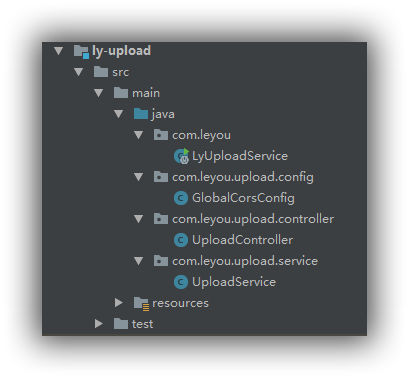
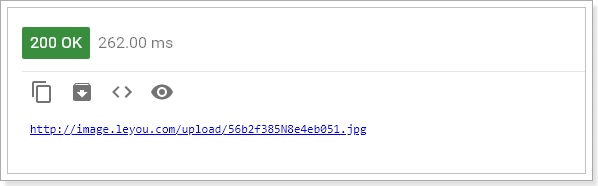
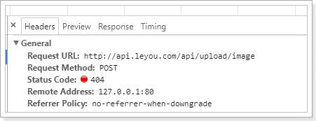
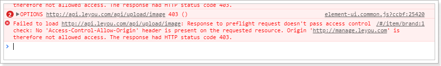

> **流程描述**：前台Vue，上传图片至服务端存储，并返回图片地址

### 新建工程

这是一个微服务项目，事先已经有了依赖管理的父工程，在此不多作阐述。

{:.center}

### 添加依赖

添加EurekaClient和web依赖：

```xml
<?xml version="1.0" encoding="UTF-8"?>
<project xmlns="http://maven.apache.org/POM/4.0.0"
         xmlns:xsi="http://www.w3.org/2001/XMLSchema-instance"
         xsi:schemaLocation="http://maven.apache.org/POM/4.0.0 http://maven.apache.org/xsd/maven-4.0.0.xsd">
    <parent>
        <artifactId>leyou</artifactId>
        <groupId>com.leyou.parent</groupId>
        <version>1.0.0-SNAPSHOT</version>
    </parent>
    <modelVersion>4.0.0</modelVersion>

    <groupId>com.leyou.service</groupId>
    <artifactId>ly-upload</artifactId>
    <version>1.0.0-SNAPSHOT</version>

    <dependencies>
        <dependency>
            <groupId>org.springframework.cloud</groupId>
            <artifactId>spring-cloud-starter-netflix-eureka-client</artifactId>
        </dependency>
        <dependency>
            <groupId>org.springframework.boot</groupId>
            <artifactId>spring-boot-starter-web</artifactId>
        </dependency>
    </dependencies>
</project>
```

### 编写配置

```yaml
server:
  port: 8082
spring:
  application:
    name: upload-service
  servlet:
    multipart:
      max-file-size: 5MB # 限制文件上传的大小
# Eureka
eureka:
  client:
    service-url:
      defaultZone: http://127.0.0.1:10086/eureka
  instance:
    lease-renewal-interval-in-seconds: 5 # 每隔5秒发送一次心跳
    lease-expiration-duration-in-seconds: 10 # 10秒不发送就过期
    prefer-ip-address: true
    ip-address: 127.0.0.1
    instance-id: ${spring.application.name}:${server.port}
```

尤其注意下面这一段：添加了限制文件大小的配置

```yaml
spring:
  application:
    name: upload-service
  servlet:
    multipart:
      max-file-size: 5MB # 限制文件上传的大小
```

启动类的建立不多做阐述。

### 编写上传功能

#### controller

编写controller需要知道4个内容：

- 请求方式：上传肯定是POST
- 请求路径：/upload/image
- 请求参数：文件，参数名是file，SpringMVC会封装为一个接口：MultipleFile
- 返回结果：上传成功后得到的文件的url路径

代码如下：

```java
@RestController
@RequestMapping("upload")
public class UploadController {
    @Autowired
    UploadService uploadService;
    /**
     * 上传图片功能
     * @param file
     * @return
     */
    @PostMapping("image")
    public ResponseEntity<String> uploadImage(@RequestParam("file")MultipartFile file){
        String url=this.uploadService.upload(file);
        if(StringUtils.isBlank(url)){
            // url为空，证明上传失败
            return new ResponseEntity<>(HttpStatus.BAD_REQUEST);
        }
        // 返回200，并且携带url路径
        return ResponseEntity.ok(url);
    }
}
```

#### service

在上传文件过程中，我们需要对上传的内容进行校验：

1. 校验文件大小
2. 校验文件的媒体类型
3. 校验文件的内容

文件大小在Spring的配置文件中设置，因此已经会被校验，我们不用管。

具体代码：

```java
@Service
public class UploadService {
    private static final Logger logger= LoggerFactory.getLogger(UploadService.class);
    // 支持的文件类型
    private static final List<String> suffixes= Arrays.asList("image/png","image/jpeg");
    public String upload(MultipartFile file){
        try{
            // 1、图片信息校验
            // 1)校验文件类型
            String type=file.getContentType();
            if(!suffixes.contains(type)){
                logger.info("上传失败，文件类型不匹配：{}", type);
                return null;
            }
            // 2)校验图片内容
            BufferedImage image= ImageIO.read(file.getInputStream());
            if(image==null){
                logger.info("上传失败，文件内容不符合要求");
                return null;
            }
            // 2、保存图片
            // 2.1、生成保存目录
            File dir=new File("D:\\my_project\\idea_pro_inuse\\leyouUpload");
            if(!dir.exists()){
                dir.mkdirs();
            }
            // 2.2、保存图片
            file.transferTo(new File(dir,file.getOriginalFilename()));
            // 2.3、拼接图片地址
            String url="http://image.leyou.com/upload/"+file.getOriginalFilename();
            return url;
        }catch (Exception e){
            return null;
        }
    }
}
```

**思考：**为什么图片地址需要使用另外的url？

- 图片不能保存在服务器内部，这样会对服务器产生额外的加载负担
- 一般静态资源都应该使用独立域名，这样访问静态资源时不会携带一些不必要的cookie，减小请求的数据量

### 测试上传

这里由于未保存postman提交记录，暂且用其他图片作阐述

{:.center}

结果：

{:.center}

### 绕过网关

图片上传是文件的传输，如果也经过Zuul网关的代理，文件就会经过多次网路传输，造成不必要的网络负担。在高并发时，可能导致网络阻塞，Zuul网关不可用。这样我们的整个系统就瘫痪了。

所以，我们上传文件的请求就不经过网关来处理了。

#### Zuul的路由过滤

Zuul中提供了一个ignored-patterns属性，用来忽略不希望路由的URL路径，示例：

```properties
zuul.ignored-patterns: /upload/**
```

路径过滤会对一切微服务进行判定。

Zuul还提供了`ignored-services`属性，进行服务过滤：

```properties
zuul.ignored-services: upload-servie
```

我们这里采用忽略服务：

```yaml
zuul:
  ignored-services:
    - upload-service # 忽略upload-service服务
```

上面的配置采用了集合语法，代表可以配置多个

#### Nginx的rewrite指令

现在，修改页面的访问路径：

```html
<v-upload
      v-model="brand.image" 
      url="/upload/image" 
      :multiple="false" 
      :pic-width="250" :pic-height="90"
      />
```

查看页面的请求路径：

{:.center}

可以看到这个地址不对，依然是去找Zuul网关，因为我们的系统全局配置了URL地址。怎么办？

有同学会想：修改页面请求地址不就好了。

**注意：原则上，我们是不能把除了网关以外的服务对外暴露的，不安全。**

既然不能修改页面请求，那么就只能在Nginx反向代理上做文章了。

我们修改nginx配置，将以/api/upload开头的请求拦截下来，转交到真实的服务地址:

```nginx
location /api/upload {
    proxy_pass http://127.0.0.1:8082;
    proxy_connect_timeout 600;
    proxy_read_timeout 600;
}
```

这样写大家觉得对不对呢？

显然是不对的，因为ip和端口虽然对了，但是路径没变，依然是：http://127.0.0.1:8002/api/upload/image

前面多了一个/api

Nginx提供了rewrite指令，用于对地址进行重写，语法规则：

```
rewrite "用来匹配路径的正则" 重写后的路径 [指令];
```

我们的案例：

```nginx
server {
        listen       80;
        server_name  api.leyou.com;

        proxy_set_header X-Forwarded-Host $host;
        proxy_set_header X-Forwarded-Server $host;
        proxy_set_header X-Forwarded-For $proxy_add_x_forwarded_for;

    	# 上传路径的映射
		location /api/upload {	
			proxy_pass http://127.0.0.1:8082;
			proxy_connect_timeout 600;
			proxy_read_timeout 600;
			
			rewrite "^/api/(.*)$" /$1 break; 
        }
		
        location / {
			proxy_pass http://127.0.0.1:10010;
			proxy_connect_timeout 600;
			proxy_read_timeout 600;
        }
    }
```

- 首先，我们映射路径是/api/upload，而下面一个映射路径是 / ，根据最长路径匹配原则，/api/upload优先级更高。也就是说，凡是以/api/upload开头的路径，都会被第一个配置处理

- `proxy_pass`：反向代理，这次我们代理到8082端口，也就是upload-service服务

- `rewrite "^/api/(.*)$" /$1 break`，路径重写：

  - `"^/api/(.*)$"`：匹配路径的正则表达式，用了分组语法，把`/api/`以后的所有部分当做1组

  - `/$1`：重写的目标路径，这里用$1引用前面正则表达式匹配到的分组（组编号从1开始），即`/api/`后面的所有。这样新的路径就是除去`/api/`以外的所有，就达到了去除`/api`前缀的目的

  - `break`：指令，常用的有2个，分别是：last、break

    - last：重写路径结束后，将得到的路径重新进行一次路径匹配
    - break：重写路径结束后，不再重新匹配路径。

    我们这里不能选择last，否则以新的路径/upload/image来匹配，就不会被正确的匹配到8082端口了

修改完成，输入`nginx -s reload`命令重新加载配置。然后再次上传试试。

### 跨域问题

重启nginx，再次上传，发现报错了：

{:.center}

在upload-service中添加一个CorsFilter即可：

```java
@Configuration
public class GlobalCorsConfig {
    @Bean
    public CorsFilter corsFilter() {
        //1.添加CORS配置信息
        CorsConfiguration config = new CorsConfiguration();
        //1) 允许的域,不要写*，否则cookie就无法使用了
        config.addAllowedOrigin("http://manage.leyou.com");
        //2) 是否发送Cookie信息
        config.setAllowCredentials(false);
        //3) 允许的请求方式
        config.addAllowedMethod("OPTIONS");
        config.addAllowedMethod("POST");
        config.addAllowedHeader("*");

        //2.添加映射路径，我们拦截一切请求
        UrlBasedCorsConfigurationSource configSource = new UrlBasedCorsConfigurationSource();
        configSource.registerCorsConfiguration("/**", config);

        //3.返回新的CorsFilter.
        return new CorsFilter(configSource);
    }
}
```

再次测试

{:.center}