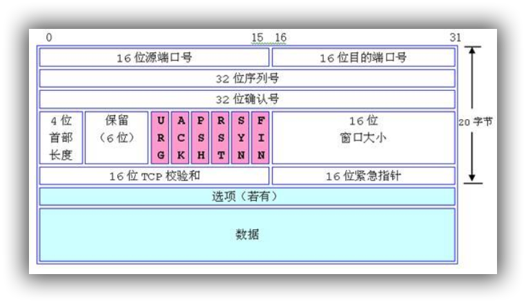
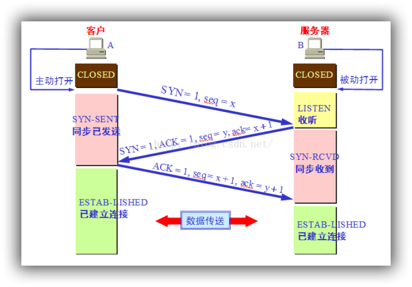
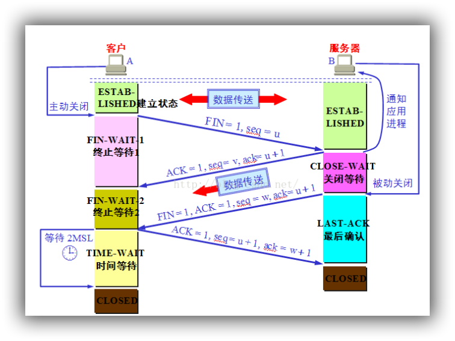

> 概要：TCP 在传输之前会进行三次沟通，一般称为“三次握手”，传完数据断开的时候要进行四次沟通，一般称为“四次挥手”。 

### 数据包说明

- 源端口号（ 16 位）：它（连同源主机 IP 地址）标识源主机的一个应用进程。

- 目的端口号（ 16 位）：它（连同目的主机 IP 地址）标识目的主机的一个应用进程。**这两个值加上 IP 报头中的源主机 IP 地址和目的主机 IP 地址唯一确定一个 TCP 连接。**

- 顺序号 seq（ 32 位）： **用来标识从 TCP 源端向 TCP 目的端发送的数据字节流，它表示在这个报文段中的第一个数据字节的顺序号**。如果将字节流看作在两个应用程序间的单向流动，则TCP 用顺序号对每个字节进行计数。序号是 32bit 的无符号数， **序号到达 2 的 32 次方 － 1 后又从 0 开始。 当建立一个新的连接时， SYN 标志变 1** ，顺序号字段包含由这个主机选择的该连接的初始顺序号 ISN （ Initial Sequence Number ）。

- 确认号 ack（ 32 位）： **包含发送确认的一端所期望收到的下一个顺序号**。因此，确认序号应当是上次已成功收到数据字节顺序号加 1 。 **只有 ACK 标志为 1 时确认序号字段才有效**。 TCP 为应用层提供全双工服务，这意味数据能在两个方向上独立地进行传输。因此，连接的每一端必须保持每个方向上的传输数据顺序号。

- TCP 报头长度（ 4 位）：给出报头中 32bit 字的数目， **它实际上指明数据从哪里开始**。 需要这个值是因为任选字段的长度是可变的。这个字段占 4bit ，因此 TCP 最多有 60 字节的首部。然而，没有任选字段，正常的长度是 20 字节。

- 保留位（ 6 位）：保留给将来使用，目前必须置为 0 。

- 控制位（ control flags ， 6 位）：在 TCP 报头中有 6 个标志比特，它们中的多个可同时被设置为 1 。依次为：
  - URG ：为 1 表示紧急指针有效，为 0 则忽略紧急指针值。
  - ACK ：为 1 表示确认号有效，为 0 表示报文中不包含确认信息，忽略确认号字段。
  - PSH ：为 1 表示是带有 PUSH 标志的数据， **指示接收方应该尽快将这个报文段交给应用层而不用等待缓冲区装满**。
  - RST ： **用于复位由于主机崩溃或其他原因而出现错误的连接**。它还可以用于拒绝非法的报文段和拒绝连接请求。一般情况下，如果收到一个 RST 为 1 的报文，那么一定发生了某些问题。
  - SYN ：同步序号， **为 1 表示连接请求**，用于建立连接和使顺序号同步（ synchronize ）。
  - FIN ： **用于释放连接**，为 1 表示发送方已经没有数据发送了，即关闭本方数据流。

- 窗口大小（ 16 位）：数据字节数，表示从确认号开始，本报文的源方可以接收的字节数，即源方接收窗口大小。窗口大小是一个 16bit 字段，因而窗口大小最大为 65535 字节。

- 校验和（ 16 位）：此校验和是对整个的 TCP 报文段， **包括 TCP 头部和 TCP 数据，以 16 位字进行计算所得**。这是一个强制性的字段，一定是由发送端计算和存储， 并**由接收端进行验证**。

- 紧急指针（ 16 位）：只有当 URG 标志置 1 时紧急指针才有效。 **TCP 的紧急方式是发送端向另一端发送紧急数据的一种方式**。 
- 选项：最常见的可选字段是最长报文大小，又称为 MSS(Maximum Segment Size) 。每个连接方通常都在通信的第一个报文段（为建立连接而设置 SYN 标志的那个段）中指明这个选项，**它指明本端所能接收的最大长度的报文段**。选项长度不一定是 32 位字的整数倍，所以要加填充位，使得报头长度成为整字数。
- 数据： TCP 报文段中的数据部分是可选的。在一个连接建立和一个连接终止时，双方交换的报文段仅有 TCP 首部。如果一方没有数据要发送，也使用没有任何数据的首部来确认收到的数据。在处理超时的许多情况中，也会发送不带任何数据的报文段。 

{:.center}

### 三次握手

第一次握手：主机 A 发送位码为 **syn＝ 1**,随机产生 **seq number=1234567** 的数据包到服务器，主机 B由 SYN=1 知道， A 要求建立联机；
第 二 次 握 手 ： 主 机 B 收 到 请 求 后 要 确 认 联 机 信 息 ， 向 A 发 送 ack number=( **主 机 A 的seq+1),syn=1,ack=1,随机产生 seq=7654321 的包**
第三次握手： 主机 A 收到后检查 ack number 是否正确，即第一次发送的 seq number+1,以及位码ack 是否为 1，若正确， **主机 A 会再发送 ack number=(主机 B 的 seq+1),ack=1，主机 B 收到后确认 seq 值与 ack=1 则连接建立成功**。 

{:.center}

#### 为什么不是两次？

假想一下，如果我们去掉了第三次呢？ 
因为我们不进行第三次握手，所以在S对C的请求进行回应(第二次握手)后，就会理所当然的认为连接已建立，而如果C并没有收到S的回应呢？此时，C仍认为连接未建立，S会对已建立的连接保存必要的资源，如果大量的这种情况，S会崩溃。 

因此第三次握手是必要的。

#### 为什么不是四次？

可能会存在这样的疑问：

>既然没法确认第二次的握手，C是否可以收到，那么怎么确定第三次握手S就可以收到呢？

不错，这根本没法确定，因为完全可靠的通信协议是根本不存在的，我们任何的通信协议都是在接受这样的现实情况之上进行的。 
而三次握手后，C和S至少可以确认之前的通信情况，但无法确认之后的情况。 
在这个道理上说，无论是四次还是五次或是更多次都是徒劳的。

### 四次挥手

TCP 建立连接要进行三次握手，而断开连接要进行四次。这是由于 **TCP 的半关闭造成的**。因为 TCP 连接是全双工的(即数据可在两个方向上同时传递)所以进行关闭时每个方向上都要单独进行关闭。这个单方向的关闭就叫半关闭。当一方完成它的数据发送任务，就发送一个 FIN 来向另一方通告将要终止这个方向的连接。

- 关闭客户端到服务器的连接：首先客户端 A 发送一个 FIN，用来关闭客户到服务器的数据传送，
  然后等待服务器的确认。其中终止标志位 FIN=1，序列号 seq=u
- 服务器收到这个 FIN，它发回一个 ACK，确认号 ack 为收到的序号加 1。
- 关闭服务器到客户端的连接：也是发送一个 FIN 给客户端。
- 客户段收到 FIN 后，并发回一个 ACK 报文确认，并将确认序号 seq 设置为收到序号加 1。

首先进行关闭的一方将执行主动关闭，而另一方执行被动关闭。 

{:.center}

​	主机 A 发送 FIN 后，进入**终止等待状态**， 服务器 B 收到主机 A 连接释放报文段后，就立即给主机 A 发送确认，然后服务器 B 就进入 **close-wait 状态**，此时 TCP 服务器进程就通知高层应用进程，因而从 A 到 B 的连接就释放了。**此时是“半关闭”状态**。即 A 不可以发送给B，但是 B 可以发送给 A。此时，若 B 没有数据报要发送给 A 了，其应用进程就通知 TCP 释放连接，然后发送给 A 连接释放报文段，并等待确认。 A 发送确认后，进入 **time-wait**，注意，此时 TCP 连接还没有释放掉，然后经过时间等待计时器设置的 2MSL 后， A 才进入到close 状态。 

#### 为什么需要四次挥手？

实际上第二次可以省略, 但会引发不必要的FIN重传

（1）第一次挥手

​     因此当主动方发送断开连接的请求（即FIN报文）给被动方时，仅仅代表主动方不会再发送数据报文了，但主动方仍可以接收数据报文。

​    （2）第二次挥手

​     被动方此时有可能还有相应的数据报文需要发送，因此需要先发送ACK报文，告知主动方“我知道你想断开连接的请求了”。这样主动方便不会因为没有收到应答而继续发送断开连接的请求（即FIN报文）。

   （3）第三次挥手

​    被动方在处理完数据报文后，便发送给主动方FIN报文；这样可以保证数据通信正常可靠地完成。发送完FIN报文后，被动方进入LAST_ACK阶段（超时等待）。

   （4）第四挥手

​    如果主动方及时发送ACK报文进行连接中断的确认，这时被动方就直接释放连接，进入可用状态。