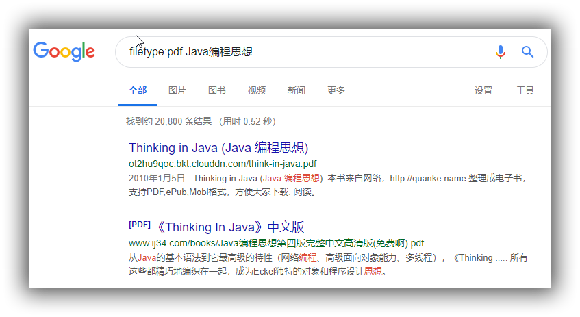

说真的，我喜欢Google的一切！

{:.center}

> 黑客可能利用Google去搜索精准敏感的信息并占为己有；创业者可能利用Google去搜索更有用的商业信息；产品经理可以利用Google去抓住用户的痛点；销售可能利用Google去搜索客服的基本信息；

如果你做过搜索引擎（Apache Lucene）开发，肯定会很熟悉这些语法知识的，搜索引擎语法实质上是由搜索引擎**领域特定语言DSL（Domain Specific** **Language）**所支持的，只是搜索引擎具体语法的实现又对DSL进行了通俗化处理，毕竟使用搜索引擎的不全是程序员；一般来说，每个搜索引擎都有一些它特殊的语法规则，但是大部分语法规则是一样的。

为什么要掌握这些语法规则呢？主要是它能帮助我们**最快最准确**的查找到**最有用**的信息。

### 基础知识

```xml
在搜索词组和短语时，我们用双引号包裹起来；搜索之前，我们需要提炼出你要搜索的关键字，这样便于搜索引擎能够提供更加准确的信息。
说明：特殊字符与搜索关键之间不能有空格。
AND：用于查询包含多个关键字。
+：强制搜索它后面的词语。
注：如果需要查询包含and的词组，只需把该词组用双引号包裹起来，如“"hot and red"”。
NOT: 与AND操作符相反，表示忽略一个词。
-: 与NOT操作符意义一样。
OR：搜索一个或者另外一个关键字。
|: 与OR操作符意义一样。
注：Google对括号并不“感冒”。
```

### 搜索语法

基本语法如下：

```xml
操作符:关键字
```

### 常见操作符

**intitle与allintitle**

intitle主要用于查询**网页顶部显示的文本**；allintitle显示的结果更为准确。如：intitle:当乐网

{:.center}

**allintext**

在网页内容里查询搜索项。如：allintext:"当乐熊"

{:.center}

**inurl与allinurl**

在url中查找关键字。如：inurl:.php?id=

{:.center}

**site**

搜索特定的站点。如：site:www.d.cn

{:.center}

**filetype**

指定搜索的文件类型。如：filetype:pdf Java编程思想

{:.center}

**link**

用于搜索链接到一个网站或者URL的链接。如：link:www.d.cn

**inanchor**

在链接的描述文本中查找文本。inanchor:"忆蓉之心"

**cache**

显示网页的缓存版本。cache:www.d.cn

注：如果cache传递一个无效的URL或者主机名，google会把它当作一个词组来搜索。

**numrange**

查找某一范围内的数字。如：numrange:最小数-最大数

**daterange**

查找某个特定日期范围内发布的网页。如：daterange:儒略历1-儒略历2

注：儒略历计算公式[年(I)，月(J)，日(K)]

```xml
JD=K-32075+1461*(I+4800+ (J-14)/12)/4+367*(J-2-(J-14)/12*12)/12-3*((I+4900+(J-
14)/12)/100)/4
```

**info**

显示google的摘要信息。如果传递一个无效的主机名或者url，google会把它当作一个词组来搜索。如：info:www.d.cn

**related**

显示相关站点。如果传递一个无效的主机名或者URL，google会把它当做一个词组来搜索。如：related:www.qq.cn

**stocks**

搜索股票信息。如：stocks:腾讯

**define**

显示某个术语的定义。如：define:windows

**phonebook**

搜索电话列表（商业和住宅电话列表），如：phonebook:Jim；还有rphonebook专门搜索住宅电话列表，bphonebook搜索商业电话。

### 高级搜索技巧

这些所谓的高级技巧，说白了就是把这些基础的操作符组合在一起快速查找到你想要的内容。因此，我们必须要掌握好这些基础操作符和相应的语法知识，才能打出漂亮的“组合拳”，快速查找到你想要的信息

查找目录与文档，如下：

```xml
intitle:index.of inurl:admin
intitle:index.of ws_ftp.log
intitle:index.of "server at"
intitle:index.of  filetype:bak
inurl:conf or inurl:config or inurl:cfg
filetype:log username
filetype:xls username password email
```

查找后台登录与数据库，如下：

```xml
inurl:/admin/login
allinurl:admin mdb
intitle:"Web Data Administrator - Login"  # MS SQL登录
intitle:"Gateway Configuration Menu" # Oracle
inurl:pls/admin_/gateway.htm # Oracle 登录入口
inurl:"main.php" "phpMyAdmin" "running on" # phpMyAdmin
intitle:index.of config.php
```

### 总结

更多的技巧需要你对Google语法的掌握程度和实际环境来获得。比如大家可以去参考《通过Google挖掘细分市场的一个案例》这篇文章，利用学到Google语法知识尝试者去挖掘出更有意思的东西。