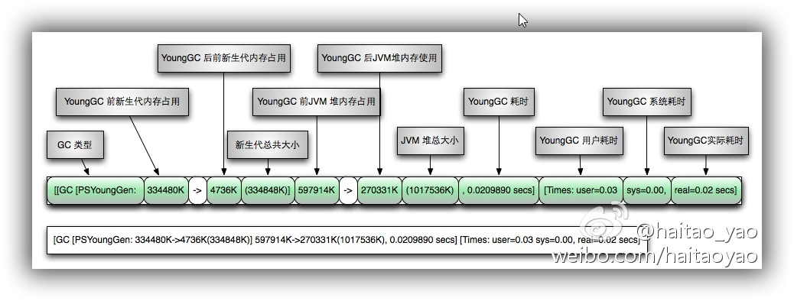
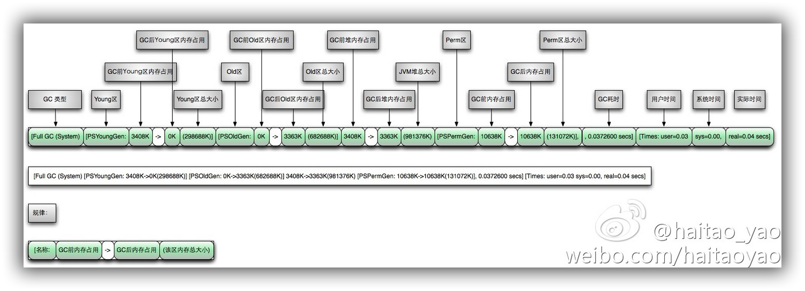

这篇文章记录我学习JVM当中做的一些笔记，比较杂乱，但比较有价值(哈哈，不要脸如我)

write once，run everywhere

- 软件层面机器码翻译
- 内存管理

**程序计数器**：指向当前线程正在执行的字节码指令的地址--行号

为毛需要它？想想CPU，想要去CPU运行，先要得到它的时间片，这是抢占式的，如果没有程序计数器，我下次来的时候，从哪儿开始运行？

**虚拟机栈**：存储当前线程运行方法所需要的数据，指令，返回地址

运行时数据区：方法区+Heap（数据），程序计数器+虚拟机栈+本地方法栈（指令）

怎么理解这个运行时数据区？就想象人喝水，喝的水会转化成水分子blabla。。。Java类变成class文件以后，要被虚拟机加载，当然也是被拆成一块一块的咯

虚拟机栈--》栈帧--》动态链接？这是个什么玩意儿？----类似于运行时多态，private Service service；这个Service的实现类有很多，那运行时方法怎么找，那就看存在这个**动态连接**当中的地址信息了。。。牵强。。

**方法区**：类信息，常量，静态变量，JIT

- 垃圾回收

  为什么要分代？--对象的生命周期不一样嘛

  jvm参数解释   -Xms  -X：表示非官方的  有的还有-XX，什么意思？非稳定的   -XX：-Disableblabla，哪个“-”是什么意思？ false 

  - -Xms20M  只记后面哪个字母  这个s什么意思？  starting
  - -Xmx  “x”：max
  - -Xmn  “n”: new

  命令：jmap -heap 查看虚拟机堆的相关信息

  98%的对象会在minor gc的时候被回收掉

  新生代堆区为什么比例设置为8：1：1，而不是9：1？   这就有讲究了，看上面那句话，我们希望98%的对象在minor gc的时候被干掉，我们的目标就是尽量不让它们进入老年区

  触发一次minor gc的话，就扫描Eden区和s0区，还有存活的就往s1区扔

  对象很大的话，移来移去开销还很大，不如直接把他扔到老年区去，这里面就有个设置了

  长期存活的对象：对象每经历一次gc，年龄+1.到了一个阈值以后就往老年区里面扔

  动态对象年龄判定：相同年龄所有对象的大小总和 > survivor空间的一半

  分配担保：minor gc之前检查 老年代最大可用连续空间是否大于新生代所有对象总空间

  - minor gc
  - major gc
  - full gc

- 引用

  - 强  Object object=new Object()
  - 软 先判断内存空间够不够，不够了的话，不好意思，你就被回收了
  - 弱 我不管 我就要回收你
  - 虚 回收的时候有通知。。。（回来再看）

- 垃圾回收算法

  - 标记清除算法
  - 复制回收算法  比较浪费内存哈，总空出来一个区。。
  - 标记-整理算法

- 垃圾收集器

  - serial：stop the world（stw）很多个应用线程在工作，可能有一个垃圾回收线程管垃圾收集，它跳出来说“我要打扫垃圾了，你们都给我停了”，so。。。适合于young区
  - ParNew：多线程打扫垃圾，多个垃圾清扫线程一起垃圾回收
  - parallel scavenge 它关注的是吞吐量=运行用户代码时间/（运行用户代码时间+垃圾回收时间）
  - CMS 减少回收停顿的时间--用的是标记清除算法
  - serial old CMS的备用方案 CMS失败的时候调用---用的标记整理算法
  - parallel old  标记整理算法

- 炼数成金版本

  - 有哪些虚拟机

    - VMware
    - virtual box
    - JVM

    区别？ 前两者都是使用软件模拟物理CPU的指令集   JVM是模拟Java字节码的指令集

  - 看看发展历史

    - 04年
      - 泛型
      - 注解
      - 装箱
      - 枚举
      - 可变长的参数
      - foreach 循环
    - JDK 1.6
      - 脚本语言支持
      - JDBC 4.0
      - Java编译器API
    - JDK 1.7
      - G1垃圾收集器
      - 动态语言增强
      - 64位系统中的压缩指针
      - NIO2.0
    - JDK8
      - lambda 表达式
      - 语法增强，Java类型注解 

  - Java语言规范  定义了一些使用的字符，哪些字符是合法的，数据类型等等

  - JVM规范

  Java语言规范和JVM规范相对独立

  使用补码的好处是没有歧义的去表示0  处理运算的时候使用补码表示符号位参与运算即可得到准确的结果

  - JVM需要对Java library提供以下支持

    - 反射 java.lang.reflect
    - ClassLoader
    - 初始化class和interface
    - 安全相关 Java.security
    - 多线程
    - 弱引用

  - 方法区

    - 保存装载的类信息

      - 类型的常量池
      - 字段 方法信息
      - 方法字节码

      一般来说，这里面具体存什么，跟虚拟机的版本有关，如JDK1.6的时候String 类型还存在这里，JDK7的时候就迁移到了堆里面，一般意义来讲，这里面主要存类的描述信息，元信息

      - 通常和永久区关联在一起

  - Java栈

    可以理解为由栈帧组成，栈帧当中比较重要的就是局部变量表。。。函数调用组成栈帧

    Java没有寄存器 所有操作数传递使用操作数栈

    **栈上分配：**函数调用完自动清理  小对象（一般几十个bytes，在没有逃逸的情况下，可以直接分配在栈上） 大对象和逃逸对象无法栈上分配

    **堆上分配：**每次需要清理空间

一般认为volatile的性能比锁性能好（不绝对） 使用volatile的条件是；语义是否满足应用

可见性：一个线程修改了变量，其他线程**立即**能够知道

保证可见性的方法：

- volatile
- synchronized （unlock之前，写变量值回主内存）
- final （一旦初始化完成，其他线程就可见）

**解释执行**：读一句执行一句

**编译运行**（JIT）：

- 将字节码编译成机器码
- 直接执行机器码
- 运行时编译
- 编译后性能有数量级的提升

trace跟踪参数：

- -verbose：gc
- -XX:+printGC 都可以打印GC的简要信息
- -XX:+PrintGCDetails   打印GC详细信息
- -XX:PrintGCTimeStamps  打印GC发生的时间戳
- -Xloggc:log/gc.log  指定GC log的位置 以文件输出
- -XX:+PrintHeapAtGC  每一GC后，都打印出堆信息
- -XX:+TraceClassLoading 监控类的加载
- -XX:+PrintClassHistogram   打印类的信息  分别显示：序号、实例数量、总大小、类型
- -Xmx  指定最大堆
- -Xms   指定最小堆
- -Xmn  设置新生代的大小
- -XX:NewRatio   新时代（eden+2*s）和老年代 （不包含永久区）的比值  4表示 新生代：老年代=1：4 即年轻代占堆的1/5
- -XX:SurvivorRatio 设置两个Survivor和Eden的比
- -XX:+HeapDumpOnOutOfMemoryError  OOM时导出堆到文件
- -XX:HeapDumpPath 定义OOM的路径
- -XX:OnOutOfMemory   在OOM的时候，执行一个脚本

总结：根据实际情况调整新生代和幸存代的大小

​	官方推荐新生代占堆的3/8

​	幸存代占新生代的1/10

​	在OOM时，记得Dump出堆，确保可以排查现场问题

- -XX:PermSize   设置永久区的初始空间
- -XX:MaxPermSize   设置永久区的最大空间  

它们表示一个系统可以容纳多少个类型

如果堆空间没有用完也抛出了OOM  有可能是永久区溢出导致的

- Xss  

  > 栈大小分配  通常只有几百K  局部变量  参数分配在栈上

  想让函数多调用几次怎么办？ 要不你就调大栈空间  但是能同时跑的线程就少了  要不你就尽量减少局部变量的次数	

Java中，GC的对象是堆空间和永久区

古老的垃圾回收算法：引用计数法 难处理循环引用  没有被Java采用

标记-清除算法  两个阶段：标记阶段和清除阶段

标记-压缩算法  适合于存活对象较多的场合，如老年代

复制算法  不适合存活对象较多的场合  两块空间完全相同 每次只用一块  在新生代当中使用

根据不同代的特点，选取合适的收集算法：

- 少量对象存活，适合复制算法
- 大量对象存活，适合标记清理或者标记压缩

可触及性：从根节点可以触及到这个对象

可复活的：一旦所有引用被释放，就是可复活状态  在finalize（）当中可能复活该对象  经验：避免使用finalize，操作不慎可能造成错误 它的优先级低，何时被调用，不确定   可以使用try catch finally来替代她

- 什么样的对象可以成为根？
  - 栈中引用的对象
  - 方法区中静态成员或者常量引用的对象（全局对象）
  - JNI方法栈中引用的对象

stop the world：Java中一种全局暂停的现象  所有Java代码停止，native代码可以执行，但不能和JVM交互

它多半是由GC引起的，也有其他原因：

- Dump线程
- 死锁检查
- 堆Dump

stw的危害：长时间服务停止，没有响应    遇到HA系统，可能引起主备切换，严重危害生产环境

串行收集器：最古老  最稳定  效率高  可能会产生较长的停顿

- 用法：-XX:+UseSerialGC  
  - 新生代、老年代使用串行回收
  - 新生代--复制算法
  - 老年代--标记-压缩

并行收集器：ParNew

- 用法：-XX:+UseParNewGC
  - 新生代并行
  - 老年代串行
  - 可以使用 -XX:ParallelGCThreads 限制线程数量

并行收集器：Parallel

- 用法：-XX:+UseParallelGC  ----使用Parallel收集器，老年代依旧串行    -XX:+UseParallelOldGC  ---使用Parallel收集器 +并行老年代
  - 类似ParNew
  - 新生代复制算法
  - 老年代标记-压缩
  - 更加关注吞吐量

-XX:MaxGCPauseMills   最大停顿时间  单位毫秒

-XX:GCTimeRatio 垃圾收集时间占总时间的比  默认99 即允许1%的时间做GC

以上两个参数是矛盾的，不可能同时调优

CMS（concurrent marked Sweep ）收集器  ---并发标记清除   与用户线程一起执行  着重实现了标记的过程

- 停顿时间会变短  但是吞吐量会变小

- 他是个老年代收集器  （新生代使用ParNew）

- 用法：-XX:+UseConcMarkSweepGC

- 运行过程：（可以看出它也并不是完全脱离了停顿，还是有STW的）

  - 初始标记
  - 并发标记（和用户线程一起）
  - 重新标记
  - 并发清除（和用户线程一起）

- 特点

  - 尽可能降低停顿
  - 会影响系统整体吞吐量和性能
  - 清理不彻底
  - 因为和用户线程一起执行 ，不能再空间快满时再清理
    - -XX:CMSInitiatingOccupancyFraction  设置触发GC的阈值
    - 如果不幸内存预留的不够，就会引起concurrent mode failure （使用串行收集器作为后备）

  -XX:+UseCMSCompactAtFullCollection full GC后，进行一次整理  整理过程是独占的，会引起停顿时间变长

  -XX:+CMSFullGCBeforeCompaction	设置进行几次Full GC后，进行一次碎片整理

- **ClassLOader**

class装载验证流程

> 加载
>
> 链接
>
> - 验证
> - 准备  
> - 解析
>
> 初始化  执行类构造器<clinit>  static 变量 赋值语句  static{}语句 子类的<clinit>调用前保证父类的<clinit>先被调用  <clinit>是线程安全的

加载：

- 装载类的第一个阶段
- 取得类的二进制流
- 转为方法区数据结构
- 在Java堆中生成对应的java.lang.class对象

..........

classloader是一个抽象类

classloader可以定制，满足不同的字节码流获取方式，你可以从网络上加载，可以从文件中加载。。。。

classloader负责类装载过程中的加载阶段

- bootstrap classloader
- extension classloader
- app classloader
- custom classloader

自底向上检查类是否已经加载

自顶向下尝试加载类

有个问题，在bootstrap classloader当中可能声明了某个工厂类或者接口，而实现却在app classloader中，要怎么做才能让bootstrap classloader拿到这个实现类的实例对象呢？

解决办法：Thread.setContextClassLoader()  基本思想是，在顶层class loader中传入底层Class loader的实例  他是一个**角色**，上下文ClassLoader可以突破双亲模式带来的局限性

双亲模式是默认的模式，但不是必须这么做

怎么实现一个热替换的功能，就是动态的更新类信息，不用重启JVM，那就需要用到class loader相关的知识了

- 系统性能监控（linux）
  - uptime：
    - 系统时间
    - 运行时间
    - 连接数
    - 一段时间内系统平均负载
  - top：
    - 可以知道哪个程序占CPU最多
  - vmstat
    - 可以统计系统的CPU，内存，swap，和io等情况
  - pidstat（需要安装）sudo apt-get install sysstat
    - 细致观察进程
    - 监控CPU
    - 监控IO
    - 监控内存
    - pidstat -p 2962 -u 1 3 -t  查看进程2962的相关情况，-u查看CPU，1--一秒采样一次，3，采样三次，-t --查看线程

Windows性能监控：

- 工具：process explorer
  - 命令行：pslist

Java自带的工具：

- jps  列出Java进程
- jinfo：用来查看正在运行的Java应用程序的扩展参数，甚至支持在运行时修改部分参数
- jmap：生成Java应用程序的堆快照和对象的统计信息  可以dump堆  用法：jmap -heap pid
- jstack：打印线程信息  
- jConsole：图形化监控工具，监控堆信息，永久区使用情况，类加载情况等
- visual VM：含故障诊断和性能监控的可视化工具

从jstack的输出找出死锁

G1垃圾回收器:。。。

- 如何查看当前的垃圾回收器

  - -XX:+PrintFlagsFinal
  - -XX:+PrintCommondLineFlags
  - server 模式还是client模式
  - MBean

- GC日志

  - 1.输出日志

    - -XX:+PrintGCTimrStamps
    - -XX:PrintGCDetails
    - -Xloggc:/home/data/gc.log
    - -XX:+PrintHeapAtGC

  - 日志文件控制

    - -XX:UseGCLogFileRotation
    - -XX:GCLogFileSize=8K

  - 日志怎么看

    - **YoungGC日志解释如下**：

    

    - **FullGC日志解释如下**：

      

