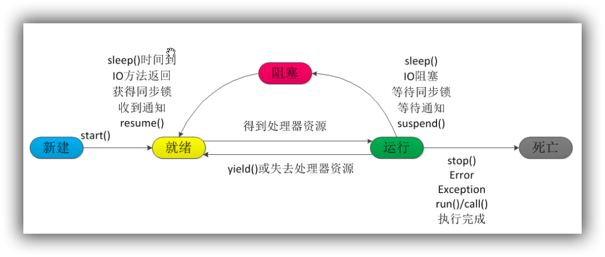
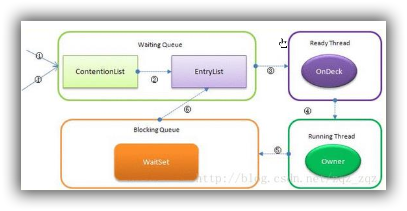

### Java线程的创建方式

- 继承 Thread 类 

Thread 类本质上是实现了 Runnable 接口的一个实例，代表一个线程的实例。 启动线程的唯一方法就是通过 Thread 类的 start()实例方法。 start()方法是一个 native 方法，它将启动一个新线程，并执行 run()方法。 

- 实现 Runnable 接口 

如果自己的类已经 extends 另一个类，就无法直接 extends Thread，此时，可以实现一个Runnable 接口。 

- ExecutorService、 Callable<Class>、 Future 有返回值线程 

有返回值的任务必须实现 Callable 接口，类似的，无返回值的任务必须 Runnable 接口。执行Callable 任务后，可以获取一个 Future 的对象，在该对象上调用 get 就可以获取到 Callable 任务返回的 Object 了，再结合线程池接口 ExecutorService 就可以实现传说中有返回结果的多线程了。 

- 基于线程池的方式 

线程和数据库连接这些资源都是非常宝贵的资源。那么每次需要的时候创建，不需要的时候销毁，是非常浪费资源的。那么我们就可以使用缓存的策略，也就是使用线程池。 

### 4种线程池

Java 里面线程池的顶级接口是 Executor，但是严格意义上讲 Executor 并不是一个线程池，而只是一个执行线程的工具。真正的线程池接口是 ExecutorService 

- newCachedThreadPool 

创建一个可根据需要创建新线程的线程池，但是在以前构造的线程可用时将重用它们。对于执行很多短期异步任务的程序而言，这些线程池通常可提高程序性能。 调用 execute 将重用以前构造的线程（如果线程可用）。如果现有线程没有可用的，则创建一个新线程并添加到池中。终止并从缓存中移除那些已有 60 秒钟未被使用的线程。 因此，长时间保持空闲的线程池不会使用任何资源。 

- newFixedThreadPool 

创建一个可重用固定线程数的线程池，以共享的无界队列方式来运行这些线程。在任意点，在大多数 nThreads 线程会处于处理任务的活动状态。如果在所有线程处于活动状态时提交附加任务，则在有可用线程之前，附加任务将在队列中等待。如果在关闭前的执行期间由于失败而导致任何线程终止，那么一个新线程将代替它执行后续的任务（如果需要）。在某个线程被显式地关闭之前，池中的线程将一直存在。 

- newScheduledThreadPool 

创建一个线程池，它可安排在给定延迟后运行命令或者定期地执行。 

- newSingleThreadExecutor 

Executors.newSingleThreadExecutor()返回一个线程池（这个线程池只有一个线程） ,这个线程池可以在线程死后（或发生异常时）重新启动一个线程来替代原来的线程继续执行下去！ 

### 线程生命周期 

当线程被创建并启动以后，它既不是一启动就进入了执行状态，也不是一直处于执行状态。在线程的生命周期中，它要经过新建(New)、就绪（Runnable）、运行（Running）、阻塞(Blocked)和死亡(Dead)5 种状态。尤其是当线程启动以后，它不可能一直"霸占"着 CPU 独自运行，所以 CPU 需要在多条线程之间切换，于是线程状态也会多次在运行、阻塞之间切换 

- 新建状态（NEW） 

当程序使用 new 关键字创建了一个线程之后，该线程就处于新建状态，此时仅由 JVM 为其分配内存，并初始化其成员变量的值 

- 就绪状态（RUNNABLE） 

当线程对象调用了 start()方法之后，该线程处于就绪状态。 Java 虚拟机会为其创建方法调用栈和程序计数器，等待调度运行。 

- 运行状态（RUNNING） 

如果处于就绪状态的线程获得了 CPU，开始执行 run()方法的线程执行体，则该线程处于运行状态。 

- 阻塞状态（BLOCKED） 

阻塞状态是指线程因为某种原因放弃了 cpu 使用权，也即让出了 cpu timeslice，暂时停止运行。直到线程进入可运行(runnable)状态，才有机会再次获得 cpu timeslice 转到运行(running)状态。阻塞的情况分三种 ：

**等待阻塞（o.wait->等待对列）**：运行(running)的线程执行 o.wait()方法， JVM 会把该线程放入等待队列(waitting queue)中。 

**同步阻塞(lock->锁池)** ：运行(running)的线程在获取对象的同步锁时，若该同步锁被别的线程占用，则 JVM 会把该线程放入锁池(lock pool)中。

**其他阻塞(sleep/join)**  ：运行(running)的线程执行 Thread.sleep(long ms)或 t.join()方法，或者发出了 I/O 请求时，JVM 会把该线程置为阻塞状态。当 sleep()状态超时、 join()等待线程终止或者超时、或者 I/O处理完毕时，线程重新转入可运行(runnable)状态。 

- 线程死亡（DEAD） 

线程会以下面三种方式结束，结束后就是死亡状态。 

1.正常结束 ：run()或 call()方法执行完成，线程正常结束。 

2.异常结束 ：线程抛出一个未捕获的 Exception 或 Error。 

3.调用 stop ：直接调用该线程的 stop()方法来结束该线程—该方法通常容易导致死锁，不推荐使用。 



### 终止线程的4种方式

- 正常运行结束 

程序运行结束，线程自动结束。 

- 使用退出标志退出线程 

一般 run()方法执行完，线程就会正常结束，然而，常常有些线程是伺服线程。它们需要长时间的运行，只有在外部某些条件满足的情况下，才能关闭这些线程。使用一个变量来控制循环，例如：最直接的方法就是设一个 boolean 类型的标志，并通过设置这个标志为 true 或 false 来控制 while循环是否退出，代码示例 ：

```java
public class ThreadSafe extends Thread {
    public volatile boolean exit = false;
    public void run() {
        while (!exit){
//do something
        }
    }
}
```

定义了一个退出标志 exit，当 exit 为 true 时， while 循环退出， exit 的默认值为 false.在定义 exit时，使用了一个 Java 关键字 volatile，这个关键字的目的是使 exit 同步，也就是说在同一时刻只能由一个线程来修改 exit 的值。 

- Interrupt 方法结束线程 

使用 interrupt()方法来中断线程有两种情况： 

1.线程处于阻塞状态： 如使用了 sleep,同步锁的 wait,socket 中的 receiver,accept 等方法时，会使线程处于阻塞状态。当调用线程的 interrupt()方法时，会抛出 InterruptException 异常。阻塞中的那个方法抛出这个异常，通过代码捕获该异常，然后 break 跳出循环状态，从而让我们有机会结束这个线程的执行。 通常很多人认为只要调用 interrupt 方法线程就会结束，实际上是错的， 一定要先捕获 InterruptedException 异常之后通过 break 来跳出循环，才能正常结束 run 方法。 

2.线程未处于阻塞状态： 使用 isInterrupted()判断线程的中断标志来退出循环。当使用interrupt()方法时，中断标志就会置 true，和使用自定义的标志来控制循环是一样的道理 

```java
public class ThreadSafe extends Thread {
        public void run() {
        while (!isInterrupted()){ //非阻塞过程中通过判断中断标志来退出
            try{
                Thread.sleep(5*1000);//阻塞过程捕获中断异常来退出
            }catch(InterruptedException e){
                e.printStackTrace();
                break;//捕获到异常之后，执行 break 跳出循环
            }
        }
    }
}
```

- stop 方法终止线程（线程不安全） 

程序中可以直接使用 thread.stop()来强行终止线程，但是 stop 方法是很危险的，就象突然关闭计算机电源，而不是按正常程序关机一样，可能会产生不可预料的结果，不安全主要是：thread.stop()调用之后，创建子线程的线程就会抛出 ThreadDeatherror 的错误，并且会释放子线程所持有的所有锁。一般任何进行加锁的代码块，都是为了保护数据的一致性，如果在调用thread.stop()后导致了该线程所持有的所有锁的突然释放(不可控制)，那么被保护数据就有可能呈现不一致性，其他线程在使用这些被破坏的数据时，有可能导致一些很奇怪的应用程序错误。因
此，并不推荐使用 stop 方法来终止线程。 

### sleep 与 wait 区别 

1. 对于 sleep()方法，我们首先要知道该方法是属于 Thread 类中的。而 wait()方法，则是属于Object 类中的 
2. sleep()方法导致了程序暂停执行指定的时间，让出 cpu 该其他线程，但是他的监控状态依然保持着，当指定的时间到了又会自动恢复运行状态。 
3. 在调用 sleep()方法的过程中， 线程不会释放对象锁 
4. 而当调用 wait()方法的时候，线程会放弃对象锁，进入等待此对象的等待锁定池，只有针对此对象调用 notify()方法后本线程才进入对象锁定池准备获取对象锁进入运行状态。 

### start 与 run 区别 

1. start（） 方法来启动线程，真正实现了多线程运行。这时无需等待 run 方法体代码执行完毕，可以直接继续执行下面的代码。 
2. 通过调用 Thread 类的 start()方法来启动一个线程， 这时此线程是处于就绪状态， 并没有运行。
3. 方法 run()称为线程体，它包含了要执行的这个线程的内容，线程就进入了运行状态，开始运行 run 函数当中的代码。 Run 方法运行结束， 此线程终止。然后 CPU 再调度其它线程。  

### Java后台线程

1. **定义**：守护线程--也称“服务线程”， 他是后台线程， 它有一个特性，即为用户线程 提供公共服务， 在没有用户线程可服务时会自动离开。 
2. **优先级**：守护线程的优先级比较低，用于为系统中的其它对象和线程提供服务 
3. **设置**：通过 setDaemon(true)来设置线程为“守护线程”；将一个用户线程设置为守护线程的方式是在 线程对象创建之前用线程对象的 setDaemon 方法 
4. 在 Daemon 线程中产生的新线程也是 Daemon 的。 
5. 线程则是 JVM 级别的，以 Tomcat 为例，如果你在 Web 应用中启动一个线程，这个线程的生命周期并不会和 Web 应用程序保持同步。也就是说，即使你停止了 Web 应用，这个线程依旧是活跃的。 
6. **example**: 垃圾回收线程就是一个经典的守护线程，当我们的程序中不再有任何运行的Thread,程序就不会再产生垃圾，垃圾回收器也就无事可做， 所以当垃圾回收线程是 JVM 上仅剩的线程时，垃圾回收线程会自动离开。它始终在低级别的状态中运行，用于实时监控和管理系统中的可回收资源 
7. **生命周期**：守护进程（Daemon）是运行在后台的一种特殊进程。它独立于控制终端并且周期性地执行某种任务或等待处理某些发生的事件。也就是说守护线程不依赖于终端，但是依赖于系统，与系统“同生共死”。当 JVM 中所有的线程都是守护线程的时候， JVM 就可以退出了；如果还有一个或以上的非守护线程则 JVM 不会退出。 

### Java锁

- 乐观锁 

乐观锁是一种乐观思想，即认为读多写少，遇到并发写的可能性低，每次去拿数据的时候都认为别人不会修改，所以不会上锁，但是在更新的时候会判断一下在此期间别人有没有去更新这个数据，采取在写时先读出当前版本号，然后加锁操作（比较跟上一次的版本号，如果一样则更新），如果失败则要重复读-比较-写的操作。

java 中的乐观锁基本都是通过 CAS 操作实现的， CAS 是一种更新的原子操作， 比较当前值跟传入值是否一样，一样则更新，否则失败。 

- 悲观锁

悲观锁是就是悲观思想，即认为写多，遇到并发写的可能性高，每次去拿数据的时候都认为别人会修改，所以每次在读写数据的时候都会上锁，这样别人想读写这个数据就会 block 直到拿到锁。java中的悲观锁就是Synchronized,AQS框架下的锁则是先尝试cas乐观锁去获取锁，获取不到，才会转换为悲观锁，如 RetreenLock。 

- 自旋锁 

自旋锁原理非常简单， 如果持有锁的线程能在很短时间内释放锁资源，那么那些等待竞争锁的线程就不需要做内核态和用户态之间的切换进入阻塞挂起状态，它们只需要等一等（自旋），等持有锁的线程释放锁后即可立即获取锁，这样就避免用户线程和内核的切换的消耗。 

线程自旋是需要消耗 cpu 的，说白了就是让 cpu 在做无用功，如果一直获取不到锁，那线程也不能一直占用 cpu 自旋做无用功，所以需要设定一个自旋等待的最大时间。 

如果持有锁的线程执行的时间超过自旋等待的最大时间扔没有释放锁，就会导致其它争用锁的线程在最大等待时间内还是获取不到锁，这时争用线程会停止自旋进入阻塞状态。 

**自旋锁的优缺点** ：

自旋锁尽可能的减少线程的阻塞，这对于锁的竞争不激烈，且占用锁时间非常短的代码块来说性能能大幅度的提升，因为自旋的消耗会小于线程阻塞挂起再唤醒的操作的消耗，这些操作会导致线程发生两次上下文切换！ 

但是如果锁的竞争激烈，或者持有锁的线程需要长时间占用锁执行同步块，这时候就不适合使用自旋锁了，因为自旋锁在获取锁前一直都是占用 cpu 做无用功，占着 XX 不 XX，同时有大量线程在竞争一个锁，会导致获取锁的时间很长，线程自旋的消耗大于线程阻塞挂起操作的消耗，其它需要 cpu 的线程又不能获取到 cpu，造成 cpu 的浪费。所以这种情况下我们要关闭自旋锁； 

**自旋锁时间阈值（1.6 引入了适应性自旋锁）** 

自旋锁的目的是为了占着 CPU 的资源不释放，等到获取到锁立即进行处理。但是如何去选择自旋的执行时间呢？如果自旋执行时间太长，会有大量的线程处于自旋状态占用 CPU 资源，进而会影响整体系统的性能。因此自旋的周期选的额外重要！ 

JVM 对于自旋周期的选择， jdk1.5 这个限度是一定的写死的， 在 1.6 引入了适应性自旋锁，适应性自旋锁意味着自旋的时间不在是固定的了，而是由前一次在同一个锁上的自旋时间以及锁的拥有者的状态来决定，基本认为一个线程上下文切换的时间是最佳的一个时间，同时 JVM 还针对当前 CPU 的负荷情况做了较多的优化， 如果平均负载小于 CPUs 则一直自旋， 如果有超过(CPUs/2)个线程正在自旋，则后来线程直接阻塞， 如果正在自旋的线程发现 Owner 发生了变化则延迟自旋时间（自旋计数）或进入阻塞， 如果 CPU 处于节电模式则停止自旋， 自旋时间的最坏情况是 CPU的存储延迟（CPU A 存储了一个数据，到 CPU B 得知这个数据直接的时间差） ， 自旋时会适当放弃线程优先级之间的差异。 

**自旋锁的开启**
JDK1.6 中-XX:+UseSpinning 开启；
-XX:PreBlockSpin=10 为自旋次数；
JDK1.7 后，去掉此参数，由 jvm 控制； 

- Synchronized 同步锁 

synchronized 它可以把任意一个非 NULL 的对象当作锁。 他属于独占式的悲观锁，同时属于可重入锁。 

**Synchronized 作用范围** 

1. 作用于方法时，锁住的是对象的实例(this)；
2. 当作用于静态方法时，锁住的是Class实例，又因为Class的相关数据存储在永久带PermGen（jdk1.8 则是 metaspace），永久代是全局共享的，因此静态方法锁相当于类的一个全局锁，会锁所有调用该方法的线程；
3. synchronized 作用于一个对象实例时，锁住的是所有以该对象为锁的代码块。 它有多个队列，当多个线程一起访问某个对象监视器的时候，对象监视器会将这些线程存储在不同的容器中。 

**Synchronized 核心组件** 

1)  Wait Set：调用 wait 方法被阻塞的线程被放置在这里；
2)  Contention List： 竞争队列，所有请求锁的线程首先被放在这个竞争队列中；
3)  Entry List： Contention List 中那些有资格成为候选资源的线程被移动到 Entry List 中；
4)  OnDeck：任意时刻， 最多只有一个线程正在竞争锁资源，该线程被成为 OnDeck；
5)  Owner：当前已经获取到所资源的线程被称为 Owner；
6)  !Owner：当前释放锁的线程。



1. JVM 每次从队列的尾部取出一个数据用于锁竞争候选者（OnDeck），但是并发情况下，ContentionList 会被大量的并发线程进行 CAS 访问，为了降低对尾部元素的竞争， JVM 会将一部分线程移动到 EntryList 中作为候选竞争线程。

2. Owner 线程会在 unlock 时，将 ContentionList 中的部分线程迁移到 EntryList 中，并指定EntryList 中的某个线程为 OnDeck 线程（一般是最先进去的那个线程）。

3. Owner 线程并不直接把锁传递给 OnDeck 线程，而是把锁竞争的权利交给 OnDeck，OnDeck 需要重新竞争锁。这样虽然牺牲了一些公平性，但是能极大的提升系统的吞吐量，在JVM 中，也把这种选择行为称之为“竞争切换”。

4. OnDeck 线程获取到锁资源后会变为 Owner 线程，而没有得到锁资源的仍然停留在 EntryList中。如果Owner 线程被 wait 方法阻塞，则转移到 WaitSet 队列中，直到某个时刻通过 notify或者 notifyAll 唤醒，会重新进去 EntryList 中。

5. 处于 ContentionList、 EntryList、 WaitSet 中的线程都处于阻塞状态，该阻塞是由操作系统来完成的（Linux 内核下采用 pthread_mutex_lock 内核函数实现的）。

6. Synchronized 是非公平锁。 Synchronized 在线程进入 ContentionList 时， 等待的线程会先尝试自旋获取锁，如果获取不到就进入 ContentionList，这明显对于已经进入队列的线程是不公平的，还有一个不公平的事情就是自旋获取锁的线程还可能直接抢占 OnDeck 线程的锁资源。
  参考： https://blog.csdn.net/zqz_zqz/article/details/70233767

7. 每个对象都有个 monitor 对象， 加锁就是在竞争 monitor 对象，代码块加锁是在前后分别加上monitorenter 和 monitorexit 指令来实现的，方法加锁是通过一个标记位来判断的

8. synchronized 是一个重量级操作，需要调用操作系统相关接口，性能是低效的，有可能给线程加锁消耗的时间比有用操作消耗的时间更多。

9. Java1.6， synchronized 进行了很多的优化， 有适应自旋、锁消除、锁粗化、轻量级锁及偏向锁等，效率有了本质上的提高。在之后推出的 Java1.7 与 1.8 中，均对该关键字的实现机理做了优化。引入了偏向锁和轻量级锁。都是在对象头中有标记位，不需要经过操作系统加锁。

10. 锁可以从偏向锁升级到轻量级锁，再升级到重量级锁。这种升级过程叫做锁膨胀；

11. JDK 1.6 中默认是开启偏向锁和轻量级锁，可以通过-XX:-UseBiasedLocking 来禁用偏向锁。

- ReentrantLock 

ReentantLock 继承接口 Lock 并实现了接口中定义的方法， 他是一种可重入锁， 除了能完成 synchronized 所能完成的所有工作外，还提供了诸如**可响应中断锁、可轮询锁请求、定时锁等避免多线程死锁的方法** 

**Lock 接口的主要方法**

1. void lock(): 执行此方法时, 如果锁处于空闲状态, 当前线程将获取到锁. 相反, 如果锁已经被其他线程持有, 将禁用当前线程, 直到当前线程获取到锁.
2. boolean tryLock()： 如果锁可用, 则获取锁, 并立即返回 true, 否则返回 false. 该方法和lock()的区别在于,tryLock()只是"试图"获取锁, 如果锁不可用, 不会导致当前线程被禁用,当前线程仍然继续往下执行代码. 而 lock()方法则是一定要获取到锁, 如果锁不可用, 就一直等待, 在未获得锁之前,当前线程并不继续向下执行.
3. void unlock()：执行此方法时, 当前线程将释放持有的锁. 锁只能由持有者释放, 如果线程并不持有锁, 却执行该方法, 可能导致异常的发生.
4. Condition newCondition()： 条件对象，获取等待通知组件。该组件和当前的锁绑定，当前线程只有获取了锁，才能调用该组件的 await()方法，而调用后，当前线程将缩放锁。
5. getHoldCount() ： 查询当前线程保持此锁的次数，也就是执行此线程执行 lock 方法的次数。
6. getQueueLength（） ： 返回正等待获取此锁的线程估计数，比如启动 10 个线程， 1 个线程获得锁，此时返回的是 9
7. getWaitQueueLength： （Condition condition）返回等待与此锁相关的给定条件的线程估计数。比如 10 个线程，用同一个 condition 对象，并且此时这 10 个线程都执行了condition 对象的 await 方法，那么此时执行此方法返回 10
8. hasWaiters(Condition condition)： 查询是否有线程等待与此锁有关的给定条件(condition)，对于指定contidion 对象，有多少线程执行了 condition.await 方法
9. hasQueuedThread(Thread thread)： 查询给定线程是否等待获取此锁
10. hasQueuedThreads()： 是否有线程等待此锁
11. isFair()： 该锁是否公平锁
12. isHeldByCurrentThread()： 当前线程是否保持锁锁定，线程的执行 lock 方法的前后分别是 false 和 true
13. isLock()： 此锁是否有任意线程占用
14. lockInterruptibly（） ： 如果当前线程未被中断，获取锁
15. tryLock（） ： 尝试获得锁，仅在调用时锁未被线程占用，获得锁
16. tryLock(long timeout TimeUnit unit)： 如果锁在给定等待时间内没有被另一个线程保持，则获取该锁。 

