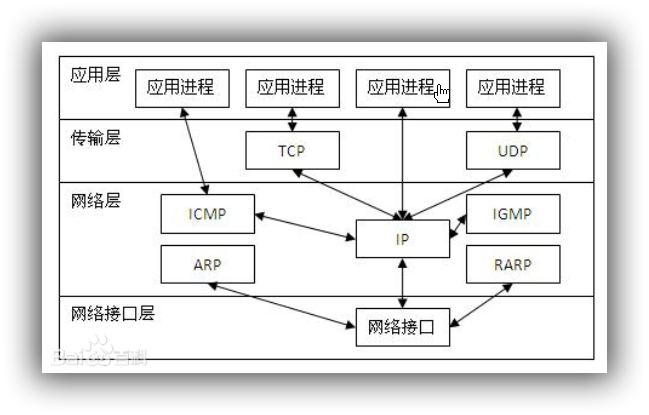

#### 概述

TCP/IP 协议不是 TCP 和 IP 这两个协议的合称，而是指因特网整个 TCP/IP 协议族。从协议分层模型方面来讲， **TCP/IP 由四个层次组成：网络接口层、网络层、传输层、应用层**。 

{:.center}

#### 网络访问层

网络访问层(Network Access Layer)在 TCP/IP 参考模型中并没有详细描述， **只是指出主机必须使用某种协议与网络相连**。 

#### 网络层 

网络层(Internet Layer)是整个体系结构的关键部分，其功能是使主机可以把分组发往任何网络，并使分组独立地传向目标。这些分组可能经由不同的网络，到达的顺序和发送的顺序也可能不同。高层如果需要顺序收发，那么就必须自行处理对分组的排序。 **互联网层使用因特网协议(IP， Internet Protocol)**。 

#### 传输层 

传输层(Tramsport Layer)使源端和目的端机器上的对等实体可以进行会话。 **在这一层定义了两个端到端的协议**：传输控制协议(**TCP**， Transmission Control Protocol)和用户数据报协议(**UDP**， User Datagram Protocol)。 TCP 是面向连接的协议，它提供可靠的报文传输和对上层应用的连接服务。为此，除了基本的数据传输外，它还有可靠性保证、流量控制、多路复用、优先权和安全性控制等功能。 UDP 是面向无连接的不可靠传输的协议，主要用于不需要 TCP 的排序和流量控制等功能的应用程序。 

#### 应用层 

应用层(Application Layer)包含所有的高层协议，包括： **虚拟终端协议(TELNET，TELecommunications NETwork)、文件传输协议(FTP， File Transfer Protocol)、电子邮件传输协议(SMTP， Simple Mail Transfer Protocol)、域名服务(DNS， Domain Name Service)、网上新闻传输协议(NNTP， Net News Transfer Protocol)和超文本传送协议(HTTP， HyperText Transfer Protocol)等**。 