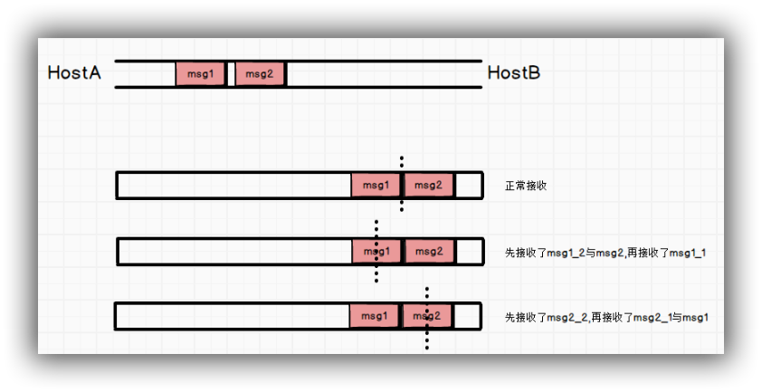

### 简介

TCP是个流协议，它存在粘包问题，TCP是一个基于字节流的传输服务，"流"意味着TCP所传输的数据是没有边界的。这不同于UDP提供基于消息的传输服务，其传输的数据是有边界的。TCP的发送方无法保证对等方每次接收到的是一个完整的数据包。主机A向主机B发送两个数据包，主机B的接收情况可能是：

{:.center}

产生粘包问题的原因有以下几个：

- 第一 。应用层调用write方法，将应用层的缓冲区中的数据拷贝到套接字的发送缓冲区。而发送缓冲区有一个SO_SNDBUF的限制，如果应用层的缓冲区数据大小大于套接字发送缓冲区的大小，则数据需要进行多次的发送。
- 第二种情况是，TCP所传输的报文段有MSS的限制，如果套接字缓冲区的大小大于MSS，也会导致消息的分割发送。
- 第三种情况由于链路层最大发送单元MTU，在IP层会进行数据的分片。

这些情况都会导致一个完整的应用层数据被分割成多次发送，导致接收对等方不是按完整数据包的方式来接收数据。

**粘包的问题的解决思路**：

**粘包问题的最本质原因在与接收对等方无法分辨消息与消息之间的边界在哪**。我们通过使用某种方案给出边界，例如：

- 发送定长包。如果每个消息的大小都是一样的，那么在接收对等方只要累计接收数据，直到数据等于一个定长的数值就将它作为一个消息。
- 包尾加上\r\n标记。FTP协议正是这么做的。但问题在于如果数据正文中也含有\r\n，则会误判为消息的边界。
- 包头加上包体长度。包头是定长的4个字节，说明了包体的长度。接收对等方先接收包体长度，依据包体长度来接收包体。
- 使用更加复杂的应用层协议。

### 典型的几个解决方案简要描述

**一、使用定长包**

这里需要封装两个函数：

```c
ssize_t readn(int fd, void *buf, size_t count)
ssize_t writen(int fd, void *buf, size_t count)
```

这两个函数的参数列表和返回值与`read`、`write`一致。它们的作用的读取/写入count个字节后再返回。

有了这两个函数之后，我们就可以使用定长包来发送数据了

```c
char readbuf[512];
readn(conn,readbuf,sizeof(readbuf));  //每次读取512个字节
```

同理的，写入的时候也写入512个字节

```c
char writebuf[512];
 fgets(writebuf,sizeof(writebuf),stdin);
 writen(conn,writebuf,sizeof(writebuf);
```

每个消息都以固定的512字节（或其他数字，看你的应用层的缓冲区大小）来发送，以此区分每一个信息，这便是以固定长度解决粘包问题的思路。定长包解决方案的缺点在于会导致增加网络的负担，无论每次发送的有效数据是多大，都得按照定长的数据长度进行发送。

**二、使用结构体，显式说明数据部分的长度**

在这个方案中，我们需要定义一个‘struct packet’包结构，结构中指明数据部分的长度，用四个字节来表示。发送端的对等方接收报文时，先读取前四个字节，获取数据的长度，由长度来进行数据的读取。定义一个结构体。

```c
struct packet
{
        unsigned int msgLen ;  //4个字节字段，说明数据部分的大小
        char data[512] ;  //数据部分 
}
```

读写过程省略。

**三、按行读取**

ftp协议采用/r/n来识别一个消息的边界，我们在这里实现一个按行读取的功能，该功能能够按/n来识别消息的边界。这里介绍一个函数：

```c
 ssize_t recv(int sockfd, void *buf, size_t len, int flags);
```

与read函数相比，recv函数的区别在于两点：

1. recv函数**只能**够用于套接口IO。
2. recv函数含有flags参数，可以指定一些选项。

recv函数的flags参数常用的选项是：

1. MSG_OOB 接收带外数据，即通过紧急指针发送的数据
2. MSG_PEEK 从缓冲区中读取数据，但并不从缓冲区中清除所读数据

为了实现按行读取，我们需要使用recv函数的MSG_PEEK选项。PEEK的意思是"偷看"，我们可以理解为窥视，看看socket的缓冲区内是否有某种内容，而清除缓冲区。

### 其他描述

具体方案由使用的场景决定，即分为：实时性要求高和实时性要求不高，这两种情况。

**一、对于实时性要求高的场景：**

关闭Nagle算法（TCP_NODELAY）和Crok算法（TCP_CROK）。以Linux为例，这两个算法可以参考一下           tcp_output.c的实现。

具体是通过设置TCP_NODELAY和TCP_CROK来实现的。

（1）如果包长度已经到达MSS，则直接允许发送。

（2）如果该包含有了FIN，则允许发送。

（3）TCP_NODELAY:如果不设置，则会延时确认ACK，从而达到积攒小包的效果。

（4）TCP_CROK:CROK意思为塞子，如果设置，则会将发送端堵住，一直到超时或者这些包已经拼凑成超过MSS长度的包。

 **二、对于实时性要求不高的场景：**

（1）约定结束标志。

（2）设置控制结构。

（3）每次发一个包，等待其超时（利用超时会立即发的特点）。

扩展：

```xml
Nagle算法是通过设置确认ACK的时延来实现的。
Crok算法则是通过积攒拼凑要发送的包，直至达到预先设定的MSS长度。
```


### 参考文章

https://www.cnblogs.com/QG-whz/p/5537447.html