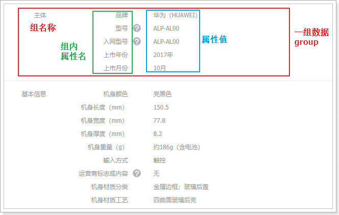
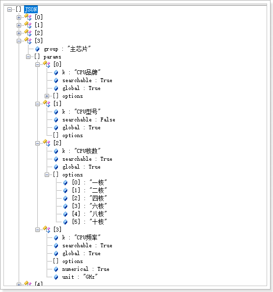
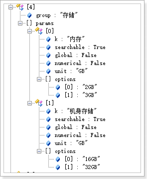
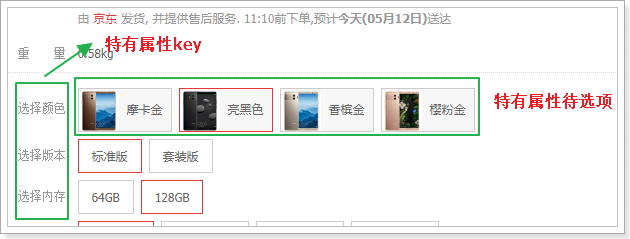

## SPU和SKU

SPU：Standard Product Unit （标准产品单位） ，一组具有共同属性的商品集

SKU：Stock Keeping Unit（库存量单位），SPU商品集因具体特性不同而细分的每个商品

以图为例来看：

{:.center}

- 本页的 华为Mate10 就是一个商品集（SPU）
- 因为颜色、内存等不同，而细分出不同的Mate10，如亮黑色128G版。（SKU）

可以看出：

- SPU是一个抽象的商品集概念，为了方便后台的管理。
- SKU才是具体要销售的商品，每一个SKU的价格、库存可能会不一样，用户购买的是SKU而不是SPU

## 数据库设计分析

### 思考并发现问题

弄清楚了SPU和SKU的概念区分，接下来我们一起思考一下该如何设计数据库表。

首先来看SPU，大家一起思考下SPU应该有哪些字段来描述？

```
id:主键
title：标题
description：描述
specification：规格
packaging_list：包装
after_service：售后服务
comment：评价
category_id：商品分类
brand_id：品牌
```

似乎并不复杂，但是大家仔细思考一下，商品的规格字段你如何填写？

 {:.center}

不同商品的规格不一定相同，数据库中要如何保存？

再看下SKU，大家觉得应该有什么字段？

```
id：主键
spu_id：关联的spu
price：价格
images：图片
stock：库存
颜色？
内存？
硬盘？
```

碰到难题了，不同的商品分类，可能属性是不一样的，比如手机有内存，衣服有尺码，全品类的电商网站，这些不同的商品的不同属性，如何设计到一张表中？

### 分析规格参数

仔细查看每一种商品的规格你会发现：

虽然商品规格千变万化，但是同一类商品（如手机）的规格是统一的，有图为证：

> 华为的规格：

 {:.center}


> 三星的规格：

 {:.center}


也就是说，商品的规格参数应该是与分类绑定的。**每一个分类都有统一的规格参数模板，但不同商品其参数值可能不同**。

如下图所示：

 {:.center}

### SKU的特有属性

SPU中会有一些特殊属性，用来区分不同的SKU，我们称为SKU特有属性。如华为META10的颜色、内存属性。

不同种类的商品，一个手机，一个衣服，其SKU属性不相同。

同一种类的商品，比如都是衣服，SKU属性基本是一样的，都是颜色、尺码等。

这样说起来，似乎SKU的特有属性也是与分类相关的？事实上，仔细观察你会发现，**SKU的特有属性是商品规格参数的一部分**：

{:.center}


也就是说，我们没必要单独对SKU的特有属性进行设计，它可以看做是规格参数中的一部分。这样规格参数中的属性可以标记成两部分：

- 所有sku共享的规格属性（称为全局属性）
- 每个sku不同的规格属性（称为特有属性）

{:.center}


### 搜索属性

打开一个搜索页，我们来看看过滤的条件：

{:.center}

你会发现，过滤条件中的屏幕尺寸、运行内存、网路、机身内存、电池容量、CPU核数等，在规格参数中都能找到：

 {:.center}

也就是说，规格参数中的数据，将来会有一部分作为搜索条件来使用。我们可以在设计时，将这部分属性标记出来，将来做搜索的时候，作为过滤条件。要注意的是，无论是SPU的全局属性，还是SKU的特有属性，都有可能作为搜索过滤条件的，并不冲突，而是有一个交集：

 {:.center}


## 规格参数表

### 表结构

先看下规格参数表：

```mysql
CREATE TABLE `tb_specification` (
  `category_id` bigint(20) NOT NULL COMMENT '规格模板所属商品分类id',
  `specifications` varchar(3000) NOT NULL DEFAULT '' COMMENT '规格参数模板，json格式',
  PRIMARY KEY (`category_id`)
) ENGINE=InnoDB DEFAULT CHARSET=utf8 COMMENT='商品规格参数模板，json格式。';
```

很奇怪是吧，只有两个字段。特别需要注意的是第二个字段：

- specificatons：规格参数模板，json格式

为什么是一个json？我们看下规格参数的格式：

{:.center}

如果按照传统数据库设计，这里至少需要3张表：

- group：代表组，与商品分类关联
- param_key：属性名，与组关联，一对多
- param_value：属性备选值，与属性名关联，一对多

这样程序的复杂度大大增加，但是提高了数据的复用性。

这里的解决方案是，采用json来保存整个规格参数模板，不需要额外的表，一个字符串就够了。

### json结构分析

> 先整体看一下：

 {:.center}

- 因为规格参数分为很多组，所以json最外层是一个数组。
- 数组中是对象类型，每个对象代表一个组的数据，对象的属性包括：
  - group：组的名称
  - params：该组的所有属性

> 接下来是params：

 {:.center}

以`主芯片`这一组为例：

- group：注明，这里是主芯片
- params：该组的所有规格属性，因为不止一个，所以是一个数组。这里包含四个规格属性：CPU品牌，CPU型号，CPU频率，CPU核数。每个规格属性都是一个对象，包含以下信息：
  - k：属性名称
  - searchable：是否作为搜索字段，将来在搜索页面使用，boolean类型
  - global：是否是SPU全局属性，boolean类型。true为全局属性，false为SKU的特有属性
  - options：属性值的可选项，数组结构。起约束作用，不允许填写可选项以外的值，比如CPU核数，有人添10000核岂不是很扯淡
  - numerical：是否为数值，boolean类型，true则为数值，false则不是。为空也代表非数值
  - unit：单位，如：克，毫米。如果是数值类型，那么就需要有单位，否则可以不填。

上面的截图中所有属性都是全局属性，我们来看看内存，应该是特有属性：

  {:.center}


总结下：

- 规格参数分组，每组有多个参数
- 参数的 `k`代表属性名称，没有值，具体的SPU才能确定值
- 参数会有不同的属性：是否可搜索，是否是全局、是否是数值，这些都用boolean值进行标记：
  - SPU下的多个SKU共享的参数称为全局属性，用`global`标记
  - SPU下的多个SKU特有的参数称为特有属性
  - 如果参数是数值类型，用`numerical`标记，并且指定单位`unit`
  - 如果参数可搜索，用`searchable`标记

# SPU和SKU数据结构

规格确定以后，就可以添加商品了,先看下数据库表

## SPU表

### 表结构

SPU表：

```mysql
CREATE TABLE `tb_spu` (
  `id` bigint(20) NOT NULL AUTO_INCREMENT COMMENT 'spu id',
  `title` varchar(255) NOT NULL DEFAULT '' COMMENT '标题',
  `sub_title` varchar(255) DEFAULT '' COMMENT '子标题',
  `cid1` bigint(20) NOT NULL COMMENT '1级类目id',
  `cid2` bigint(20) NOT NULL COMMENT '2级类目id',
  `cid3` bigint(20) NOT NULL COMMENT '3级类目id',
  `brand_id` bigint(20) NOT NULL COMMENT '商品所属品牌id',
  `saleable` tinyint(1) NOT NULL DEFAULT '1' COMMENT '是否上架，0下架，1上架',
  `valid` tinyint(1) NOT NULL DEFAULT '1' COMMENT '是否有效，0已删除，1有效',
  `create_time` datetime DEFAULT NULL COMMENT '添加时间',
  `last_update_time` datetime DEFAULT NULL COMMENT '最后修改时间',
  PRIMARY KEY (`id`)
) ENGINE=InnoDB AUTO_INCREMENT=208 DEFAULT CHARSET=utf8 COMMENT='spu表，该表描述的是一个抽象的商品，比如 iphone8';
```

与我们前面分析的基本类似，但是似乎少了一些字段，比如商品描述。

我们做了表的垂直拆分，将SPU的详情放到了另一张表：tb_spu_detail

```mysql
CREATE TABLE `tb_spu_detail` (
  `spu_id` bigint(20) NOT NULL,
  `description` text COMMENT '商品描述信息',
  `specifications` varchar(3000) NOT NULL DEFAULT '' COMMENT '全部规格参数数据',
  `spec_template` varchar(1000) NOT NULL COMMENT '特有规格参数及可选值信息，json格式',
  `packing_list` varchar(1000) DEFAULT '' COMMENT '包装清单',
  `after_service` varchar(1000) DEFAULT '' COMMENT '售后服务',
  PRIMARY KEY (`spu_id`)
) ENGINE=InnoDB DEFAULT CHARSET=utf8;

```

这张表中的数据都比较大，为了不影响主表的查询效率我们拆分出这张表。

需要注意的是这两个字段：specifications和spec_template。

### spu中的规格参数

前面讲过规格参数与商品分类绑定，一个分类下的所有SPU具有类似的规格参数。SPU下的SKU可能会有不同的规格参数，因此我们计划是这样：

- SPU中保存全局的规格参数信息。
- SKU中保存特有规格参数。

以手机为例，品牌、操作系统等肯定是全局属性，内存、颜色等肯定是特有属性。

当你确定了一个SPU，比如小米的：红米4X

全局属性举例：

```
品牌：小米
型号：红米4X
```

特有属性举例：

```
颜色：[香槟金, 樱花粉, 磨砂黑]
内存：[2G, 3G]
机身存储：[16GB, 32GB]
```

来看下我们的 表如何存储这些信息：

#### specifications字段

首先是specifications，其中保存全部规格参数信息，因此也是一个json格式：

> 整体来看：

 {:.center}

整体看上去与规格参数表中的数据一样，也是一个数组，并且分组，每组下有多个参数

> 展开一组来看

 {:.center}

可以看到，与规格参数表中的模板相比，最大的区别就是，这里指定了具体的值，因为商品确定了，其参数值肯定也确定了。

> 特有属性

刚才看到的是全局属性，那么特有属性在这个字段中如何存储呢？

 {:.center}

我们发现特有属性也是有的，但是，注意看这里是不确定具体值的，因为特有属性只有在SKU中才能确定。这里只是保存了options，所有SKU属性的可选项。


在哪里会用到这个字段的值呢，商品详情页的规格参数信息中：

 {:.center}


#### spec_template字段

既然specifications已经包含了所有的规格参数，那么为什么又多出了一个spec_template呢？

里面又有哪些内容呢？

来看数据格式：

 {:.center}

可以看出，里面只保存了规格参数中的特有属性，而且格式进行了大大的简化，只有属性的key，和待选项。

为什么要冗余保存一份？

因为很多场景下我们只需要查询特有规格属性，如果放在一起，每次查询再去分离比较麻烦。

比如，商品详情页展示可选的规格参数时：

   {:.center}


## SKU表

### 表结构

```mysql
CREATE TABLE `tb_sku` (
  `id` bigint(20) NOT NULL AUTO_INCREMENT COMMENT 'sku id',
  `spu_id` bigint(20) NOT NULL COMMENT 'spu id',
  `title` varchar(255) NOT NULL COMMENT '商品标题',
  `images` varchar(1000) DEFAULT '' COMMENT '商品的图片，多个图片以‘,’分割',
  `price` bigint(15) NOT NULL DEFAULT '0' COMMENT '销售价格，单位为分',
  `indexes` varchar(100) COMMENT '特有规格属性在spu属性模板中的对应下标组合',
  `own_spec` varchar(1000) COMMENT 'sku的特有规格参数，json格式，反序列化时应使用linkedHashMap，保证有序',
  `enable` tinyint(1) NOT NULL DEFAULT '1' COMMENT '是否有效，0无效，1有效',
  `create_time` datetime NOT NULL COMMENT '添加时间',
  `last_update_time` datetime NOT NULL COMMENT '最后修改时间',
  PRIMARY KEY (`id`),
  KEY `key_spu_id` (`spu_id`) USING BTREE
) ENGINE=InnoDB DEFAULT CHARSET=utf8 COMMENT='sku表,该表表示具体的商品实体,如黑色的64GB的iphone 8';
```

还有一张表，代表库存：

```mysql
CREATE TABLE `tb_stock` (
  `sku_id` bigint(20) NOT NULL COMMENT '库存对应的商品sku id',
  `seckill_stock` int(9) DEFAULT '0' COMMENT '可秒杀库存',
  `seckill_total` int(9) DEFAULT '0' COMMENT '秒杀总数量',
  `stock` int(9) NOT NULL COMMENT '库存数量',
  PRIMARY KEY (`sku_id`)
) ENGINE=InnoDB DEFAULT CHARSET=utf8 COMMENT='库存表，代表库存，秒杀库存等信息';
```

问题：为什么要将库存独立一张表？

因为库存字段写频率较高，而SKU的其它字段以读为主，因此我们将两张表分离，读写不会干扰。

特别需要注意的是sku表中的`indexes`字段和`own_spec`字段。sku中应该保存特有规格参数的值，就在这两个字段中。


### sku中的特有规格参数

#### indexes字段

在SPU表中，已经对特有规格参数及可选项进行了保存，结构如下：

```json
{
    "机身颜色": [
        "香槟金",
        "樱花粉",
        "磨砂黑"
    ],
    "内存": [
        "2GB",
        "3GB"
    ],
    "机身存储": [
        "16GB",
        "32GB"
    ]
}
```

这些特有属性如果排列组合，会产生12个不同的SKU，而不同的SKU，其属性就是上面备选项中的一个。

比如：

- 红米4X，香槟金，2GB内存，16GB存储
- 红米4X，磨砂黑，2GB内存，32GB存储

你会发现，每一个属性值，对应于SPUoptions数组的一个选项，如果我们记录下角标，就是这样：

- 红米4X，0,0,0
- 红米4X，2,0,1

既然如此，我们是不是可以将不同角标串联起来，作为SPU下不同SKU的标示。这就是我们的indexes字段。

 {:.center}

这个设计在商品详情页会特别有用：

 {:.center}

当用户点击选中一个特有属性，你就能根据 角标快速定位到sku。

#### own_spec字段

看结构：

```json
{"机身颜色":"香槟金","内存":"2GB","机身存储":"16GB"}
```

保存的是特有属性的键值对。

SPU中保存的是可选项，但不确定具体的值，而SKU中的保存的就是具体的键值对了。

这样，在页面展示规格参数信息时，就可以根据key来获取值，用于显示。