### 需求描述

有1到8八个数字，放在一个3x3的九宫格里面，那么会留下一个空格。

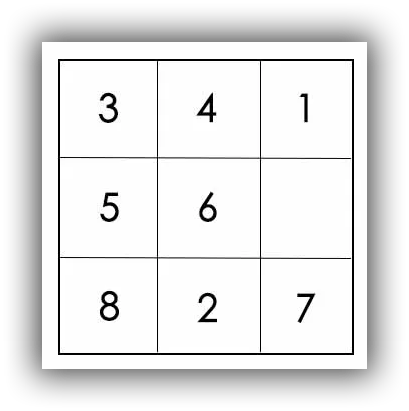{:.center}

空格可以和上下左右的数字进行交换，你可以认为空格在移动。如果移动成

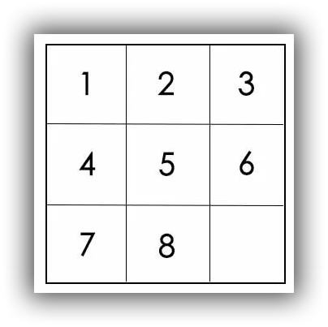{:.center}

则游戏胜利。

你需要完成以下2件事情：

1、给出数据结构来描述这个过程。

2、给你一个初始状态，告诉我能不能胜利，并给出如何移动才能胜利。

第一个问题比较好做，就是定义几个状态量和行为方法即可：

```java
import java.util.LinkedList;
import java.util.List;

public class HuaRongDao {
    //定义一个二维数组来表示这个棋盘
    private static int[][] arr;
    //方向移动标识
    private static final int left=1;
    private static final int right=2;
    private static final int up=3;
    private static final int down=4;

    //x，y记录当前走到哪一步,即空格在什么位置
    private static int x;
    private static int y;
    //定义移动的轨迹数组
    private static List<Integer> list=new LinkedList<>();

    //初始化这个二维数组并找到空格的位置
    private void findBlank(int[][] array){
        this.arr=array;
        for(int i=0;i<array.length;i++){
            for(int j=0;j<array[0].length;j++){
                if (array[i][j]==0){
                    this.x=i;
                    this.y=j;
                }
            }
        }
    }
    private static boolean canMove(int dir){
        switch (dir){
            case left:return y>0;
            case right:return y<arr[0].length;
            case up:return x>0;
            case down:return x<arr.length;
        }
        return false;
    }
    private static void move(int dir){
        int temp;
        switch (dir){
            case left:{
                temp=arr[x][y-1];
                arr[x][y-1]=0;
                arr[x][y]=temp;
                y=y-1;
                break;
            }
            case right:{
                temp=arr[x][y+1];
                arr[x][y+1]=0;
                arr[x][y]=temp;
                y=y+1;
                break;
            }
            case up:{
                temp=arr[x-1][y];
                arr[x-1][y]=0;
                arr[x][y]=temp;
                x=x-1;
                break;
            }
            case down:{
                temp=arr[x+1][y];
                arr[x+1][y]=0;
                arr[x][y]=temp;
                x=x+1;
                break;
            }
        }
    }
    private static void print(){
        for(int i=0;i<arr.length;i++){
            for(int j=0;j<arr[0].length;j++){
                System.out.print(arr[i][j]+" ");
            }
            System.out.println();
        }
    }
}

```

至于第二问，我们先来看一个问题

对于以下迷宫，应该怎么走？

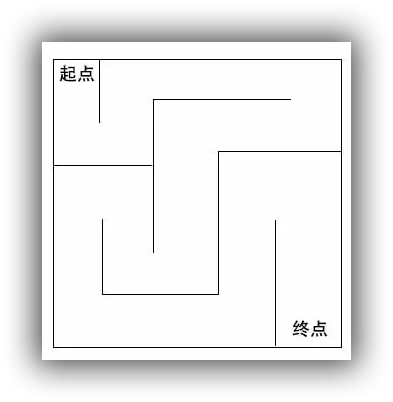{:.center}

很显然，人眼一看就大概知道怎么走。

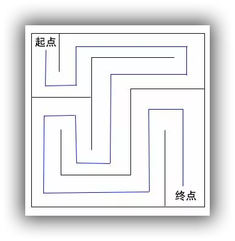{:.center}

计算机应该怎么走呢？

每个点都可以按照右下左上的方向来进行尝试，如果是墙壁，就换一个方向，如果可以走，就往前走到下一点，然后再接着尝试。直到到达终点为止。

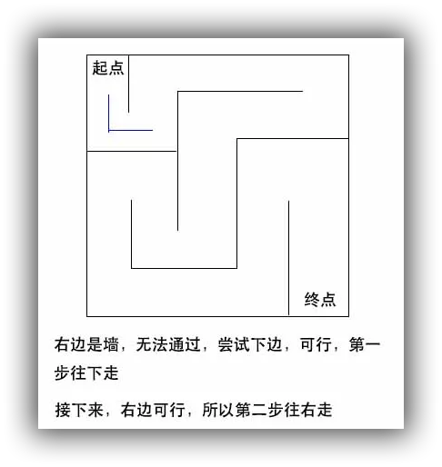{:.center}

四个方向顺序尝试，如果能够走通，就继续往下走，接着尝试下一点。

这里所说的尝试，即是搜索。

前面已经走过两步了，下面看看第三步怎么走：

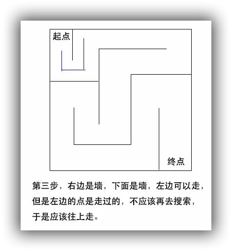{:.center}

搜索的时候，不再搜索一些明显不对的方向，这在搜索算法当中叫做剪枝。剪掉没用的分支，提高效率

再看一个迷宫：

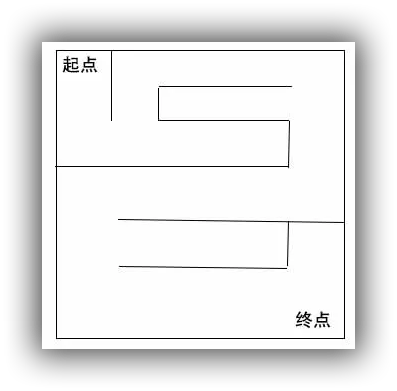{:.center}

一眼就能看出的走法：

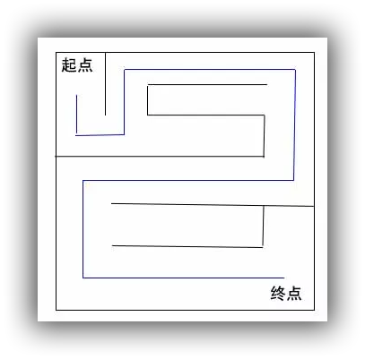{:.center}

算法来进行搜索呢？

{:.center}

此时第三步会发现右边能走，就往右边走，但会发现右边是一个死胡同。那么这是就应该“回溯”。

注意，这块并不是往左走，而是回退，退回到上一步。如果我们正在往前搜索，当然不能走回头路。但是当前面没有路的时候，我们就需要返回来，找到之前有可能出现岔路口的地方，再去下一个方向进行搜索。

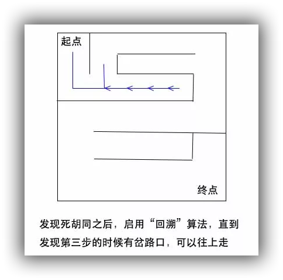{:.center}

那么，对应于原来的问题我们应该怎么解呢？

加入以下面这个状态开始：

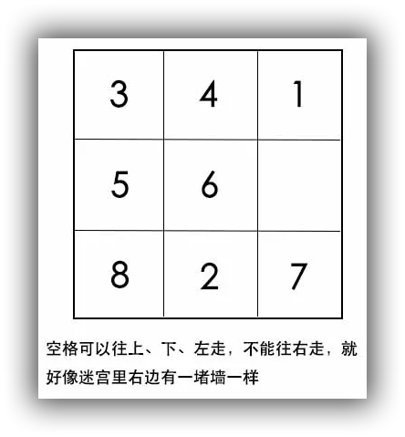{:.center}

接着：

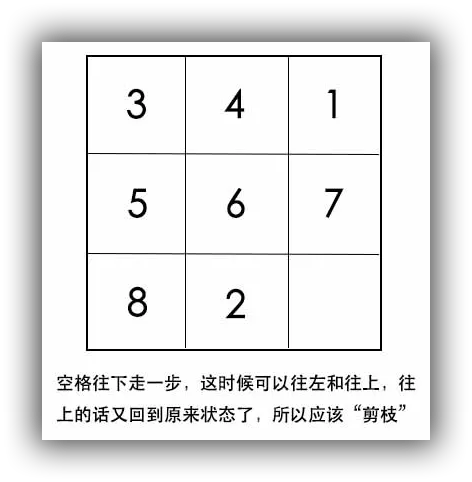{:.center}

再接着：

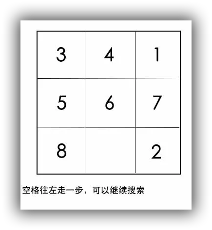{:.center}

那么，什么时候应该回溯呢？那就是发现碰到“**死胡同**”的时候，也就是所有的路都走不通的时候

这个回溯的过程就跟栈非常类似，往前走一步就像是入栈，到了死胡同，要往回退，就像是出栈。但用递归来编码，相对来说难度要小一点。

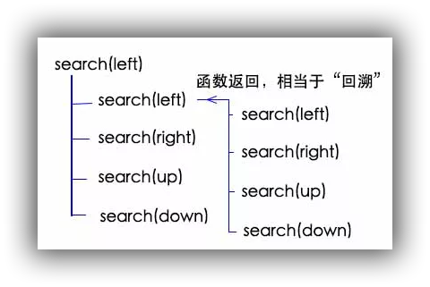{:.center}

当然，递归在计算机里面也是用栈实现的，用递归的话，会清晰不少。

接下来的问题是，我如何判断到达了胜利的状态呢？

想一想，如果每一条路都被堵住的话，回溯就会回到起点了吧，如果回到起点状态还没有胜利的话，就是不能到达胜利状态了。

最后一个问题，正确的移动步骤应该如何记录呢？

思考：走迷宫的时候，每走一步，就把这一步是往哪走的记录下来，但是碰到了死胡同，往回退的时候，又把之前记录的步骤最后一步去掉。这样一来，达到终点的时候，记下来的步骤就是一条从起点到终点的路径了。

记录移动路径，其实就是在真正搜索之前，把方向记录下来，而搜索如果要返回了，则说明该次搜索已经结束，没有结果，应该把该记录去除。

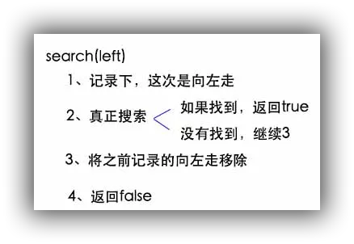{:.center}

看看具体的代码实现：

```java
package com.leyou.test;

import java.util.HashSet;
import java.util.LinkedList;
import java.util.List;
import java.util.Set;

public class HuaRongDao {

    // 定义方向
    private static final int LEFT = 1;
    private static final int RIGHT = 2;
    private static final int UP = 3;
    private static final int DOWN = 4;

    // 3x3的九宫格
    private int[][] arr;

    // 记录空格的位置
    private int x;
    private int y;

    // 定义移动的数组
    private List<Integer> moveArr = new LinkedList<Integer>();

    // 定义终点状态
    private static final Integer WIN_STATE = 123456780;

    // 保存已经搜索过的状态
    private Set<Integer> statusSet = new HashSet<Integer>();

    // 初始化，数字0代表空格，先遍历，找出空格的位置
    public HuaRongDao(int[][] arr) {
        this.arr = arr;
        for(int i=0; i<arr.length; i++) {
            for(int j=0; j<arr.length; j++) {
                if(arr[i][j] == 0) {
                    x = i;
                    y = j;
                }
            }
        }
    }

    // 判断是否可以朝某个方向进行移动
    private boolean canMove(int direction) {
        switch (direction) {
            // y > 0才能左移
            case LEFT:
                return y > 0;
            // y < 2才能右移
            case RIGHT:
                return y < 2;
            // x > 0才能上移
            case UP:
                return x > 0;
            // x < 2才能下移
            case DOWN:
                return x < 2;
        }
        return false;
    }

    // 朝某个方向进行移动，该函数不作判断，直接移动
    // 调用前请自行用canMove先行判断
    private void move(int direction) {
        int temp;
        switch (direction) {
            // 空格和左侧数字交换
            case LEFT:
                temp = arr[x][y - 1];
                arr[x][y - 1] = 0;
                arr[x][y] = temp;
                y = y - 1;
                break;
            // 空格和右侧数字交换
            case RIGHT:
                temp = arr[x][y + 1];
                arr[x][y + 1] = 0;
                arr[x][y] = temp;
                y = y + 1;
                break;
            // 空格和上方数字交换
            case UP:
                temp = arr[x - 1][y];
                arr[x - 1][y] = 0;
                arr[x][y] = temp;
                x = x - 1;
                break;
            // 空格和下方数字交换
            case DOWN:
                temp = arr[x + 1][y];
                arr[x + 1][y] = 0;
                arr[x][y] = temp;
                x = x + 1;
                break;
        }
        // 该方向记录
        moveArr.add(direction);
    }

    // 某个方向的回退，该函数不作判断，直接移动
    // 其操作和move方法正好相反
    private void moveBack(int direction) {
        int temp;
        switch (direction) {
            // 空格和左侧数字交换
            case LEFT:
                temp = arr[x][y + 1];
                arr[x][y + 1] = 0;
                arr[x][y] = temp;
                y = y + 1;
                break;
            // 空格和右侧数字交换
            case RIGHT:
                temp = arr[x][y - 1];
                arr[x][y - 1] = 0;
                arr[x][y] = temp;
                y = y - 1;
                break;
            // 空格和上方数字交换
            case UP:
                temp = arr[x + 1][y];
                arr[x + 1][y] = 0;
                arr[x][y] = temp;
                x = x + 1;
                break;
            // 空格和下方数字交换
            case DOWN:
                temp = arr[x - 1][y];
                arr[x - 1][y] = 0;
                arr[x][y] = temp;
                x = x - 1;
                break;
        }
        // 记录的移动步骤出栈
        moveArr.remove(moveArr.size() - 1);
    }

    // 获取状态，这里把9个数字按顺序组成一个整数来代表状态
    // 方法不唯一，只要能区分九宫格状态就行
    private Integer getStatus() {
        int status = 0;
        for(int i=0; i<arr.length; i++) {
            for(int j=0; j<arr.length; j++) {
                status = status * 10 + arr[i][j];
            }
        }
        return status;
    }

    // 搜索方法
    private boolean search(int direction) {
        // 如果能够朝该方向行走
        if(canMove(direction)) {
            // 往该方向移动
            move(direction);
            // 移动后的状态
            Integer status = getStatus();
            // 如果已经是胜利状态，返回true
            if(WIN_STATE.equals(status)) {
                return true;
            }
            // 如果是之前走过的状态了，返回false
            if(statusSet.contains(status)) {
                // 这一步走错了，回退
                moveBack(direction);
                return false;
            }
            // 将当前状态存入set
            statusSet.add(status);
            // 继续朝四个方向进行搜索
            boolean searchFourOk = search(RIGHT) || search(DOWN) || search(LEFT) || search(UP);
            if(searchFourOk) {
                return true;
            } else {
                // 这一步走错了，把它的记录去除
                moveBack(direction);
                return false;
            }
        }
        return false;
    }

    // 解题入口方法
    public boolean solve() {
        Integer status = getStatus();
        // 如果已经是胜利状态，返回true
        if(WIN_STATE.equals(status)) {
            return true;
        }
        // 初始状态先记录
        statusSet.add(status);
        // 朝4个方向进行搜索
        return search(RIGHT) || search(DOWN) || search(LEFT) || search(UP);
    }

    // 打印路径
    public void printRoute() {
        for(int i=0; i<moveArr.size(); i++) {
            System.out.print(getDirString(moveArr.get(i)));
            System.out.print(" ");
        }
    }

    // 方向与其对应的字符串
    private String getDirString(int dir) {
        switch (dir) {
            case LEFT:
                return "左";
            case RIGHT:
                return "右";
            case UP:
                return "上";
            case DOWN:
                return "下";
        }
        return null;
    }

    // 打印当前华容道的状态
    public void print() {
        for(int i=0; i<arr.length; i++) {
            for(int j=0; j<arr.length; j++) {
                System.out.print(arr[i][j]);
                System.out.print(" ");
            }
            System.out.println();
        }
    }

}
```

这里代码编写注意几点，第一，我们是以当前空格所在位置作为状态的，当回溯的时候，注意x，y状态的回复；第二，我们对于“当前局面”的设定，当前局面也可以理解为当前状态，一定需要保证它的唯一性；第三，写递归代码的时候有套路，我们一般都是先判定状态是否满足，如果满足就直接返回真，不满足的话再判断状态集里面是否已经有了此状态，有的话直接回溯并返回假，紧接着就是搜索，搜索完判断是否满足，不满足就回溯。

好了，让我们写一个测试用例来测试一下代码：

```java
public static void main(String[] args) {
        int[][] arr=(此处有jekyll渲染问题，请读者自行在这里构造一个二维数组);
        HuaRongDao huaRongDao=new HuaRongDao(arr);
        huaRongDao.solve();
        huaRongDao.printRoute();
        huaRongDao.print();
    }
```

but! 不幸的事情发生了：

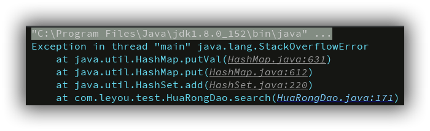{:.center}

栈溢出了，为什么呢？

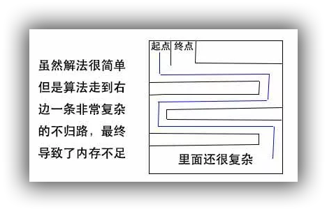{:.center}

那么我们改一改代码，把search函数入口里面的判断条件改一改：

```java
if(canMove(direction)&& moveArr.size()<100)
```

再来测试同样的测试用例

```xml
下 右 
1 2 3 
4 5 6 
7 8 0 
```

这就得到了正确的结果。

以上，就是深度搜索了，深度搜索就像一个死钻牛角尖的人一样，不撞南墙不回头。

但上面这道题，其实更适合使用广度优先搜索。广度优先搜索，是先搜索每一个可行方向的第一步，然后再接着搜索每一个可行方向的第二步。以此类推。

简单理解就是，每到一个岔路口，就会分成多波人在每一个方向上去进行搜索。

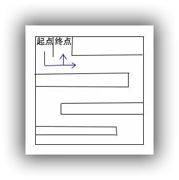{:.center}

广度优先搜索就没有回溯的必要了。不再使用递归了

广度搜索可以将要搜索的初始状态加到一个**队列**里，然后每次从队列中取出一个状态，往可以前进的方向前进一步，然后再将该状态放到队列。利用队列先进先出的特点，就可以实现广搜的效果。这和之前深搜的对比一下就能看出来了，**深搜是栈的最佳体现，而广搜则更多的体现一种队列的思想**。

那么，对于这个问题，使用广度搜索，如何判断胜利状态呢？如果队列空了还没有找到出口，说明所有的方向都找不到，那么自然就无法胜利了。

然后，怎么记录这条胜利的路径呢？其实只要每一步都记录上一步的状态和这次的方向即可。这样在达到最终胜利状态的时候，可以找到这个状态的上一步。而上一步又可以找到上上步，这就是链表的特征了。

有了上面的基础，继续来解决这个问题

```java
import java.util.HashSet;
import java.util.LinkedList;
import java.util.List;
import java.util.Set;

public class HuaRongDao {

    // 定义方向
    private static final int LEFT = 0;
    private static final int RIGHT = 1;
    private static final int UP = 2;
    private static final int DOWN = 3;

    // 定义辅助数组
    private static final int[][] dxdy = {{0, -1}, {0, 1}, {-1, 0}, {1, 0}};

    // 3x3的九宫格
    private int[][] arr;

    // 记录空格的位置
    private int x;
    private int y;

    // 定义移动的数组
    private List<Integer> moveArr = new LinkedList<Integer>();

    // 定义终点状态
    private static final Integer WIN_STATE = 123456780;

    // 保存已经搜索过的状态
    private Set<Integer> statusSet = new HashSet<Integer>();

    // 代表广搜的每一步，通过lastItem链起来
    private class SearchItem {
        private Integer status;
        private Integer dir;
        private SearchItem lastItem;
        SearchItem(Integer status, Integer dir, SearchItem lastItem) {
            this.status = status;
            this.dir = dir;
            this.lastItem = lastItem;
        }
        public Integer getStatus() {return status;}
        public Integer getDir() {return dir;}
        public SearchItem getLastItem() {return lastItem;}
    }

    // 广搜的存储队列
    private List<SearchItem> statusToSearch = new LinkedList<SearchItem>();

    // 初始化，数字0代表空格，先遍历，找出空格的位置
    public HuaRongDao(int[][] arr) {
        this.arr = arr;
        getXY();
    }

    // 获取空格的x和y坐标
    private void getXY() {
        for(int i=0; i<arr.length; i++) {
            for(int j=0; j<arr.length; j++) {
                if(arr[i][j] == 0) {
                    x = i;
                    y = j;
                }
            }
        }
    }

    // 判断是否可以朝某个方向进行移动
    private boolean canMove(int direction) {
        switch (direction) {
            // y > 0才能左移
            case LEFT:
                return y > 0;
            // y < 2才能右移
            case RIGHT:
                return y < 2;
            // x > 0才能上移
            case UP:
                return x > 0;
            // x < 2才能下移
            case DOWN:
                return x < 2;
        }
        return false;
    }

    // 找出该方向的相反方向
    private int getBackDir(int direction) {
        switch (direction) {
            // y > 0才能左移
            case LEFT:
                return RIGHT;
            // y < 2才能右移
            case RIGHT:
                return LEFT;
            // x > 0才能上移
            case UP:
                return DOWN;
            // x < 2才能下移
            case DOWN:
                return UP;
        }
        return 0;
    }

    // 朝某个方向进行移动，该函数不作判断，直接移动
    // 调用前请自行用canMove先行判断
    private void move(int direction) {
        int temp;
        temp = arr[x + dxdy[direction][0]][y + dxdy[direction][1]];
        arr[x + dxdy[direction][0]][y + dxdy[direction][1]] = 0;
        arr[x][y] = temp;
        x = x + dxdy[direction][0];
        y = y + dxdy[direction][1];
    }

    // 某个方向的前进，该函数不作判断，直接移动
    private void moveForward(int direction) {
        move(direction);
        // 该方向记录
        moveArr.add(direction);
    }

    // 某个方向的回退，该函数不作判断，直接移动
    // 其操作和moveForward方法正好相反
    private void moveBack(int direction) {
        move(getBackDir(direction));
        // 记录的移动步骤出栈
        moveArr.remove(moveArr.size() - 1);
    }

    // 获取状态，这里把9个数字按顺序组成一个整数来代表状态
    // 方法不唯一，只要能区分九宫格状态就行
    public Integer getStatus() {
        int status = 0;
        for(int i=0; i<arr.length; i++) {
            for(int j=0; j<arr.length; j++) {
                status = status * 10 + arr[i][j];
            }
        }
        return status;
    }

    // 根据状态还原九宫格数组
    // 该方法是getStatus的逆过程
    public void recoverStatus(Integer status) {
        for(int i=0; i<arr.length; i++) {
            for(int j=0; j<arr.length; j++) {
                arr[2 - i][2 - j] = status % 10;
                status = status / 10;
            }
        }
        getXY();
    }

    // 搜索方法
    private boolean search() {
        // 如果还有要搜索的状态
        while(statusToSearch.size() > 0) {
            // 队首出列
            SearchItem item = statusToSearch.remove(0);
            Integer status = item.getStatus();
            // 搜到了
            if(status.equals(WIN_STATE)) {
                // 找到路径
                recordRoute(item);
                return true;
            }
            // 根据status还原arr和x，y
            recoverStatus(status);
            // 4个方向进行遍历
            for(int i=0; i<4; i++) {
                // 如果能够朝该方向行走
                if(canMove(i)) {
                    // 向前一步
                    moveForward(i);
                    status = getStatus();
                    // 之前搜过的状态
                    if (statusSet.contains(status)) {
                        moveBack(i);
                        // 放弃
                        continue;
                    }
                    // 新状态加入待搜索
                    statusSet.add(status);
                    statusToSearch.add(new SearchItem(status, i, item));
                    moveBack(i);
                }
            }
        }
        return false;
    }

    // 解题入口方法
    public boolean solve() {
        Integer status = getStatus();
        // 如果已经是胜利状态，返回true
        if(WIN_STATE.equals(status)) {
            return true;
        }
        // 初始状态先记录
        statusSet.add(status);
        // 初始状态进入搜索队列
        statusToSearch.add(new SearchItem(status, null, null));
        return search();
    }

    // 根据链表顺藤摸瓜，找到路径
    private void recordRoute(SearchItem item) {
        while(null != item.getLastItem()) {
            moveArr.add(0, item.getDir());
            item = item.getLastItem();
        }
    }

    // 打印路径
    public void printRoute() {
        for(int i=0; i<moveArr.size(); i++) {
            System.out.print(getDirString(moveArr.get(i)));
            System.out.print(" ");
        }
    }

    // 方向与其对应的字符串
    private String getDirString(int dir) {
        switch (dir) {
            case LEFT:
                return "左";
            case RIGHT:
                return "右";
            case UP:
                return "上";
            case DOWN:
                return "下";
        }
        return null;
    }

    // 打印当前华容道的状态
    public void print() {
        for(int i=0; i<arr.length; i++) {
            for(int j=0; j<arr.length; j++) {
                System.out.print(arr[i][j]);
                System.out.print(" ");
            }
            System.out.println();
        }
    }

}
```

看看测试用例：

```xml
1 2 3 
4 5 6 
8 7 0 
无法胜利
1 2 3 
4 0 6 
7 5 8 
可以胜利，路径为：下 右 
3 4 1 
5 6 0 
8 2 7 
可以胜利，路径为：左 左 上 右 下 左 下 右 右 上 左 左 下 右 上 上 右 下 左 左 上 右 下 右 下 

Process finished with exit code 0
```

### 总结

总结一下深搜和广搜的区别和适用场景。

其实广搜比深搜多了一个队列来存储要搜索的状态，但它却能够得到最优解，属于空间换时间。

而深搜的适用场景也就很明显了，如果这道题的要求是求所有解，深搜的空间更少，编码也要简单一些，所以更加适合