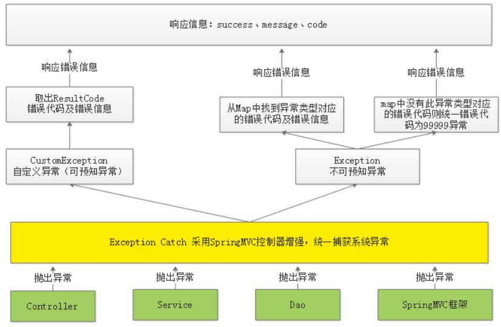

## 异常处理

**异常处理所面临的问题**

- 1.操作不成功仅向用户返回“错误代码：11111，失败信息：操作失败”，无法区别具体的错误信息。 

- 2.service方法在执行过程出现异常在哪捕获？在service中需要都加try/catch，如果在controller也需要添加
  try/catch，代码冗余严重且不易维护。 

**解决方案**

- 1.在Service方法中的编码顺序是先校验判断，有问题则抛出具体的异常信息，最后执行具体的业务操作，返回成功信息。 

- 2.在统一异常处理类中去捕获异常，无需controller捕获异常，向用户返回统一规范的响应信息 

**代码模板**

```java
//新增页面
    public CmsPageResult add(CmsPage cmsPage) {
        if(cmsPage == null){
            //抛出异常，非法参数异常..指定异常信息的内容

        }
        //校验页面名称、站点Id、页面webpath的唯一性
        //根据页面名称、站点Id、页面webpath去cms_page集合，如果查到说明此页面已经存在，如果查询不到再继续添加
        CmsPage cmsPage1 = cmsPageRepository.findByPageNameAndSiteIdAndPageWebPath(cmsPage.getPageName(), cmsPage.getSiteId(), cmsPage.getPageWebPath());
        if(cmsPage1!=null){
            //页面已经存在
            //抛出异常，异常内容就是页面已经存在
            ExceptionCast.cast(CmsCode.CMS_ADDPAGE_EXISTSNAME);
        }

        //调用dao新增页面
        cmsPage.setPageId(null);
        cmsPageRepository.save(cmsPage);
        return new CmsPageResult(CommonCode.SUCCESS,cmsPage);

    }
```

**异常处理流程**

- 自定义异常类型

```java
public class CustomException extends RuntimeException {

    //错误代码
    ResultCode resultCode;

    public CustomException(ResultCode resultCode){
        this.resultCode = resultCode;
    }
    public ResultCode getResultCode(){
        return resultCode;
    }


}
```

- 对于可预知的异常由程序员在代码中主动抛出

如上程序模板

- 异常捕获

```java
@ControllerAdvice//控制器增强
public class ExceptionCatch {

    private static final Logger LOGGER = LoggerFactory.getLogger(ExceptionCatch.class);

    //定义map，配置异常类型所对应的错误代码
    private static ImmutableMap<Class<? extends Throwable>,ResultCode> EXCEPTIONS;
    //定义map的builder对象，去构建ImmutableMap
    protected static ImmutableMap.Builder<Class<? extends Throwable>,ResultCode> builder = ImmutableMap.builder();

    //捕获CustomException此类异常
    @ExceptionHandler(CustomException.class)
    @ResponseBody
    public ResponseResult customException(CustomException customException){
        //记录日志
        LOGGER.error("catch exception:{}",customException.getMessage());
        ResultCode resultCode = customException.getResultCode();
        return new ResponseResult(resultCode);
    }
    //捕获Exception此类异常
    @ExceptionHandler(Exception.class)
    @ResponseBody
    public ResponseResult exception(Exception exception){
        //记录日志
        LOGGER.error("catch exception:{}",exception.getMessage());
        if(EXCEPTIONS == null){
            EXCEPTIONS = builder.build();//EXCEPTIONS构建成功
        }
        //从EXCEPTIONS中找异常类型所对应的错误代码，如果找到了将错误代码响应给用户，如果找不到给用户响应99999异常
        ResultCode resultCode = EXCEPTIONS.get(exception.getClass());
        if(resultCode !=null){
            return new ResponseResult(resultCode);
        }else{
            //返回99999异常
            return new ResponseResult(CommonCode.SERVER_ERROR);
        }


    }

    static {
        //定义异常类型所对应的错误代码
        builder.put(HttpMessageNotReadableException.class,CommonCode.INVALID_PARAM);
    }
}
```

- 统一异常处理图示

{:.center}