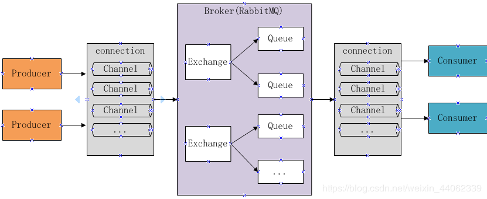

#### 简单介绍

MQ全称为Message Queue，即消息队列， RabbitMQ是由erlang语言开发，基于AMQP（Advanced Message
Queue 高级消息队列协议）协议实现的消息队列，它是一种应用程序之间的通信方法，消息队列在分布式系统开
发中应用非常广泛。RabbitMQ官方地址：http://www.rabbitmq.com/ 

#### 使用场景

- 任务异步处理

将不需要同步处理的并且耗时长的操作由消息队列通知消息接收方进行异步处理。提高了应用程序的响应时间。 

- 应用程序解耦合 

MQ相当于一个中介，生产方通过MQ与消费方交互，它将应用程序进行解耦合。

#### 类似产品

ActiveMQ，RabbitMQ，ZeroMQ，Kafka，MetaMQ，RocketMQ、Redis 

#### WHY RabbitMQ？

- 使用简单，功能强大。
- 基于AMQP协议。
- 社区活跃，文档完善。
- 高并发性能好，这主要得益于Erlang语言。
- Spring Boot默认已集成RabbitMQ 

#### AMQP协议

AMQP是一套公开的消息队列协议，最早在2003年被提出，它旨在从协议层定义消息通信数据的标准格式，
为的就是解决MQ市场上协议不统一的问题。RabbitMQ就是遵循AMQP标准协议开发的MQ服务。 

#### 与JMS辨析

JMS是java提供的一套消息服务API标准，其目的是为所有的java应用程序提供统一的消息通信的标准，类似java的
jdbc，只要遵循jms标准的应用程序之间都可以进行消息通信。它和AMQP有什么 不同，jms是java语言专属的消
息服务标准，它是在api层定义标准，并且只能用于java应用；而AMQP是在协议层定义的标准，是跨语言的 。 

#### RabbitMQ工作原理图示



**组件说明**

- Broker：消息队列服务进程，此进程包括两个部分：Exchange和Queue。 
- Exchange：消息队列交换机，按一定的规则将消息路由转发到某个队列，对消息进行过滤
- Queue：消息队列，存储消息的队列，消息到达队列并转发给指定的消费方 
- Producer：消息生产者，即生产方客户端，生产方客户端将消息发送到MQ。 
- Consumer：消息消费者，即消费方客户端，接收MQ转发的消息。 

#### 消息收发流程

- 发送消息
  - 1、生产者和Broker建立TCP连接。
  - 2、生产者和Broker建立通道。
  - 3、生产者通过通道消息发送给Broker，由Exchange将消息进行转发。
  - 4、Exchange将消息转发到指定的Queue（队列） 
- 接收消息
  - 1、消费者和Broker建立TCP连接
  - 2、消费者和Broker建立通道
  - 3、消费者监听指定的Queue（队列）
  - 4、当有消息到达Queue时Broker默认将消息推送给消费者。
  - 5、消费者接收到消息。 

#### 程序编码实现消息的发送和接收

- 发送程序编码流程
  - 创建连接
  - 创建通道
  - 声明队列
  - 发送消息 
- 接收程序编码流程
  - 创建连接
  - 创建通道
  - 声明队列
  - 监听队列
  - 接收消息
  - ack回复 

#### 一段简单的发布订阅模式的原生编码

- 生产者

```java
public class Producer02_publish {
    //队列名称
    private static final String QUEUE_INFORM_EMAIL = "queue_inform_email";
    private static final String QUEUE_INFORM_SMS = "queue_inform_sms";
    private static final String EXCHANGE_FANOUT_INFORM="exchange_fanout_inform";

    public static void main(String[] args) {
        //通过连接工厂创建新的连接和mq建立连接
        ConnectionFactory connectionFactory = new ConnectionFactory();
        connectionFactory.setHost("127.0.0.1");
        connectionFactory.setPort(5672);//端口
        connectionFactory.setUsername("guest");
        connectionFactory.setPassword("guest");
        //设置虚拟机，一个mq服务可以设置多个虚拟机，每个虚拟机就相当于一个独立的mq
        connectionFactory.setVirtualHost("/");

        Connection connection = null;
        Channel channel = null;
        try {
            //建立新连接
            connection = connectionFactory.newConnection();
            //创建会话通道,生产者和mq服务所有通信都在channel通道中完成
            channel = connection.createChannel();
            //声明队列，如果队列在mq 中没有则要创建
            //参数：String queue, boolean durable, boolean exclusive, boolean autoDelete, Map<String, Object> arguments
            /**
             * 参数明细
             * 1、queue 队列名称
             * 2、durable 是否持久化，如果持久化，mq重启后队列还在
             * 3、exclusive 是否独占连接，队列只允许在该连接中访问，如果connection连接关闭队列则自动删除,如果将此参数设置true可用于临时队列的创建
             * 4、autoDelete 自动删除，队列不再使用时是否自动删除此队列，如果将此参数和exclusive参数设置为true就可以实现临时队列（队列不用了就自动删除）
             * 5、arguments 参数，可以设置一个队列的扩展参数，比如：可设置存活时间
             */
            channel.queueDeclare(QUEUE_INFORM_EMAIL,true,false,false,null);
            channel.queueDeclare(QUEUE_INFORM_SMS,true,false,false,null);
            //声明一个交换机
            //参数：String exchange, String type
            /**
             * 参数明细：
             * 1、交换机的名称
             * 2、交换机的类型
             * fanout：对应的rabbitmq的工作模式是 publish/subscribe
             * direct：对应的Routing	工作模式
             * topic：对应的Topics工作模式
             * headers： 对应的headers工作模式
             */
            channel.exchangeDeclare(EXCHANGE_FANOUT_INFORM, BuiltinExchangeType.FANOUT);
            //进行交换机和队列绑定
            //参数：String queue, String exchange, String routingKey
            /**
             * 参数明细：
             * 1、queue 队列名称
             * 2、exchange 交换机名称
             * 3、routingKey 路由key，作用是交换机根据路由key的值将消息转发到指定的队列中，在发布订阅模式中调协为空字符串
             */
            channel.queueBind(QUEUE_INFORM_EMAIL,EXCHANGE_FANOUT_INFORM,"");
            channel.queueBind(QUEUE_INFORM_SMS,EXCHANGE_FANOUT_INFORM,"");
            //发送消息
            //参数：String exchange, String routingKey, BasicProperties props, byte[] body
            /**
             * 参数明细：
             * 1、exchange，交换机，如果不指定将使用mq的默认交换机（设置为""）
             * 2、routingKey，路由key，交换机根据路由key来将消息转发到指定的队列，如果使用默认交换机，routingKey设置为队列的名称
             * 3、props，消息的属性
             * 4、body，消息内容
             */
            for(int i=0;i<5;i++){
                //消息内容
                String message = "send inform message to user";
                channel.basicPublish(EXCHANGE_FANOUT_INFORM,"",null,message.getBytes());
                System.out.println("send to mq "+message);
            }

        } catch (Exception e) {
            e.printStackTrace();
        } finally {
            //关闭连接
            //先关闭通道
            try {
                channel.close();
            } catch (IOException e) {
                e.printStackTrace();
            } catch (TimeoutException e) {
                e.printStackTrace();
            }
            try {
                connection.close();
            } catch (IOException e) {
                e.printStackTrace();
            }
        }


    }
}

```

- 消费者1

```java
public class Consumer02_subscribe_email {
    //队列名称
    private static final String QUEUE_INFORM_EMAIL = "queue_inform_email";
    private static final String EXCHANGE_FANOUT_INFORM="exchange_fanout_inform";


    public static void main(String[] args) throws IOException, TimeoutException {
        //通过连接工厂创建新的连接和mq建立连接
        ConnectionFactory connectionFactory = new ConnectionFactory();
        connectionFactory.setHost("127.0.0.1");
        connectionFactory.setPort(5672);//端口
        connectionFactory.setUsername("guest");
        connectionFactory.setPassword("guest");
        //设置虚拟机，一个mq服务可以设置多个虚拟机，每个虚拟机就相当于一个独立的mq
        connectionFactory.setVirtualHost("/");

        //建立新连接
        Connection connection = connectionFactory.newConnection();
        //创建会话通道,生产者和mq服务所有通信都在channel通道中完成
        Channel channel = connection.createChannel();

        /**
         * 参数明细
         * 1、queue 队列名称
         * 2、durable 是否持久化，如果持久化，mq重启后队列还在
         * 3、exclusive 是否独占连接，队列只允许在该连接中访问，如果connection连接关闭队列则自动删除,如果将此参数设置true可用于临时队列的创建
         * 4、autoDelete 自动删除，队列不再使用时是否自动删除此队列，如果将此参数和exclusive参数设置为true就可以实现临时队列（队列不用了就自动删除）
         * 5、arguments 参数，可以设置一个队列的扩展参数，比如：可设置存活时间
         */
        channel.queueDeclare(QUEUE_INFORM_EMAIL,true,false,false,null);
        //声明一个交换机
        //参数：String exchange, String type
        /**
         * 参数明细：
         * 1、交换机的名称
         * 2、交换机的类型
         * fanout：对应的rabbitmq的工作模式是 publish/subscribe
         * direct：对应的Routing	工作模式
         * topic：对应的Topics工作模式
         * headers： 对应的headers工作模式
         */
        channel.exchangeDeclare(EXCHANGE_FANOUT_INFORM, BuiltinExchangeType.FANOUT);
        //进行交换机和队列绑定
        //参数：String queue, String exchange, String routingKey
        /**
         * 参数明细：
         * 1、queue 队列名称
         * 2、exchange 交换机名称
         * 3、routingKey 路由key，作用是交换机根据路由key的值将消息转发到指定的队列中，在发布订阅模式中调协为空字符串
         */
        channel.queueBind(QUEUE_INFORM_EMAIL, EXCHANGE_FANOUT_INFORM, "");

        //实现消费方法
        DefaultConsumer defaultConsumer = new DefaultConsumer(channel){

            /**
             * 当接收到消息后此方法将被调用
             * @param consumerTag  消费者标签，用来标识消费者的，在监听队列时设置channel.basicConsume
             * @param envelope 信封，通过envelope
             * @param properties 消息属性
             * @param body 消息内容
             * @throws IOException
             */
            @Override
            public void handleDelivery(String consumerTag, Envelope envelope, AMQP.BasicProperties properties, byte[] body) throws IOException {
                //交换机
                String exchange = envelope.getExchange();
                //消息id，mq在channel中用来标识消息的id，可用于确认消息已接收
                long deliveryTag = envelope.getDeliveryTag();
                //消息内容
                String message= new String(body,"utf-8");
                System.out.println("receive message:"+message);
            }
        };

        //监听队列
        //参数：String queue, boolean autoAck, Consumer callback
        /**
         * 参数明细：
         * 1、queue 队列名称
         * 2、autoAck 自动回复，当消费者接收到消息后要告诉mq消息已接收，如果将此参数设置为tru表示会自动回复mq，如果设置为false要通过编程实现回复
         * 3、callback，消费方法，当消费者接收到消息要执行的方法
         */
        channel.basicConsume(QUEUE_INFORM_EMAIL,true,defaultConsumer);

    }
}

```

- 消费者2

```java
public class Consumer02_subscribe_sms {
    //队列名称
    private static final String QUEUE_INFORM_SMS = "queue_inform_sms";
    private static final String EXCHANGE_FANOUT_INFORM="exchange_fanout_inform";


    public static void main(String[] args) throws IOException, TimeoutException {
        //通过连接工厂创建新的连接和mq建立连接
        ConnectionFactory connectionFactory = new ConnectionFactory();
        connectionFactory.setHost("127.0.0.1");
        connectionFactory.setPort(5672);//端口
        connectionFactory.setUsername("guest");
        connectionFactory.setPassword("guest");
        //设置虚拟机，一个mq服务可以设置多个虚拟机，每个虚拟机就相当于一个独立的mq
        connectionFactory.setVirtualHost("/");

        //建立新连接
        Connection connection = connectionFactory.newConnection();
        //创建会话通道,生产者和mq服务所有通信都在channel通道中完成
        Channel channel = connection.createChannel();

        /**
         * 参数明细
         * 1、queue 队列名称
         * 2、durable 是否持久化，如果持久化，mq重启后队列还在
         * 3、exclusive 是否独占连接，队列只允许在该连接中访问，如果connection连接关闭队列则自动删除,如果将此参数设置true可用于临时队列的创建
         * 4、autoDelete 自动删除，队列不再使用时是否自动删除此队列，如果将此参数和exclusive参数设置为true就可以实现临时队列（队列不用了就自动删除）
         * 5、arguments 参数，可以设置一个队列的扩展参数，比如：可设置存活时间
         */
        channel.queueDeclare(QUEUE_INFORM_SMS,true,false,false,null);
        //声明一个交换机
        //参数：String exchange, String type
        /**
         * 参数明细：
         * 1、交换机的名称
         * 2、交换机的类型
         * fanout：对应的rabbitmq的工作模式是 publish/subscribe
         * direct：对应的Routing	工作模式
         * topic：对应的Topics工作模式
         * headers： 对应的headers工作模式
         */
        channel.exchangeDeclare(EXCHANGE_FANOUT_INFORM, BuiltinExchangeType.FANOUT);
        //进行交换机和队列绑定
        //参数：String queue, String exchange, String routingKey
        /**
         * 参数明细：
         * 1、queue 队列名称
         * 2、exchange 交换机名称
         * 3、routingKey 路由key，作用是交换机根据路由key的值将消息转发到指定的队列中，在发布订阅模式中调协为空字符串
         */
        channel.queueBind(QUEUE_INFORM_SMS, EXCHANGE_FANOUT_INFORM, "");

        //实现消费方法
        DefaultConsumer defaultConsumer = new DefaultConsumer(channel){

            /**
             * 当接收到消息后此方法将被调用
             * @param consumerTag  消费者标签，用来标识消费者的，在监听队列时设置channel.basicConsume
             * @param envelope 信封，通过envelope
             * @param properties 消息属性
             * @param body 消息内容
             * @throws IOException
             */
            @Override
            public void handleDelivery(String consumerTag, Envelope envelope, AMQP.BasicProperties properties, byte[] body) throws IOException {
                //交换机
                String exchange = envelope.getExchange();
                //消息id，mq在channel中用来标识消息的id，可用于确认消息已接收
                long deliveryTag = envelope.getDeliveryTag();
                //消息内容
                String message= new String(body,"utf-8");
                System.out.println("receive message:"+message);
            }
        };

        //监听队列
        //参数：String queue, boolean autoAck, Consumer callback
        /**
         * 参数明细：
         * 1、queue 队列名称
         * 2、autoAck 自动回复，当消费者接收到消息后要告诉mq消息已接收，如果将此参数设置为tru表示会自动回复mq，如果设置为false要通过编程实现回复
         * 3、callback，消费方法，当消费者接收到消息要执行的方法
         */
        channel.basicConsume(QUEUE_INFORM_SMS,true,defaultConsumer);

    }
}

```

#### 其他工作模式

- 1、Work queues


- 2、Publish/Subscribe


- 3、Routing


- 4、Topics


- 5、Header
- 6、RPC （这个就比较适合后台有个什么耗时任务的编码需求）


#### springboot 的编码方式

具体的就不添加代码了，这里主要描述一下编写流程

- 引入maven依赖
- 在application.yml中配置连接RabbitMQ的相关配置信息
- 定义RabbitConfig类，配置Exchange、Queue、及绑定交换机。 
- 编写生产者消费者 


