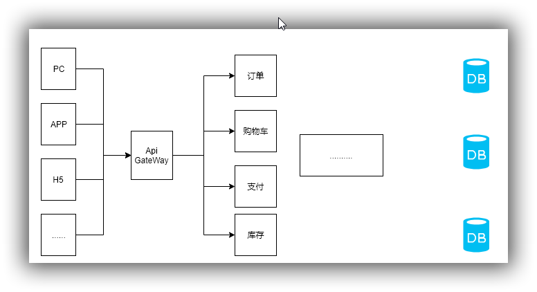

> 缘起：上午导师再次给我们讲述了微服务的演变过程，再来认识一次，有些东西你知道不等于你就能做，需要经验和深入的思考。

### 传统的单体应用

先来看一张简单的图示

从底向上大体可分为

- DAL  数据适配层
- DLL  数据逻辑处理层
- 表示层

这个比较好理解，所有的业务数据都存储在一个地方，数据被访问抽取以后，再经过业务逻辑处理，传送给表示层完成数据和视图的绑定。这是前后端不分离的情况，那么前后端分离的情况呢？

### 前后端分离

那么很简单，我们进一步分离以后，把控制器层（或者说专门提供Api接口的层）和视图分离，这样也就进一步解除了视图绑定的耦合。

但我们再观察一下上面的架构，聪明的你业务已经想到了其他的一些劣势：

- 业务之间的耦合度太大
- 业务划分的粒度不够
- 代码难以维护，可阅读性差
- 单体应用难以承受高并发、高负载
- 数据库业务数据增长快，难以扩展
- blabla...

从管理的角度考虑，也有相当不可取的地方，如果一个新入职的员工来了，一方面他对业务的理解非常费力，可能时间花了很久也不会给我们的项目添砖加瓦，而是全力去理解这一团糟了。另外我们不可能将所有的代码都给一个刚入职的新人，这是出于安全性和权益的考虑。

所以，聪明的大家大概又有了进一步的解决方案，让我们一步一步迭代。

### 集群环境部署

既然这一个机器的处理能力不够，那我们多部署几个（集群的方式，上面忘画了一个请求分发的示意图，不要介意），解决这种大家办事都去找一个人的问题。可是请求虽然都分开了，我们每台机器部署的服务其实都是一样的，而且都仍旧去访问请求一个数据库，数据库存储的问题依旧没有解决。那么很自然的，我们会根据业务的区分度进行垂直拆分了。

### 微服务架构

图画的有点丑，哈哈！但意思很明白，就是按照不同的业务粒度进行拆分。那么现在又出现了一个问题，按照什么进行拆分呢？

这个时候，我们所学的面向对象分析（OOA）就有用了，所谓的面向对象分析，即是说根据不同实体（这个实体包括可见的物理实体，以及抽象的实体，比如订单）进行划分，尽可能的拆分并保留一定的冗余。

到这个时候就比较有意思了，现在的架构解决了我们之前谈到的耦合度高、维护困难、安全性低的问题，但是又诞生了一些新的问题，一是这么多服务我们该怎么管理？由此想到了服务的注册中心；二是服务之间如何通信？是用RPC好呢还是HTTP的方式好呢？三是如果某个服务不可用了，该如何快速切换到可用的服务呢？...如此种种问题都是微服务治理需要我们考虑权衡的。

当然这中间还有一些演变过程我并没有一一画出，比如分布式和微服务在一定程度上是有区别的，一般的演进过程是单体到集群，集群到分布式，分布式到微服务，微服务到大数据，大数据到人工智能，到最后可能是精准的预测。谁知道呢？

### 小结

从应用的不断演进过程大概可以看出，设计一个系统从来不是一下就考虑完所有的可能性再去开发，而是根据业务需求量，存储容量，接口访问负载等变化一点点的演化的，这就需要我们从一开始就要注意可扩展性的问题，如果扩展性不高，开发的工作量，业务的延迟，交易的转化都会受到极大程度的影响。同时，作为开发的我们，实现一个功能可能并没有那么难，难的是从系统的角度去思考这个问题，它面向什么用户，它未来可能有多大并发，它未来会产生多少数据量，做这个功能会不会对原来的系统产生侵入，如何最快最好的对接需求而不是一直开发更改开发更改（当然这一点值得商榷），所以，以后的开发需要更多的带着思考去开发，带着疑问去开发。

