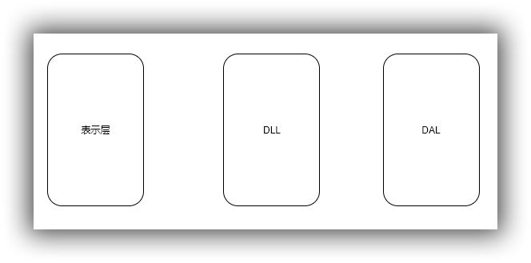
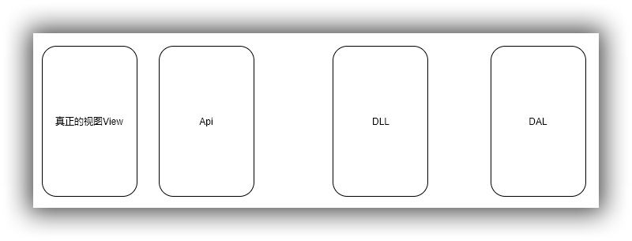
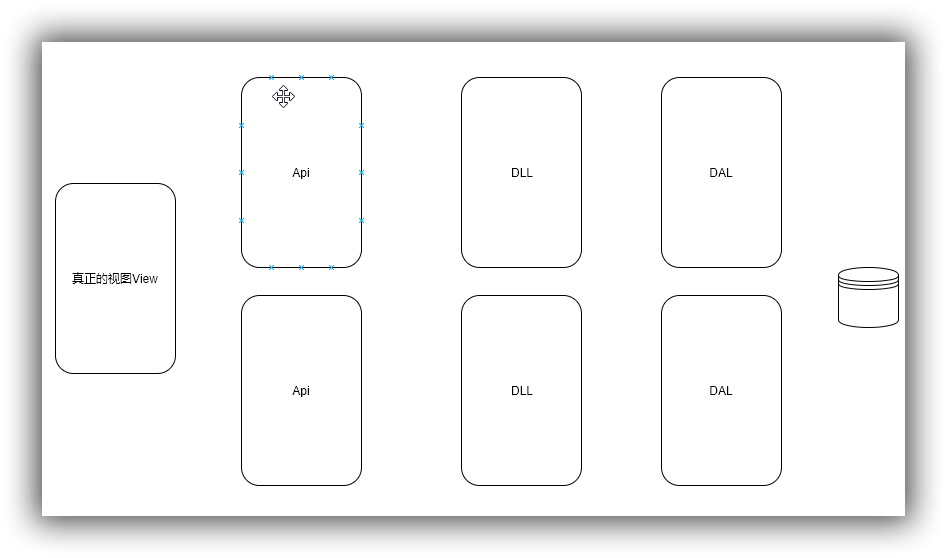

> 缘起：上午导师再次给我们讲述了微服务的演变过程，再次梳理一次，认识再深入一层

### 传统的单体应用

先来看一张简单的图示

从底向上大体可分为

- DAL  数据适配层
- DLL  数据逻辑处理层
- 表示层

这个比较好理解，所有的业务数据都存储在一个地方，数据被访问抽取以后，再经过业务逻辑处理，传送给表示层完成数据和视图的绑定。这是前后端不分离的情况，那么前后端分离的情况呢？

那么很简单，我们进一步分离以后，把控制器层（或者说专门提供Api接口的层）和视图分离，这样也就进一步解除了视图绑定的耦合。

但我们再观察一下上面的架构，聪明的你业务已经想到了其他的一些劣势：

- 业务之间的耦合度太大
- 业务划分的粒度不够
- 代码难以维护，可阅读性差
- 单体应用难以承受高并发、高负载
- 数据库业务数据增长快，难以扩展
- blabla...

从管理的角度考虑，也有相当不可取的地方，如果一个新入职的员工来了，一方面他对业务的理解非常费力，可能时间花了很久也不会给我们的项目添砖加瓦，而是全力去理解这一团糟了。另外我们不可能将所有的代码都给一个刚入职的新人，这是出于安全性和权益的考虑。

所以，聪明的大家大概又有了进一步的解决方案，让我们一步一步迭代。

既然这一个机器的处理能力不够，那我们多部署几个（集群的方式，上面忘画了一个请求分发的示意图，不要介意），解决这种大家办事都去找一个人的问题。可是请求虽然都分开了，我们每台机器部署的服务其实都是一样的，而且都仍旧去访问请求一个数据库，数据库存储的问题依旧没有解决。那么很自然的

