## 目录

* TOC
{:toc}
查看原文：[原文](https://github.com/cdoco/common-regex)

## 邮箱

`gaozihang-001@gmail.com` 只允许英文字母、数字、下划线、英文句号、以及中划线组成

```regex
^[a-zA-Z0-9_-]+@[a-zA-Z0-9_-]+(\.[a-zA-Z0-9_-]+)+$
```


`高子航001Abc@bowbee.com.cn` 名称允许汉字、字母、数字，域名只允许英文域名

```regex
^[A-Za-z0-9\u4e00-\u9fa5]+@[a-zA-Z0-9_-]+(\.[a-zA-Z0-9_-]+)+$
```


## 电话

`13012345678` 手机号

```regex
^1(3|4|5|6|7|8|9)\d{9}$
```

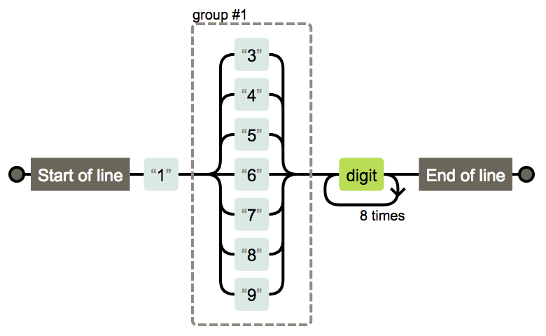

`XXX-XXXXXXX` `XXXX-XXXXXXXX` 固定电话

```regex
(\(\d{3,4}\)|\d{3,4}-|\s)?\d{8}
```


## 域名

`https://google.com/`

```regex
^((http:\/\/)|(https:\/\/))?([a-zA-Z0-9]([a-zA-Z0-9\-]{0,61}[a-zA-Z0-9])?\.)+[a-zA-Z]{2,6}(\/)
```


## IP

`127.0.0.1`

```regex
((?:(?:25[0-5]|2[0-4]\d|[01]?\d?\d)\.){3}(?:25[0-5]|2[0-4]\d|[01]?\d?\d))
```


## 帐号校验

`gaozihang_001` 字母开头，允许5-16字节，允许字母数字下划线

```regex
^[a-zA-Z][a-zA-Z0-9_]{4,15}$
```

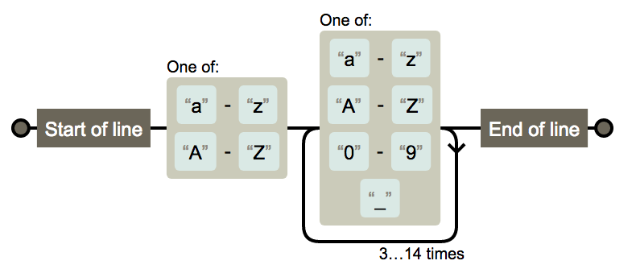

## 字符校验

### 汉字

`高子航`

```regex
^[\u4e00-\u9fa5]{0,}$
```


### 英文和数字

```regex
^[A-Za-z0-9]+$
```

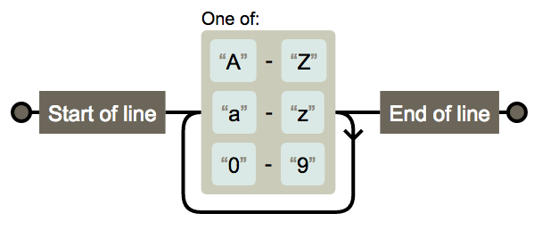

### 长度为3-20的所有字符

```regex
^.{3,20}$
```


### 英文字符

#### 由26个英文字母组成的字符串

```regex
^[A-Za-z]+$
```


#### 由26个大写英文字母组成的字符串

```regex
^[A-Z]+$
```

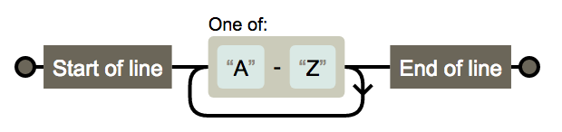

#### 由26个小写英文字母组成的字符串

```regex
^[a-z]+$
```

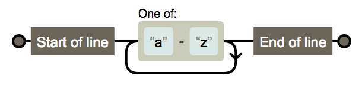

#### 由数字和26个英文字母组成的字符串

```regex
^[A-Za-z0-9]+$
```

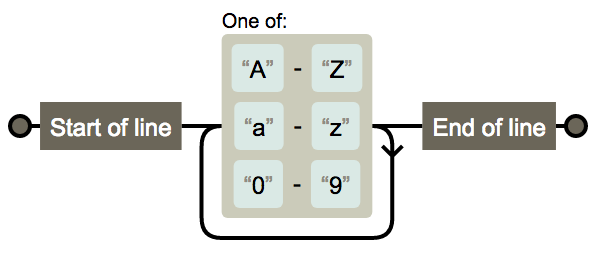

#### 由数字、26个英文字母或者下划线组成的字符串 

```regex
^\w+$
```


### 中文、英文、数字包括下划线

```regex
^[\u4E00-\u9FA5A-Za-z0-9_]+$
```


### 中文、英文、数字但不包括下划线等符号

```regex
^[\u4E00-\u9FA5A-Za-z0-9]+$
```


### 禁止输入含有%&',;=?$\"等字符

```regex
[^%&',;=?$\x22]+
```


### 禁止输入含有~的字符

```regex
[^~\x22]+
```

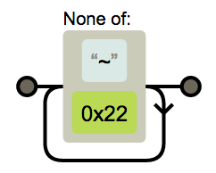

## 数字正则

### 整数

```regex
^-?[1-9]\d*$
```

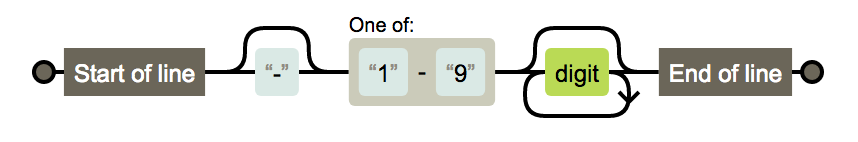

#### 正整数

```regex
^[1-9]\d*$
```


#### 负整数

```regex
^-[1-9]\d*$
```

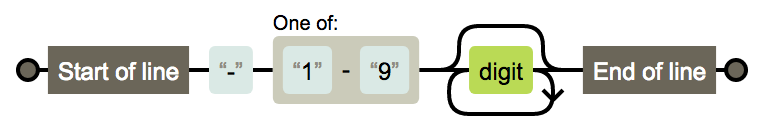

#### 非负整数

```regex
^[1-9]\d*|0$
```


#### 非正整数

```regex
^-[1-9]\d*|0$
```

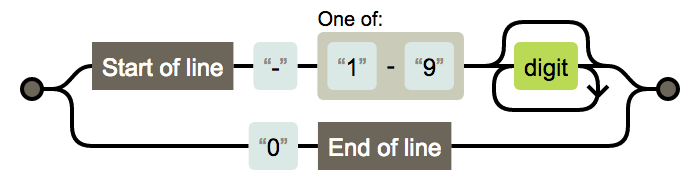

### 浮点数

```regex
^-?([1-9]\d*\.\d*|0\.\d*[1-9]\d*|0?\.0+|0)$
```


#### 正浮点数

```regex
^[1-9]\d*\.\d*|0\.\d*[1-9]\d*$
```

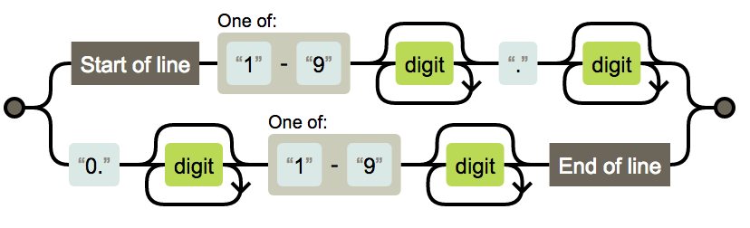

#### 负浮点数

```regex
^-([1-9]\d*\.\d*|0\.\d*[1-9]\d*)$
```

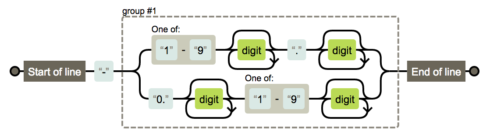

#### 非负浮点数

```regex
^[1-9]\d*\.\d*|0\.\d*[1-9]\d*|0?\.0+|0$
```


#### 非正浮点数

```regex
^(-([1-9]\d*\.\d*|0\.\d*[1-9]\d*))|0?\.0+|0$
```


