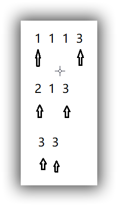

### 题目描述

如果一个数字序列逆置之后跟原序列是一样的就称这样的数字序列为回文序列。例如：
{1, 2, 1}, {15, 78, 78, 15} , {112} 是回文序列, 
{1, 2, 2}, {15, 78, 87, 51} ,{112, 2, 11} 不是回文序列。
现在给出一个数字序列，允许使用一种转换操作：
选择任意两个相邻的数，然后从序列移除这两个数，并用这两个数字的和插入到这两个数之前的位置(只插入一个和)。
现在对于所给序列要求出最少需要多少次操作可以将其变成回文序列。

**输入描述**:

```xml
输入为两行，第一行为序列长度n ( 1 ≤ n ≤ 50) 第二行为序列中的n个整数item[i] (1 ≤ iteam[i] ≤ 1000)，以空格分隔。
```

**输出描述**:

```xml
输出一个数，表示最少需要的转换次数
```

示例1

输入

```xml
4 1 1 1 3
```

输出

```xml
2
```

### 解题思路

本题其实是对双指针用法的考察，画一张图就很明白了

{:.center}

### 代码

```java
package com.leyou.test;
import java.util.*;

public class Test {
    static int n=0;
    static int[] arr;
    public static void main(String[] args) {
        Scanner sc=new Scanner(System.in);
        n=sc.nextInt();//多少个数字
        //初始化数组大小
        arr=new int[n];
        //接收数组
        for(int i=0;i<n;i++){
            arr[i]=sc.nextInt();
        }
        int min=minFind();
        System.out.println(min);
    }
    public static int minFind(){
        int count=0;
        int start=0,end=n-1;
        //双指针夹，针对这个问题，需要明白最终一定能够返回一个回文数组
        //因为到最后最不济就是所有的数组元素都合并为一个数字，这一个数字一定是回文数组
        while(start<end){
            //前面小于后面，前面需要融合,同时更新调整次数
            if(arr[start]<arr[end]){
                arr[start+1]+=arr[start];
                start++;
                count++;
            }else if(arr[start]>arr[end]){//前面大于后面，后面需要融合,同时更新调整次数
                arr[end-1]+=arr[end];
                end--;
                count++;
            }else{//前后相等了，双指针各动一步
                start++;
                end--;
            }
        }
        return count;

    }


}
```

小结一下：

注意以上代码片段

```java
while(start<end){
    //前面小于后面，前面需要融合,同时更新调整次数
    if(arr[start]<arr[end]){
        arr[start+1]+=arr[start];
        start++;
        count++;
    }else if(arr[start]>arr[end]){//前面大于后面，后面需要融合,同时更新调整次数
        arr[end-1]+=arr[end];
        end--;
        count++;
    }else{//前后相等了，双指针各动一步
        start++;
        end--;
    }
}
```

这就是双指针用法在数组里面的典型应用了，其他还有链表当中的双指针等等，注意总结

还有，以上代码：

```java
if(arr[start]<arr[end]){
                arr[start+1]+=arr[start];
                start++;
                count++;
            }
```

`if`体里面可以写成

```java
arr[++start] += arr[start - 1];
count++;
```

