### 结论

不正确地使用HashMap会引发死循环及元素丢失

### 缘起

HashMap不是线程安全的。那么HashMap在多线程环境下又会有什么问题呢？

先用一段代码简单模拟出HashMap的死循环：

```java
package com.leyou.test;

import java.util.HashMap;
import java.util.Map;
import java.util.concurrent.atomic.AtomicInteger;

public class TestHashMapResize extends Thread{
    private static AtomicInteger ai=new AtomicInteger();
    private static Map<Integer,Integer> map=new HashMap<>(1);
    public void run(){
        while(ai.get()<100000){
            map.put(ai.get(),ai.get());
            ai.incrementAndGet();
        }
    }

    public static void main(String[] args) {
        TestHashMapResize hmt0 = new TestHashMapResize();
        TestHashMapResize hmt1 = new TestHashMapResize();
        TestHashMapResize hmt2 = new TestHashMapResize();
        TestHashMapResize hmt3 = new TestHashMapResize();
        TestHashMapResize hmt4 = new TestHashMapResize();
        hmt0.start();
        hmt1.start();
        hmt2.start();
        hmt3.start();
        hmt4.start();
    }

}

```

以上代码，AtomicInteger和HashMap都是全局共享的，线程的作用很简单，给AtomicInteger不断自增并写入HashMap中。

多运行几次之后死循环就出来了，这里面要提一点，多线程环境下代码会出现问题并不意味着多线程环境下一定会出现问题，但是只要出现了问题，或者是死锁、或者是死循环，那么你的项目除了重启就没有什么别的办法了，所以代码的线程安全性在开发、评审的时候必须要重点考虑到。

看看控制台：

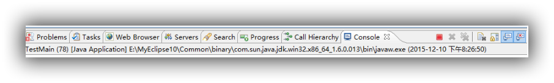{:.center}

红色方框一直亮着，说明代码死循环了。死循环问题的定位一般都是通过**jps+jstack**查看堆栈信息来定位的：

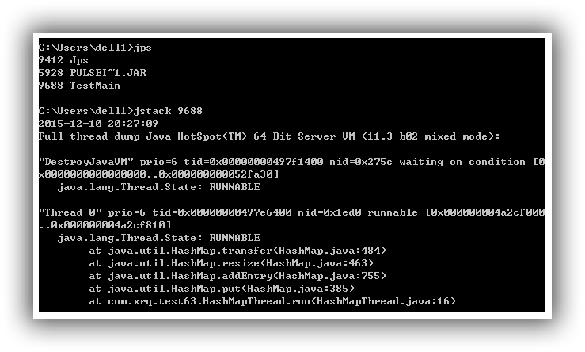{:.center}

看到Thread-0处于RUNNABLE，而从堆栈信息上应该可以看出，这次的死循环是由于Thread-0对HashMap进行扩容而引起的。

HashMap的扩容为什么会引起死循环？

### 正常的扩容过程

先来看一下HashMap一次正常的扩容过程。简单一点看吧，假设我有三个经过了最终rehash得到的数字，分别是5 7 3，HashMap的table也只有2，那么HashMap把这三个数字put进数据结构了之后应该是这么一个样子的：

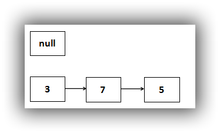{:.center}

看一下resize的代码：

下面代码比较难以理解的话，可以先看看这篇文章：[文章](https://www.cnblogs.com/zhuoqingsen/p/8577646.html)

```java
void addEntry(int hash, K key, V value, int bucketIndex) {
Entry<K,V> e = table[bucketIndex];
    table[bucketIndex] = new Entry<K,V>(hash, key, value, e);
    if (size++ >= threshold)
        resize(2 * table.length);
}
```

```java
void resize(int newCapacity) {
    Entry[] oldTable = table;
    int oldCapacity = oldTable.length;
    if (oldCapacity == MAXIMUM_CAPACITY) {
        threshold = Integer.MAX_VALUE;
        return;
    }

    Entry[] newTable = new Entry[newCapacity];
    transfer(newTable);
    table = newTable;
    threshold = (int)(newCapacity * loadFactor);
}
```

```java
void transfer(Entry[] newTable) {
    Entry[] src = table;
    int newCapacity = newTable.length;
    for (int j = 0; j < src.length; j++) {
        Entry<K,V> e = src[j];
        if (e != null) {
            src[j] = null;
            do {
                Entry<K,V> next = e.next;
                int i = indexFor(e.hash, newCapacity);
                e.next = newTable[i];
                newTable[i] = e;
                e = next;
            } while (e != null);
        }
    }
}
```

总结一下这三段代码，HashMap一次扩容的过程应该是：

1、取当前table的2倍作为新table的大小

2、根据算出的新table的大小new出一个新的Entry数组来，名为newTable

3、轮询原table的每一个位置，将每个位置上连接的Entry，算出在新table上的位置，并以链表形式连接

4、原table上的所有Entry全部轮询完毕之后，意味着原table上面的所有Entry已经移到了新的table上，HashMap中的table指向newTable

这样就完成了一次扩容，用图表示是这样的：

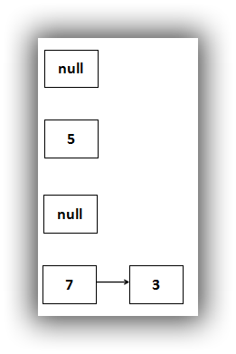{:.center}

HashMap的一次正常扩容就是这样的

### 并发扩容导致的死循环

依旧注意这段transfer代码：

```java
void transfer(Entry[] newTable) {
    Entry[] src = table;
    int newCapacity = newTable.length;
    for (int j = 0; j < src.length; j++) {
        Entry<K,V> e = src[j];
        if (e != null) {
            src[j] = null;
            do {
                Entry<K,V> next = e.next;
                int i = indexFor(e.hash, newCapacity);
                e.next = newTable[i];
                newTable[i] = e;
                e = next;
            } while (e != null);
        }
    }
}
```

两个线程，线程A和线程B。假设`Entry<K,V> next = e.next;`执行完毕，线程A切换，那么对于线程A而言，是这样的：

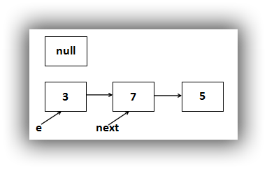{:.center}

CPU切换到线程B运行，线程B将整个扩容过程全部执行完毕，于是就形成了：

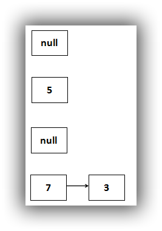{:.center}

此时CPU切换到线程A上，执行do...while...循环，首先放置3这个Entry：

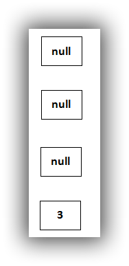{:.center}

**由于线程B已经执行完毕，因此根据Java内存模型（JMM），现在table里面所有的Entry都是最新的，也就是7的next是3，3的next是null**。3放置到table[3]的位置上了，下面的步骤是：

1、e=next，即e=7

2、判断e不等于null，循环继续

3、next=e.next，即next=7的next，也就是3

4、放置7这个Entry

所以，用图表示就是：

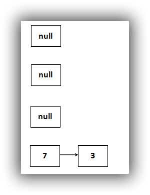{:.center}

放置完7之后，继续运行代码：

1、e=next，也就是说e=3

2、判断e不等于null，循环继续

3、next=e.next，即3的next，也就是null

4、放置3这个Entry

把3移到table[3]上去，死循环就出来了：

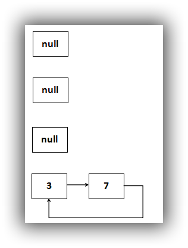{:.center}

3移到table[3]上去了，3的next指向7，由于原先7的next指向3，这样就成了一个死循环。

此时执行13行的e=next，那么e=null，循环终止。尽管此次循环确实结束了，但是后面的操作，只要涉及轮询HashMap数据结构的，无论是迭代还是扩容，都将在table[3]这个链表处出现死循环。这也就是前面的死循环堆栈出现的原因，transfer的484行，因为这是一次扩容操作，需要遍历HashMap数据结构，transfer方法是扩容的最后一个方法。

### 3 5 7又会有怎样的结果

可能有人觉得上面的数字5 7 3太巧了，像是专门为了产生HashMap的死循环而故意选择的数字。

有一个被反复实践得出的结论是，**任何在多线程下可能发生的错误场景最终一定会发生**。

5 7 3这个数字可不巧，扩容前相邻两个Entry被分配到扩容后同样的table位置是很正常的。关键的是，即使这种异常场景发生的可能性再低，只要发生一次，那么你的系统就部分甚至全部不可用了----除了重启系统没有任何办法。所以，这种可能会发生的异常场景必须提前扼杀。

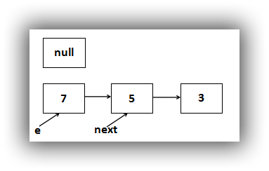{:.center}

这是扩容前数据结构中的内容，扩容之后正常的应该是：

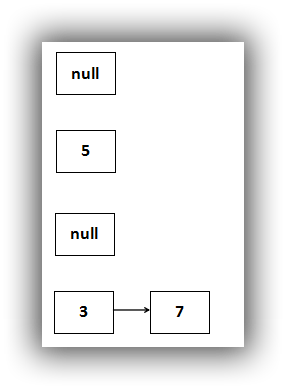{:.center}

现在在多线程下遇到问题了，某个线程先放7：

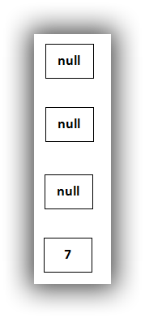{:.center}

再接着放5：

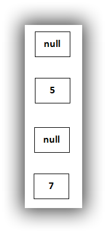{:.center}

由于5的next此时为null，因此扩容操作结束，3 5 7造成的结果就是元素丢失。

### 如何解决

把一个线程非安全的集合作为全局共享的，本身就是一种错误的做法，并发下一定会产生错误。

所以，解决这个问题的办法很简单，有两种：

1、使用Collections.synchronizedMap(Mao<K,V> m)方法把HashMap变成一个线程安全的Map

2、使用Hashtable、ConcurrentHashMap这两个线程安全的Map

不过，既然选择了线程安全的办法，那么必然要在性能上付出一定的代价----毕竟这个世界上没有十全十美的事情，既要运行效率高、又要线程安全。