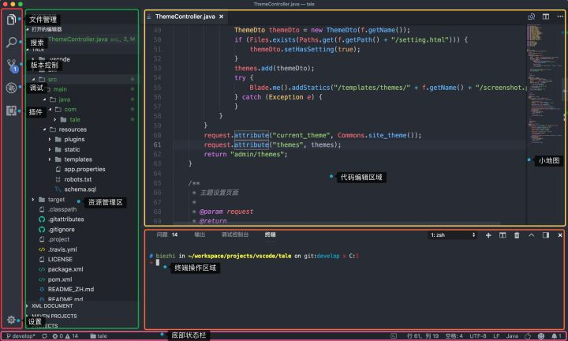
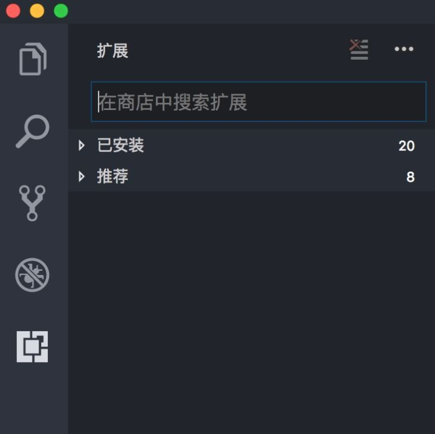
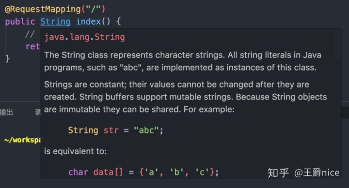
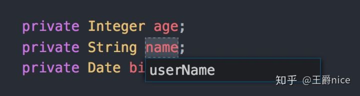
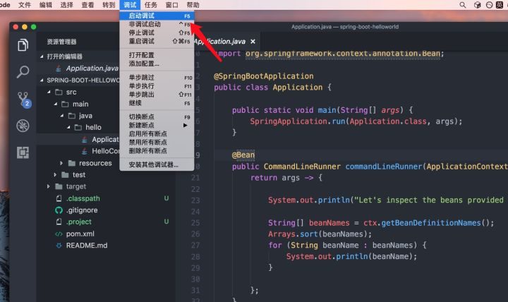
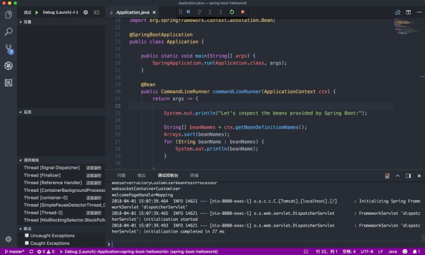
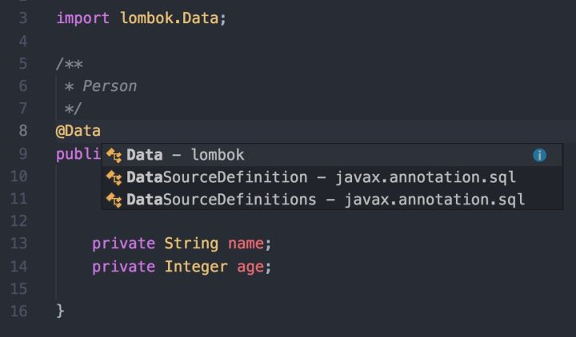

任何一个程序员都有自己喜爱的编辑器、工具、开发利器，有这样一群人，对于 `vim` 这种上古神器难以驾驭、`IDE` 又太笨重，这时候多了一个选择 vscode！！！

vscode 重新定义了编辑器，它开源、免费、Runs everywhere，是一款介于 IDE 和编辑器之间的产物，我们不能用 IDE 的所有特性都往它身上压，如果都可以的话不就是 IDE 吗？不就是吗？所以用起来的感觉你懂的，美滋滋(๑•̀ㅂ•́) ✧

那么这家伙都有什么牛逼之处呢？

## 特性

- 微软开发，软件质量没的说
- 高颜值，界面非常漂亮，允许自定义更改
- 插件超级多，开发者很愿意接受它
- 对我天朝程序员友好，你懂的
- 启动速度比 atom 快，资源占用少
- 跨平台的特性能没有吗？能吗？
- 对各种编程语言支持良好（当然我只试过java/node/go/python）
- 自动补全、代码高亮、代码跳转...
- 集成终端好用，可以用 `code` 命令打开文件/文件夹
- `debug` 功能好用(简直是 mini 的 IDE)
- ( ⊙ o ⊙ )啊！特性太多了我实在写不完

说了这么多你一定迫不及待想尝试吧~ （也许并不是）那现在

## 安装 vscode

我知道在座的各位其实根本不用我教你怎么安装，因为它是傻瓜式安装啊！它家的官网是 [https://code.visualstudio.com/](https://link.zhihu.com/?target=https%3A//code.visualstudio.com/)，你只需要在首页下载符合你操作系统的软件即可。

支持 `Windows`、`Linux`、`Mac`。

## 了解 vsccde

为什么要了解它呢？你不了解它的组成就不知道怎么把它用好（高能型大佬除外）。

## 布局




上面是 vscode 的布局，和大多数编辑器一样，分为

- **Editor** 用来编辑文件的主体区域。可以并排打开三个编辑器。
- **Side Bar** 包含不同的像浏览器一样的视图来协助来完成工程。
- **Status Bar** 展示当前打开的工程和正在编辑的文件的信息。
- **View Bar** 在最左手边，帮助切换视图以及提供额外的上下文相关的提示，比如激活了Git的情况下，需要提交的变化的数目。

在我看来学习一款编辑器并不用像学习编程语言那样，按照某个教程把所有的功能都学会，我更喜欢探索性的尝试自己需要的那些东西，比如在 **View Bar** 中如何的5个功能，其实点一点就大概明白什么意思了，查阅文字资料只是让自己更精确的掌握使用姿势。

## 配置

vscode 的用户配置分3个级别，分别是默认配置、全局配置和工作区配置，优先级也依次递增。对于团队项目，一些规范可以通过项目目录下建一个 `.vscode/setting.json` 文件进行配置,比如：

```json
// tab长度 
"editor.tabSize": 2, 
// 启用后，将在保存文件时剪裁尾随空格。 
"files.trimTrailingWhitespace": true, 
// 配置 glob 模式以排除文件和文件夹。 
"files.exclude": { 
  "**/.git": true, 
  "**/.svn": true, 
  "**/.DS_Store": true, 
  "**/.idea": true 
},
```

这个配置我一般是不用的，只用用户配置，反正电脑就一个用户。配置一下字体大小、自动保存等。

## 必装插件

1. [Beautify](https://link.zhihu.com/?target=https%3A//marketplace.visualstudio.com/items%3FitemName%3DHookyQR.beautify)：代码高亮
2. [Terminal](https://link.zhihu.com/?target=https%3A//marketplace.visualstudio.com/items%3FitemName%3Dformulahendry.terminal)：直接唤起终端
3. [Project Manager](https://link.zhihu.com/?target=https%3A//marketplace.visualstudio.com/items%3FitemName%3Dalefragnani.project-manager)：多个项目切换
4. [Auto Close Tag](https://link.zhihu.com/?target=https%3A//marketplace.visualstudio.com/items%3FitemName%3Dformulahendry.auto-close-tag)：标签自动闭合（其实我觉得可以内置的）

怎么安装呢？




在扩展输入框里输入你想用的插件就可以了，当然它还会经常推荐给我们排行比较高的插件，可以尝试安装，安装完成后重新加载编辑器就可以使用了。

## 常用快捷键

下面这些快捷键是我常用的，如果你想看更全的可以看看 [VS Code有哪些常用的快捷键](https://www.zhihu.com/question/37623310)

- 向上向下复制一行： Shift+Alt+Up 或 Shift+Alt+Down
- 注释代码: `cmd + /`
- 切换侧边栏: `cmd + b`
- 文件夹中查找: `cmd + shift + f`
- 查找替换: `cmd + shift + h`
- 重构代码: `fn + F2`
- 代码格式化: `Shift+Alt+F`，或 `Ctrl+Shift+P` 后输入 `format code`

**Ctrl+P 模式: (Mac 是 CMD+P)**

- 直接输入文件名，快速打开文件
- `>` 显示并运行命令
- `:` 跳转到行数，也可以Ctrl+G直接进入(Mac 是 CMD+G)
- `@` 跳转到symbol（搜索变量或者函数），也可以Ctrl+Shift+O直接进入
- `@:` 根据分类跳转symbol，查找属性或函数，也可以Ctrl+Shift+O后输入:进入
- `#` 根据名字查找symbol，也可以Ctrl+T

## 配置 Java 环境

先安装 Java 语言相关的插件 4 枚

1. [Language Support for Java(TM) by Red Hat](https://link.zhihu.com/?target=https%3A//marketplace.visualstudio.com/items%3FitemName%3Dredhat.java)
2. [Debugger for Java](https://link.zhihu.com/?target=https%3A//marketplace.visualstudio.com/items%3FitemName%3Dvscjava.vscode-java-debug)
3. [Java Test Runner](https://link.zhihu.com/?target=https%3A//marketplace.visualstudio.com/items%3FitemName%3Dvscjava.vscode-java-test)
4. [Maven for Java](https://link.zhihu.com/?target=https%3A//marketplace.visualstudio.com/items%3FitemName%3Dvscjava.vscode-maven)

有人想问了，妈耶还要4个插件，这么麻烦的吗？

第一个插件干嘛的？运行 Java 代码的，第二个呢？调试的，不调试可以不装，第三个运行单元测试，不测试可以不装，第四个建议装上，一个标准化的 Java 工程一定不是几个文件组成，maven 是在Java环境下构建应用程序的软件（本地要先安装哦）。

这时候还需要配置一下 `java.home`，我的是

```java
"java.home": "/Library/Java/JavaVirtualMachines/jdk1.8.0_101.jdk/Contents/Home",
```

大功告成，现在你可以在 vs code 下创建一个 `Mmp.java` 开始写 `Hello vscode!` 了。

```java
public class Mmp {

  public static void main(){
    System.out.println("Hello vscode!");
  }

}
```

点击 **调试** 或者按下 `F5` 运行这久经码场的输出语句。具体操作见文章底部视频。


**代码定位**



按住 **ctrl** 键鼠标悬停在类上面会有类描述，点击即可进入类定义处，方法也是同样。


**代码重构**

代码重构

很强大的一个地方就是我们有时候会修改字段、方法的名称。

1. 找到所有的引用： `Shift + F12`
2. 同时修改本文件中所有匹配的： `Ctrl+F12`
3. 重命名：比如要修改一个方法名，可以选中后按 `F2`，输入新的名字，回车，会发现所有的文件都修改了
4. 跳转到下一个 `Error` 或 `Warning`：当有多个错误时可以按 `F8` 逐个跳转
5. 查看 `diff`： 在 `explorer` 里选择文件右键 `Set file to compare`，然后需要对比的文件上右键选择 `Compare with file_name_you_chose`


## 运行 SpringBoot 项目

下载一个 `SpringBoot` 的示例工程

```bash
git clone https://github.com/JavaExamples/spring-boot-helloworld.git
code spring-boot-helloworld
```

> 什么？`git` 还不会




启动调试，选择 `Java` 语言，会提示我们 `launch.json` 文件是下面这样的

```json
{
    // 使用 IntelliSense 了解相关属性。 
    // 悬停以查看现有属性的描述。
    // 欲了解更多信息，请访问: https://go.microsoft.com/fwlink/?linkid=830387
    "version": "0.2.0",
    "configurations": [
        {
            "type": "java",
            "name": "Debug (Launch)-Application<spring-boot-helloworld>",
            "request": "launch",
            "cwd": "${workspaceFolder}",
            "console": "internalConsole",
            "stopOnEntry": false,
            "mainClass": "hello.Application",
            "projectName": "spring-boot-helloworld",
            "args": ""
        },
        {
            "type": "java",
            "name": "Debug (Attach)",
            "request": "attach",
            "hostName": "localhost",
            "port": 0
        }
    ]
}
```

主要看 `mainClass`，只有第一次生成这个文件，确认后点击 **调试** 即可看到控制台日志




## 尝试 Lombok

这个家伙你用不用都无妨，反正我是挺喜欢的。这里就不啰嗦到底干嘛的，简单来说就是我可以用一个 `@Data` 注解帮我自动生成（编译后生成）`getter`、`setter`、`toString`、`equals`、`hashCode` 这些方法，反正多花时间写这些代码也不会提高你的能力，修改的时候还要多花时间，完全没！必！要！好吗？

按照[官方的文档](https://link.zhihu.com/?target=https%3A//github.com/redhat-developer/vscode-java/wiki/Lombok-support)我尝试了不在 `maven` 环境下是行不通的！行不通的。如果你可以的话在文章评论下告诉我哈~

所以我们安装一个 [Lombok Annotations Support for VS Code](https://link.zhihu.com/?target=https%3A//marketplace.visualstudio.com/items%3FitemName%3DGabrielBB.vscode-lombok) 就可以了。

在 maven 工程中添加 `lombok` 依赖

```xml
<dependency>
    <groupId>org.projectlombok</groupId>
    <artifactId>lombok</artifactId>
    <version>1.16.20</version>
    <scope>provided</scope>
</dependency>
```

试一下吧




## 安装 vim 插件

> VS Code 中输入快捷键 shift + ctrl + x, 或直接打开 扩展安装导航
> 搜索 vim, 选择 Vim ![./vimvscode.png], 点击 install 安装
> 安装结束后就可以使用 vscode 下的 vim 模式了
> 推荐: 关闭 vim 扩展的 useCtrlKeys, 保留一些 VS Code 自身的一些常用快捷键， 在 settings.json 里面添加配置 “vim.useCtrlKeys”: false


## vim 入门

> 在 vs code 中打开文件时， 文件状态为默认为 vim 下的 Normal 模式
> 输入 i， 从 Normal 模式切换至 Insert 模式， 此时就可以正常输入文本了
> 单击 ESC 可以返回 Normal 模式
>
> 在 Normal 模式下可以进行如下操作
>
> | 命令(按键) | 作用                               |
> | :--------- | :--------------------------------- |
> | i          | 进入 Insert 模式                   |
> | ESC        | Insert 模式退回 Normal 模式        |
> | :q         | 退出文件编辑 (vs code 下用不到)    |
> | :w         | 保存修改文件 (vs code 下用不到)    |
> | :wq        | 保存 + 推出文件 (vs code 下用不到) |

## vim 定位

> vim 光标定位命令

### 光标上下左右

> | 命令       | 作用             | 模式            |
> | :--------- | :--------------- | :-------------- |
> | h          | 光标向左移动一格 | Normal          |
> | l          | 光标向右移动一格 | Normal          |
> | j          | 光标向下移动一行 | Normal          |
> | k          | 光标向上移动一行 | Normal          |
> | 上下左右键 | 上下左右切换光标 | Normal & Insert |
>
> **注**: banlk 字符是指 空格， tab， 换行， 回车等
>
> ### 行内光标定位
>
> | 命令 | 作用                                    | 模式            |
> | :--- | :-------------------------------------- | :-------------- |
> | 0    | 到当前行开头                            | Normal          |
> | home | 到当前行开头                            | Normal & Insert |
> | ^    | 到当前行第一个不是 blank 字符的位置     | Normal          |
> | $    | 到当前行末尾                            | Normal          |
> | g_   | 到当前行最后有一个不是 blank 字符的位置 | Normal          |
> | gg   | 到第一行                                | Normal          |
> | nG   | n 为行编号， 到第 n 行                  | Normal          |
> | G    | 到最后一行                              | Normal          |
>
> ### 词汇定位
>
> 1、默认方式， 一个单词由字母，数字和下划线组成
>
> | 命令 | 作用                        | 模式   |
> | :--- | :-------------------------- | :----- |
> | w    | w(小写), 到下一个单词的开头 | Normal |
> | e    | e(小写), 到下一个单词的结尾 | Normal |
>
> 2、如果单词以 blank 字符分隔， 使用 大写的 E 或 W 分隔
>
> 3、单词匹配
>
> | 命令 | 作用                                                         | 模式   |
> | :--- | :----------------------------------------------------------- | :----- |
> | *    | 移动到与当前光标匹配的下个单词(目前装的VS Code Vim 组件不生效) | Normal |
> | #    | 移动到与当前光标匹配的上个单词                               | Normal |
>
> ### 括号匹配
>
> | 命令 | 作用                                                         | 模式   |
> | :--- | :----------------------------------------------------------- | :----- |
> | %    | 定位与光标所在括号相对应的另一半,(使用前要将光标定位在某个括号上) | Normal |

## vim 插入

> vim 插入命令，光标定位完成后，进行插入操作前的命令, 命令执行后切换至 Insert 模式
>
> | 命令 | 作用                                                   | 模式   |
> | :--- | :----------------------------------------------------- | :----- |
> | a    | 在光标后插入， 光标定位后输入 i 命令默认是光标前插入的 | Normal |
> | o    | 小写 o 在当前行之后插入新的一行，相当与回车效果        | Normal |
> | O    | 大写 O 在当前行之前插入新的一行                        | Normal |

## vim 查找

> vim 是通过正则匹配来实现的<br>
> 在 Normal 模式下， 先输入 /， 进入搜索模式<br>
> 输入想要搜索的词汇， 此时在 vs code 中会高亮所有匹配项<br>
> 单击 enter(回车) 键后， 点击 n 键就可以光标一个个定位匹配项

## vim 替换

> 以下介绍的替换在 VS Code 中无法使用， 可以使用 其自带的 Ctrl + H 的替换<br>
> 语法： vim 的替换语法为： :[addr]s/待替换字符/替换字符/[option]
>
> ### : (英文冒号)
>
> 表示替换命令开始
>
> ### [addr] 检索范围
>
> 1、.(小数点) 表示前按行<br>
> 2、\$: 表示文件最后一行<br>
> 3、%： 表示整个当前文件<br>
> 4、n(行号)： 表示第 n 行<br>
> 5、n1,n2: 表示 第 n1 行到第 n2 行<br>
> 6、n, \$: 表示 第 n 行到文档最后一行<br>
> 7、., $: 表示 当前行到文档最后一行<br>
> 8、., n: 表示当前行到文档第 n 行
>
> ### s 替换操作
>
> 字母 s 表示替换操作
>
> ### [option] 操作类型
>
> [option] 表示操作类型<br>
> 1、g: 表示全局替换， 在检索范围内替换所有匹配项<br>
> 2、c: 表示确认替换， 在替换时需要 输入 y 一一确认<br>
> 3、p: 表示显示替代结果， 按 enter 后执行替换<br>
> 4、option 省略时仅对每行第一个匹配字符串进行替换
>
> ### 例子
>
> :.s/from/to/ 将当前行中的第一个from，替换成to。如果当前行有多个from，则只会替换其中的第一个。<br>
> :%s/from/to/g 将文档中所有的 from 替换成 to<br>
> :1,5s/from/to/c 将文档的第 1 到第 5 行， 每行的第一个 from 替换成 to , 并需要确认<br>
> :6,$s/from/to/gc 从第 6 行开始至最后一行， 将所有的 from 换从成 to, 并需要确认<br>
> :.,7s/from/to/p 从当前行到第 7 行，将每行地一个 from 替换成 to, 替换前显示替换结果， 按回车后生效

## vim 拷贝/粘贴/删除

> vim 拷贝张贴命令

### 1、粘贴

> | 命令   | 作用                           | 模式   |
> | :----- | :----------------------------- | :----- |
> | p      | 小写 p, 在光标之后插入拷贝项   | Normal |
> | P      | 大写 P, 在光标之前插入拷贝内容 | Normal |
> | np(nP) | 重复复制 n 次                  | Normal |

### 2、拷贝

> | 命令 | 作用                                                 | 模式   |
> | :--- | :--------------------------------------------------- | :----- |
> | y    | 拷贝当前行以及其后面一行，共两行                     | Normal |
> | yy   | 拷贝当前行                                           | Normal |
> | nyy  | n 为大于数字, 拷贝 n 行， 第一行为光标所在行         | Normal |
> | ye   | 从光标位置开始拷贝，至遇到第一个空后结束(不包括空格) | Normal |
> | yw   | 从光标位置开始拷贝，至遇到第一个空后结束(包括空格)   | Normal |
> | y$   | 从光标位置开始拷贝，到当前行行末, 包括空格           | Normal |
> | y0   | 从光标位置开始拷贝，到当前行行首， 包括空格          | Normal |
> | ynl  | 从光标位置开始， 向右拷贝 n 个字符                   | Normal |
> | ynB  | 从光标位置开始，向左拷贝 n 个单词                    | Normal |
>
> **如何拷贝某一块区域, 比较精确的选择拷贝区域?**<br>
> 在 Normal 模式下, 将光标定位至目标拷贝区域的开始或结束位置，<br>
> 输入命令 v(小写) 进入试图模式<br>
> 移动光标，光标所经过的位置都被选中，(跟鼠标选中形式一样)<br>
> 区域选定结束后， 输入 y 命令， 复制成功<br>
> 如果输入 大写 V 命令， 此时只能以行为单位选中区域<br>
>
> **如何实现跨文件拷贝/粘贴?**<br>
> 在文件 A 复制的内容在文件 B 中使用，<br>
> 使用命令 +y, 即将复制的内容添加到系统的剪切板， 供其他程序使用 (这个命令在 debian 下不好用， 只在全选复制的情况下有用， 复制部分的话使用右键复制,)<br>
> 使用命令 +p, 可以将系统剪切板中的内容，粘贴到当前文件 (这个命令不好用)<br>
> 在 Insert 模式下 (VS Code 中 Normal 模式也可以)， 使用快捷键 shift+insert 可以将系统剪切板中的内容，粘贴到当前文件, (推荐使用)

### 3、删除

> | 命令 | 作用                                                  | 模式   |
> | :--- | :---------------------------------------------------- | :----- |
> | dd   | 剪切当前行                                            | Normal |
> | ndd  | 剪切 n 行， 当前行为第一行                            | Normal |
> | dw   | 从光标位置开始剪切， 至遇到第一个空后结束(包括空格)   | Normal |
> | de   | 从光标位置开始剪切， 至遇到第一个空后结束(不包括空格) | Normal |
> | d$   | 从光标开始位置剪切， 至当前行行末， 包括空格          | Normal |
> | d0   | 从光标开始位置剪切， 至当前行行首， 包括空格          | Normal |
> | dl   | 删除光标所在字符                                      | Normal |
> | dh   | 删除光标所在位置之前字符                              | Normal |
> | dnl  | 从光标位置开始， 向右剪切 n 个字符                    | Normal |
> | dnh  | 剪切光标之前的 n 个字符(不包括光标所在字符)           | Normal |
> | dH   | 剪切当前光标之前所有内容                              | Normal |
> | dL   | 剪切当前光标之后所有内容(包括光标所在字符)            | Normal |
>
> **如何删除胡一块区域， 比较精确地删除区域**<br>
> 同上文的拷贝一样， 只需把 拷贝命令 y 换成 删除命令 d 即可

## 撤销/取消撤销修改

> 撤销修改命令 和 取消撤销修改命令
>
> | 命令   | 作用             | 模式   |
> | :----- | :--------------- | :----- |
> | u      | 撤销上步修改     | Normal |
> | ctrl+r | 恢复被撤销的修改 | Normal |

## 补充

> 1、重复之前的命令 Normal 模式下输入 .(小数点), n. 重复之前命令 n 次
>
> 2、对括号内内容操作 (将光标定位至左括号)
>
> - ci’、ci”、ci(、ci[、ci{、ci< 分别更改这些配对标点符号中的文本内容
> - di’、di”、di(或dib、di[、di{或diB、di< 分别删除这些配对标点符号中的文本内容
> - yi’、yi”、yi(、yi[、yi{、yi< 分别复制这些配对标点符号中的文本内容
> - vi’、vi”、vi(、vi[、vi{、vi< 分别选中这些配对标点符号中的文本内容
>
> 3、全选(复制/删除)
>
> > Normal模式下， 首先全选文档： ggVG/ggvG => (gg 让光标移动到首行, v/V 进入Vision 模式， G 移动到最后一行)
> > 输入 d 删除选中内容， 输入 y 复制选中内容
>
> 4、代码缩进
>
> > Normal 模式下， 进入 Vision 模式, 选中目标代码块，
> > 快捷键 shift+> 向右缩进
> > 快捷键 shift+< 向左缩进

## 其他有用快捷方式

- gd - Go to definition, 跳转到定义

- gb - 找出与光标下相同的下一个单词, 并添加一个光标, 类似 `vscode` 原生的 `cmd + d`

- gh - 等同于将鼠标移至光标所在单词, 方便查看定义以及报错

- 快速注释 `vim-commentary` 默认开启

- - `VSCode` 或是 `INSERT MODE` 下可以使用 `cmd + /` 快速注释光标所在/选中行, `NORMAL` 模式下 `gcc` 可以快速注释当前行, `gc2j` 注释以下两行, `VISUAL` 模式 `gc` 可快速注释选中行
  - `gCC` 使用块级注释, 注释当前行, 其他类似

- `vim-sneak` 光标快速移动

- - `s/S <char><char>` 快速向前/向后移动光标到第一次出现 `<char><char>` 字符的位置

- 代码折叠, 建议设置 `"vim.foldfix": true`(这能修复光标经过折叠代码时自动展开的 bug, 但会带来副作用)

- - `[N]zo` 会递归展开光标下的 N 层折叠, `zO` 会展开光标下所有折叠
  - `[N]zc` 会递归关闭光标下的 N 层折叠, `zC` 会关闭光标下所有折叠
  - `zM` 全部折叠, `zR` 全部展开

