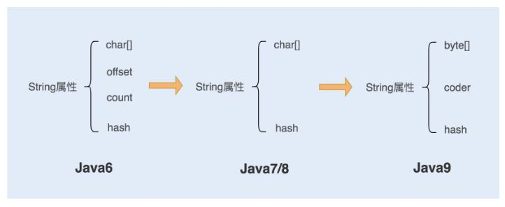

### 怎么做好性能调优

**1. 扎实的计算机基础**

我们调优的对象不是单一的应用服务，而是错综复杂的系统。应用服务的性能可能与操作系统、网络、数据库等组件相关，所以我们需要储备计算机组成原理、操作系统、网络协议以及数据库等基础知识。具体的性能问题往往还与传输、计算、存储数据等相关，那我们还需要储备数据结构、算法以及数学等基础知识。

**2. 习惯透过源码了解技术本质**

我身边有很多好学的同学，他们经常和我分享在一些技术论坛或者公众号上学到的技术。这个方式很好，因为论坛上边的大部分内容，都是生产者自己吸收消化后总结的知识点，能帮助我们快速获取、快速理解。但是只做到这个程度还不够，因为你缺失了自己的判断。怎么办呢？我们需要深入源码，通过分析来学习、总结一项技术的实现原理和优缺点，这样我们就能更客观地去学习一项技术，还能透过源码来学习牛人的思维方式，收获更好的编码实现方式。

**3. 善于追问和总结**

很多同学在使用一项技术时，只是因为这项技术好用就用了，从来不问自己：为什么这项技术可以提升系统性能？对比其他技术它好在哪儿？实现的原理又是什么呢？事实上，“知其然且知所以然”才是我们积累经验的关键。知道了一项技术背后的实现原理，我们才能在遇到性能问题时，做到触类旁通。

### 为什么要做系统调优

有的人，就是可以做到既减少服务器的数量，还能提升系统的性能

好的系统性能调优不仅仅可以提高系统的性能，还能为公司节省资源

### 什么时候介入调优

在项目初期，不必要做细致的调优工作，我们要做的是从编码上减少磁盘 I/O 操作、降低竞争锁的使用以及使用高效的算法等等。遇到比较复杂的业务，我们可以充分利用设计模式来优化业务代码。例如，设计商品价格的时候，往往会有很多折扣活动、红包活动，我们可以用装饰模式去设计这个业务。

### 影响性能的几个可能出现瓶颈的地方

- CPU——代码递归导致的无限循环，正则表达式引起的回溯，JVM 频繁的 FULL GC，以及多线程编程造成的大量上下文切换等，这些都有可能导致 CPU 资源繁忙。

- 内存
- 磁盘I/O——磁盘相比内存来说，存储空间要大很多，但磁盘 I/O 读写的速度要比内存慢，虽然目前引入的 SSD 固态硬盘已经有所优化，但仍然无法与内存的读写速度相提并论。
- 网络
- 异常——Java 应用中，抛出异常需要构建异常栈，对异常进行捕获和处理，这个过程非常消耗系统性能。如果在高并发的情况下引发异常，持续地进行异常处理，那么系统的性能就会明显地受到影响。
- 数据库——对于有大量数据库读写操作的系统来说，数据库的性能优化是整个系统的核心。
- 锁竞争——JDK1.6 之后，Java 为了降低锁竞争带来的上下文切换，对 JVM 内部锁已经做了多次优化，例如，新增了偏向锁、自旋锁、轻量级锁、锁粗化、锁消除等。而如何合理地使用锁资源，优化锁资源，就需要你了解更多的操作系统知识、Java 多线程编程基础，积累项目经验，并结合实际场景去处理相关问题。

### 性能指标体现

- 响应时间
  - 数据库响应时间：数据库操作所消耗的时间，往往是整个请求链中最耗时的；
  - 服务端响应时间：服务端包括 Nginx 分发的请求所消耗的时间以及服务端程序执行所消耗的时间；
  - 网络响应时间
  - 客户端响应时间：对于普通的 Web、App 客户端来说，消耗时间是可以忽略不计的，但如果你的客户端嵌入了大量的逻辑处理，消耗的时间就有可能变长，从而成为系统的瓶颈。

- 吞吐量

  在测试中，我们往往会比较注重系统接口的 TPS（每秒事务处理量），因为 TPS 体现了接口的性能，TPS 越大，性能越好。在系统中，我们也可以把吞吐量自下而上地分为两种：磁盘吞吐量和网络吞吐量。

  - 磁盘吞吐量
    - IOPS（Input/Output Per Second）：关注随机读写性能，适用于随机读写频繁的应用，如小文件存储（图片）、OLTP 数据库、邮件服务器。
    - 数据吞吐量：指单位时间内可以成功传输的数据量，对于大量顺序读写频繁的应用，传输大量连续数据，例如，电视台的视频编辑、视频点播 VOD（Video On Demand），数据吞吐量则是关键衡量指标。
  - 网络吞吐量：这个是指网络传输时没有帧丢失的情况下，设备能够接受的最大数据速率。网络吞吐量不仅仅跟带宽有关系，还跟 CPU 的处理能力、网卡、防火墙、外部接口以及 I/O 等紧密关联。而吞吐量的大小主要由网卡的处理能力、内部程序算法以及带宽大小决定。

### 计算机资源分配使用率

通常由 CPU 占用率、内存使用率、磁盘 I/O、网络 I/O 来表示资源使用率。这几个参数好比一个木桶，如果其中任何一块木板出现短板，任何一项分配不合理，对整个系统性能的影响都是毁灭性的。

### 负载承受能力

当系统压力上升时，你可以观察，系统响应时间的上升曲线是否平缓。这项指标能直观地反馈给你，系统所能承受的负载压力极限。例如，当你对系统进行压测时，系统的响应时间会随着系统并发数的增加而延长，直到系统无法处理这么多请求，抛出大量错误时，就到了极限。

### QA

- TPS/QPS——TPS(transaction per second)是单位时间内处理事务的数量，QPS(query per second)是单位时间内请求的数量。TPS代表一个事务的处理，可以包含了多次请求。很多公司用QPS作为接口吞吐量的指标，也有很多公司使用TPS作为标准，两者都能表现出系统的吞吐量的大小，TPS的一次事务代表一次用户操作到服务器返回结果，QPS的一次请求代表一个接口的一次请求到服务器返回结果。当一次用户操作只包含一个请求接口时，TPS和QPS没有区别。当用户的一次操作包含了多个服务请求时，这个时候TPS作为这次用户操作的性能指标就更具有代表性了。

- Java异常对性能造成影响的解释：如果没有生成堆栈追踪信息，不会有性能问题。一般业务异常避免生成堆栈追踪信息，我们知道这个异常是什么原因，所以直接返回字符串就好了。而系统异常，一般都会生成堆栈追踪信息，以便追踪源头，更好的排查问题。

- MySQL经常会遇到业务需要实时导出大量业务数据的需求，那么如何在不影响业务和不分库的的情况满足业务实时导出大量数据的需求呢？

  切忌在主库中操作这种报表类的导出，在写入和查询都在一个主库进行，会造成数据库性能瓶颈，严重的会导致数据库死锁。我们可以将数据库读写分离，写业务走主(写)库，导出数据可以从从(读)库导出。这种实现方式，首先能提高数据导出的性能，其次不影响写业务。

  如果公司有大数据中心，可以考虑将需要导出的数据实时同步到大数据中心，通过实时的流计算处理生成不同需求的业务数据。

- 端口被CLOSE_WAIT占用，重启后过了半天又重现，以前没有出现过，一般如何排查

  可以通过tcpdump抓包看看连接状态，分析是否是服务端的FIN packet没有发出去。

  正常的关闭流程是：服务端在接收到客户端发送的关闭请求FIN后，会进入CLOSE_WAIT状态，同时发送ACK回去。在完成与客户端直接的通信操作之后，再向客户端发送FIN，进入LAST_ACK状态。

  如果连接是CLOSE_WAIT状态，而不是LAST_ACK状态，说明还没有发FIN给Client，那么可能是在关闭连接之前还有许多数据要发送或者其他事要做，导致没有发这个FIN packet。

  建议确定关闭请求的四次握手，哪个环节出了问题，再去排查业务代码，可能是由于超时或者异常导致没有正常关闭连接。

- percentage of the requests served within a certain time指标

  反应单位时间内，不同响应时间的占比率，例如50% 的响应时间是1ms以内，80%的响应时间是2ms以内，99%的响应时间是5ms以内。说明有19%是在2ms~5ms以内。

### 测试性能方法策略

- 微基性能测试——可以精准定位到某个模块或者某个方法的性能问题。
- 宏基准性能测试——是一个综合测试，需要考虑到测试环境、测试场景和测试目标。

### 测试需要注意的问题

- 热身问题

  在 Java 编程语言和环境中，.java 文件编译成为 .class 文件后，机器还是无法直接运行 .class 文件中的字节码，需要通过解释器将字节码转换成本地机器码才能运行。为了节约内存和执行效率，代码最初被执行时，解释器会率先解释执行这段代码。

  随着代码被执行的次数增多，当虚拟机发现某个方法或代码块运行得特别频繁时，就会把这些代码认定为热点代码（Hot Spot Code）。为了提高热点代码的执行效率，在运行时，虚拟机将会通过即时编译器（JIT compiler，just-in-time compiler）把这些代码编译成与本地平台相关的机器码，并进行各层次的优化，然后存储在内存中，之后每次运行代码时，直接从内存中获取即可。

- 性能测试结果不稳定——可以求平均

- 多JVM情况下的影响——避免线上环境中一台机器部署多个 JVM 的情况。

### 优化策略

- 优化代码
  - 比如某段代码占用内存不断攀升，导致内存溢出，JVM频繁发生垃圾回收，导致CPU100%以上居高不下，随后又消耗了系统的CPU资源。
  - 对于LinkedList的遍历最好使用 Iterator （迭代器）迭代循环，而不要使用 for 循环获取元素，因为在每次循环获取元素时，都会去遍历一次 List，这样会降低读的效率。
- 优化设计
  - 单例模式在频繁调用创建对象的场景中，可以共享一个创建对象，这样可以减少频繁地创建和销毁对象所带来的性能消耗。
- 优化算法
- 时间换空间——对查询速度要求不高，而对存储空间要求比较严苛的时候
- 空间换时间——比如MySQL的分库分表就是

- 参数调优——比如JVM参数，线程池核心线程数等

### 兜底策略

无论优化的有多好，还是会存在承受极限，为了保证系统的稳定性，我们还需要采用一些兜底策略。

- 限流

- 智能化横向扩容

- 提前扩容——使用于可预知的高并发访问的场景

  目前很多公司使用 Docker 容器来部署应用服务。这是因为 Docker 容器是使用 Kubernetes 作为容器管理系统，而 Kubernetes 可以实现智能化横向扩容和提前扩容 Docker 服务。

### 字符串优化



char数组的方式存在什么问题？可能会出现内存泄漏

为什么char——>byte?  char 字符占 16 位，2 个字节。这个情况下，存储单字节编码内的字符（占一个字节的字符）就显得非常浪费。

coder 属性默认有 0 和 1 两个值，0 代表 Latin-1（单字节编码），1 代表 UTF-16。如果 String 判断字符串只包含了 Latin-1，则 coder 属性值为 0，反之则为 1。

为什么char[] 被 final+private 修饰？三点：

- 保证 String 对象的安全性。假设 String 对象是可变的，那么 String 对象将可能被恶意修改。
- 保证 hash 属性值不会频繁变更，确保了唯一性，使得类似 HashMap 容器才能实现相应的 key-value 缓存功能。
- 可以实现字符串常量池。在 Java 中，通常有两种创建字符串对象的方式，一种是通过字符串常量的方式创建，如 String str=“abc”；另一种是字符串变量通过 new 形式的创建，如 String str = new String(“abc”)。
  - 使用第一种方式创建字符串对象时，JVM 首先会检查该对象是否在字符串常量池中，如果在，就返回该对象引用，否则新的字符串将在常量池中被创建。这种方式可以减少同一个值的字符串对象的重复创建，节约内存。
  - String str = new String(“abc”) 这种方式，首先在编译类文件时，"abc"常量字符串将会放入到常量结构中，在类加载时，“abc"将会在常量池中创建；其次，在调用 new 时，JVM 命令将会调用 String 的构造函数，同时引用常量池中的"abc” 字符串，在堆内存中创建一个 String 对象；最后，str 将引用 String 对象。

**question：**对一个 String 对象 str 赋值“hello”，然后又让 str 值为“world”，这个时候 str 的值变成了“world”。为什么还说 String 对象不可变呢？

**answer：**第一次赋值的时候，创建了一个“hello”对象，str 引用指向“hello”地址；第二次赋值的时候，又重新创建了一个对象“world”，str 引用指向了“world”，但“hello”对象依然存在于内存中。

也就是说 **str 并不是对象，而只是一个对象引用**。真正的对象依然还在内存中，没有被改变。

**编译器优化**

源代码：

```java
String str = "abcdef";
 
for(int i=0; i<1000; i++) {
      str = str + i;
}
```

优化后代码：

```java
String str = "abcdef";
 
for(int i=0; i<1000; i++) {
        	  str = (new StringBuilder(String.valueOf(str))).append(i).toString();
}
```

能得出什么？即使使用 + 号作为字符串的拼接，也一样可以被编译器优化成 StringBuilder 的方式。平时做字符串拼接的时候，还是要显示地使用 String Builder 来提升系统性能。

**如何使用 String.intern 节省内存？**

来看个实例，twitter的用户发推的地理位置信息

```java
public class Location {
    private String city;
    private String region;
    private String countryCode;
    private double longitude;
    private double latitude;
} 
```

这样存的话需要约32G的内存，抽取一部分公共信息出来

```java
public class SharedLocation {
 
	private String city;
	private String region;
	private String countryCode;
}
 
public class Location {
 
	private SharedLocation sharedLocation;
	double longitude;
	double latitude;
}
```

这样存储量可以减少至20G左右。如何进一步优化？

```java
SharedLocation sharedLocation = new SharedLocation();
 
sharedLocation.setCity(messageInfo.getCity().intern());		sharedLocation.setCountryCode(messageInfo.getRegion().intern());
sharedLocation.setRegion(messageInfo.getCountryCode().intern());
 
Location location = new Location();
location.set(sharedLocation);
location.set(messageInfo.getLongitude());
location.set(messageInfo.getLatitude());
```


在字符串常量中，默认会将对象放入常量池；在字符串变量中，对象是会创建在堆内存中，同时也会在常量池中创建一个字符串对象，复制到堆内存对象中，并返回堆内存对象引用。

如果调用 intern 方法，会去查看字符串常量池中是否有等于该对象的字符串，如果没有，就在常量池中新增该对象，并返回该对象引用；如果有，就返回常量池中的字符串引用。堆内存中原有的对象由于没有引用指向它，将会通过垃圾回收器回收。

**字符串的分割**

**Split**() 方法使用了正则表达式实现了其强大的分割功能，而正则表达式的性能是非常不稳定的，使用不恰当会引起**回溯问题**，很可能导致 CPU 居高不下。

所以我们应该慎重使用 Split() 方法，我们可以用 String.indexOf() 方法代替 Split() 方法完成字符串的分割。如果实在无法满足需求，你就在使用 Split() 方法时，对回溯问题加以重视就可以了。

#### QA

**Q：**String.substring 方法也不再共享 char[]，从而解决了使用该方法可能导致的内存泄漏问题。这句话怎么理解

**A：** 在Java6中substring方法会调用new string构造函数，此时会复用原来的char数组，而如果我们仅仅是用substring获取一小段字符，而原本string字符串非常大的情况下，substring的对象如果一直被引用，由于substring的里面的char数组仍然指向原字符串，此时string字符串也无法回收，从而导致内存泄露。

试想下，如果有大量这种通过substring获取超大字符串中一小段字符串的操作，会因为内存泄露而导致内存溢出。  

**Q：**使用intern的方式怎么把握这个度？

**A：**  如果对空间要求高于时间要求，且存在大量重复字符串时，可以考虑使用常量池存储。

如果对查询速度要求很高，且存储字符串数量很大，重复率很低的情况下，不建议存储在常量池中。  

**Q：**A.String str= "abcdef";
B.String str= new String("abcdef");
C.String str= new String("abcdef"). intern();
D.String str1=str.intern();  这个方式到底什么时候用？

**A：**实际编码中，我们要结合实际场景来选择创建字符串的方式，例如，在创建局部变量以及常量时，我们一般使用A的这种方式；如果我们要区别一个字符串创建两个不同的对象来使用时，会选择B；intern一般使用的比较少，例如我们平时会创建很多一样的字符串的对象时，且对象会保存在内存中，我们可以考虑使用intern方法来减少过多重复对象占用内存空间。


